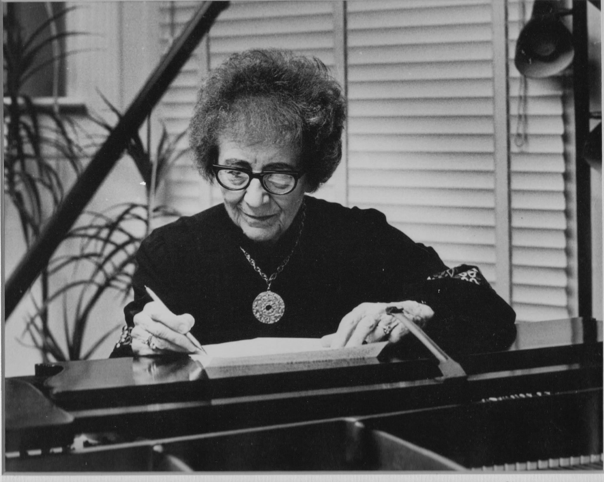
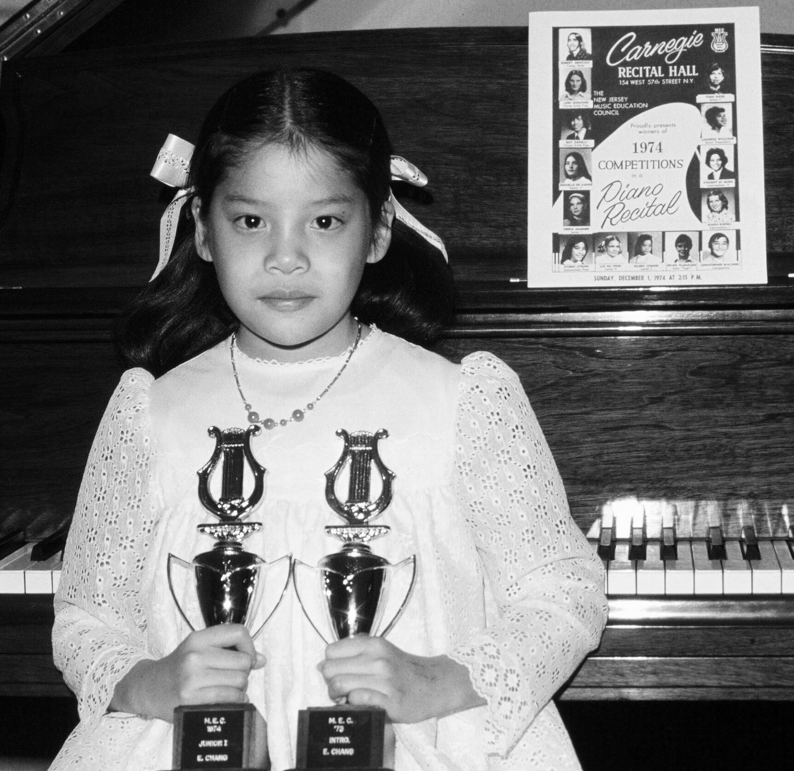
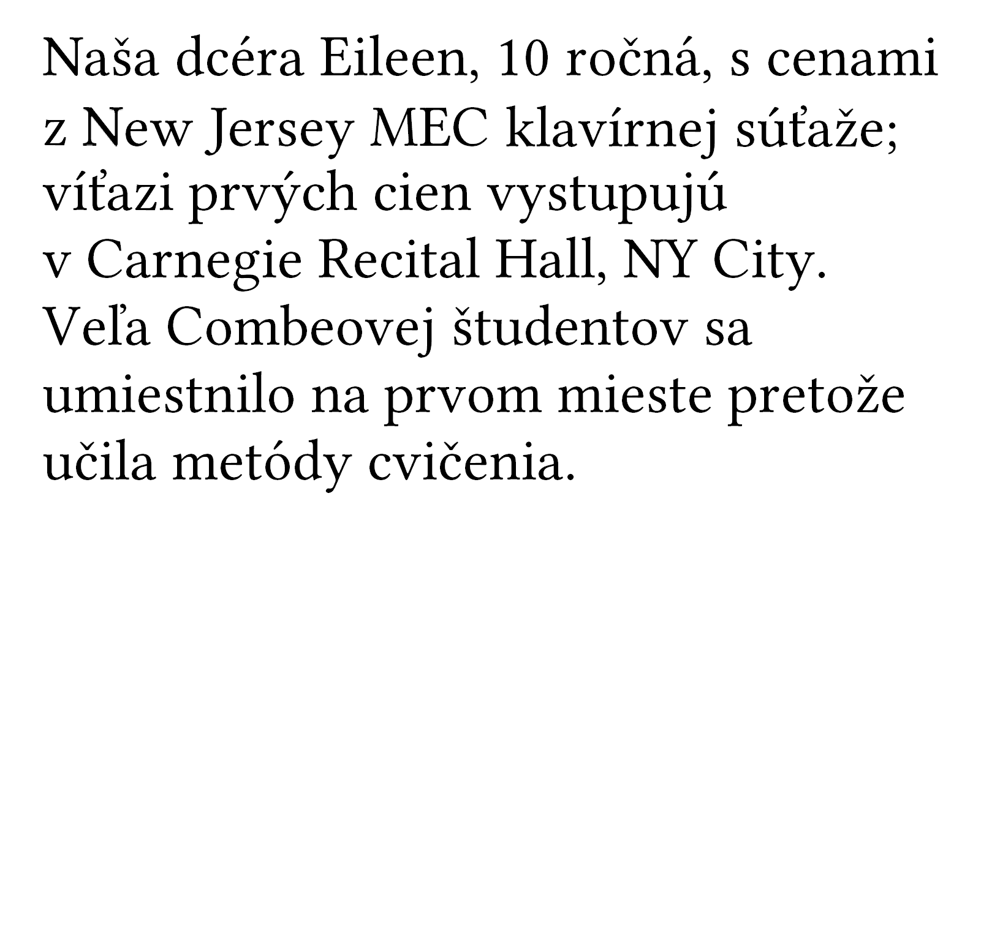
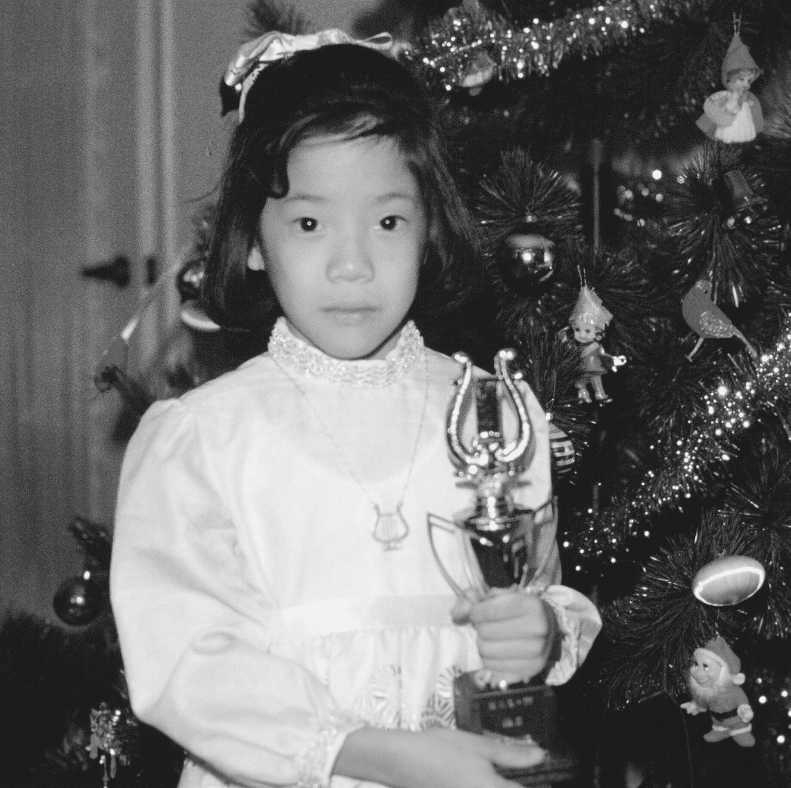
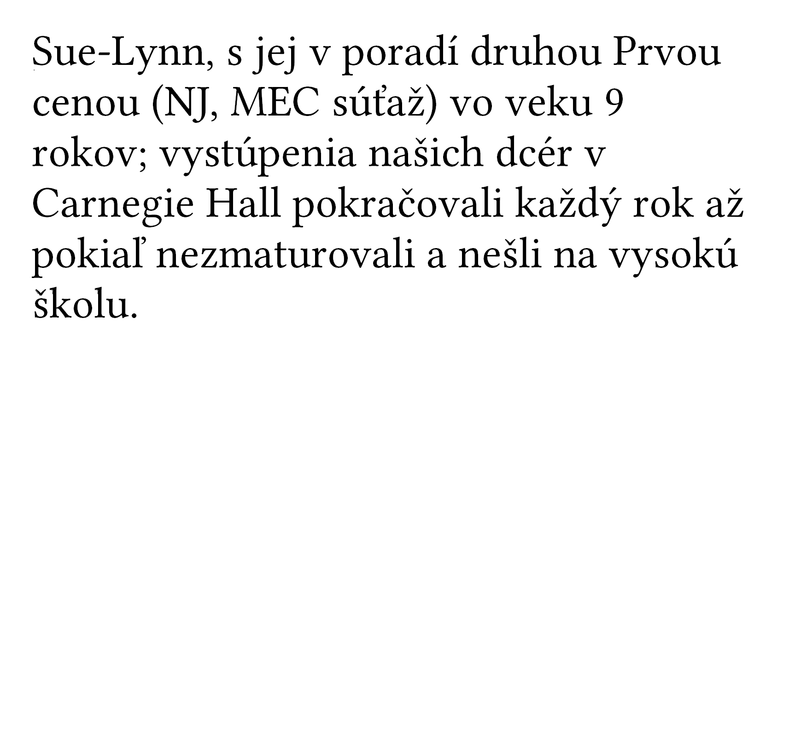
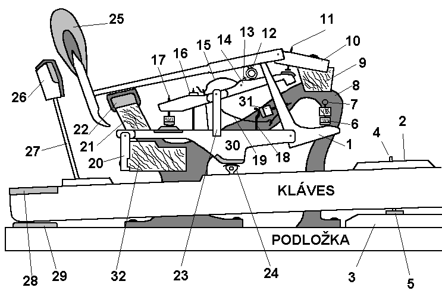

Základy cvičenia na klavíri\
Chuan C. Chang\
. vydanie\
\
M^lle^ Yvonne Combe\

**Prvé vydanie:** 1995, Colts Neck, NJ, USA\
http://members.aol.com/chang8828 (1999, ukončené v 2008)\
**Druhé vydanie:** 2009, Tampa, FL, USA, Booksurge (Amazon Publishing)\
ISBN 1-4196-7859-0, ISBN 13: 978-1419678592\
<http://www.pianopractice.org/>\
**Tretie vydanie:** Feb. 15, 2016, Tampa. FL, USA\
ISBN 13: 978-1523287222\
ISBN 10: 1523287225\
<http://www.pianopractice.org/>\
{width="6cm"} \
{width="6cm"} \

Mojej žene Merry,\
ktorá neúnavne pracovala, že som mohol napísať túto knihu\
a našim dcéram Eileen a Sue-Lynn,\
ktoré boli svedkami učení, ktoré učila Combe\
ich manželom Frankovi a Davidovi, ktorí pomohli s čítaním autorského textu.\

*Materiál prvej kapitoly pochádzal z mojich poznámok o tom, ako na sklonku života M^lle^ Yvonne Combe učila naše dcéry. M^lle^ Combe bola Debussyho žiačkou a pomáhala mu robiť transkripcie nových skladieb ako ich hral na klavíri. Hrala ten neuveriteľný koncert od Saint-Saëns so skladateľom, ktorý dirigoval. Všetci, ktorí sa zúčastnili sólových vystúpení jej študentov boli uchvátení. Bolo potrebné napísať túto knihu: bez nej by nás jej odchod pripravil o svetovú drahocennosť.*

Kapitola I: Cvičebné metódy na klavíri\
Kapitola II: Klavírne témy\
Kapitola III: Kúpa klavíra, ladenie\
(Chromatická stupnica, Kvintový kruh, temperovanie)\
Odkazy na literatúru\
Recenzie klavírnej literatúry\
[Ohlasy na knihu](http://www.pianopractice.org/testimonials.pdf) Copyright © 2016, kopírovanie povolené\
ak je autorstvo, Chuan C. Chang, zahrnuté\
Celú knihu možno zadarmo stiahnuť na:\
<http://www.pianopractice.org/>\
Translation ©  Ladislav Rado\
<http://rsw.sk/piano/zaklady-cvicenia-na-klaviri/>

Skratky {#skratky .unnumbered}
-------

AS = absolútny sluch,\
RT = rovnomerné temperovanie,\
PVP = pozícia vystretých prstov,\
FI = Fantaisie Impromptu od Chopina, Op. 66,

\
DRH = degradácia rýchleho hrania,\
RP = rotácia predlaktia,\
RZ = ruky zvlášť,\
RS = ruky spolu,\
K-II = Kirnberger II temperovanie,\
ĽR = ľavá ruka HM = hranie v mysli,\
RJ = rast jadra,\
ZPC = zlepšenie po cvičení,\
PS = paralelné sady,\
PR = pravá ruka\
RS = relatívny sluch,\
RM = rýchlostný múr,\
PC = "palec cez" - Thumb Over,\
PP = "palec pod" - Thumb Under,\
WT = Well Temperament,

Kľúčové slová {#kľúčové-slová .unnumbered}
-------------

pohyb vozíka,\
skrútená pozícia,\
rozdelenie prsov,\
glissandový pohyb,\
intuitívna metóda,\
načrtávanie,\
pivotovanie,\
pyramídová pozícia,\
štvorica,\
tiché prsty,\
tiché ruky,\
pozícia pavúka,

Predslov {#predslov .unnumbered}
========

Táto kniha je zhustená, ale podrobná učebnica o tom, čo musíte vedieť, aby ste sa naučili hrať na klavíri čo najrýchlejšie ako je to možné. Nezačínate cvičeniami a lekciovými skladbami, pretože tieto priveľmi mrhajú časom; začnite tým, že sa naučíte to, čo chcete hrať, pretože väčšina ctižiadostivých klaviristov už vie, čo chcú hrať. V prípade, že to neviete, je tu kapitola o navrhovaných skladbách pre začiatočníkov \[\].

Chodil som na hodiny klavíra viac ako sedem rokov od veku desiatich rokov, cvičil som až osem hodín cez víkendy. Moje úspechy v živote a celoživotná obetavosť klavíru \[pozri \] mi dali všetky dôvody domnievať sa, že by som mal byť úspešný v hraní na klavíri. Aj keď som sa nakoniec stal korepetítorom zboru a organista v kostole, zápasil som s Beethovenovými sonátami -- ťažké pasáže zostali neprekonateľné bez ohľadu na to, ako dlho som cvičil. To nedávalo žiaden zmysel, pretože vo svete sú tisíce zdatných klaviristov -- **ako sa to všetci naučili?** Bolo mi povedané, že boli potrebné špeciálne talenty, a že vytrvalosť bola jediným spôsobom, ale ja som sa domnieval, že existujú učitelia, ktorí vedia, ako učiť. Tí dobrí učitelia museli napísať knihy. Tak som čítal knihy a všetci učili to isté: cvičte stupnice, arpeggiá, cvičenia, začnite s jednoduchými výukovými skladbami a podobne, čo som už robil. Dokonca aj publikované rozhovory so slávnymi klaviristami nedávali poňatie o tom, ako sa to naučili, s výnimkou nekonečného vychvaľovania ich výnimočných talentov, zrejmým samoúčelným prostriedkom so žiadnou pedagogickou hodnotou. Bola celoživotná, denná, úplná oddanosť klavíru s vylúčením všetkého ostatného jediným spôsobom ako?

Túto knihu som začal písať v roku 1978, keď som vzal svoju dcéru na hodinu klavíra s M^lle^ Yvonne Combe (pozri zadný obal knihy). Po niekoľkých rokoch lekcií, naše dve dcéry postupovali neuveriteľnou rýchlosťou, ktorú sme prisudzovali "výnimočnému hudobnému talentu". Počas tejto lekcie, učiteľka zobrala ošúchanú knihu so všetkými výukovými skladbami usporiadanými podľa zložitosti, aby si vybrala novú skladbu na štúdium. M^lle^ Combe povedala, "Vyber si ktorúkoľvek chceš!!!", a moja dcéra si pozrela celú knihu, čo by sa jej mohlo páčiť, ako Combe hrala výňatky z rôznych skladieb. Nemohol som si pomôcť, nezasiahnuť, aby som sa nespýtal "Nemala by zostať v rámci jej úrovne zdatnosti?" Učiteľka sa vediac usmiala s našou dcérou a povedala **"Zložitosť nie je náš problém, však?"** Bol som tak ohromený dôsledkami toho, čo povedala, že som sa rozhodol preskúmať túto učebnú metódu. Trvalo ďalších 15 rokov výskumu pre mňa si uvedomiť, že **metódy efektívneho cvičenia boli kľúčom k úspechu, nie talent!!**, a ďalších viac ako 10 rokov zhromaždiť materiál pre túto knihu. Základné princípy tejto knihy môžu byť zhrnuté na jednej strane \[\].

Prečítal som viac ako päťdesiat najpopulárnejších klavírnych kníh a recenzoval som ich tu, a tieto knihy ukazujú, že prakticky každá metóda učenia sa skladá z ukázania študentom, čo majú cvičiť, a aké druhy techník (behy, arpeggiá, legato, staccato, trilky, atď ), sú potrebné. **Je len málo inštrukcií o tom ako cvičiť, aby ich bolo možné hrať**, čo je väčšinou nechané na študenta a nekonečné opakovania. Tieto knihy ukazujú to ako učitelia učili, pretože boli napísané rešpektovanými učiteľmi.

Väčšina známych metód ako postupovať pri získavaní techniky bola zostavená v tejto knihe, pozri \[\]. Nové skladby sa rýchlo naučíte pomocou týchto metód, pretože existujú riešenia každého technického problému a predtým "nemožné" skladby budú na dosah. Rozdiel v rýchlosti učenia medzi prístupmi založenými na efektívnych metódach cvičenia a inými môže byť rozdielom medzi odmeňujúcou hudobnou skúsenosťou v priebehu niekoľkých mesiacov a *celoživotnými* cvičeniami, lekciovými skladbami, malým pokrokom a ničím s čím by sa dalo vystupovať. Takisto som skúmal stovky internetových zdrojov a viac ako päťdesiat \[\] a **zahrnul do tejto knihy akékoľvek poznatky o cvičebných metódach zo všetkých týchto zdrojov do tejto knihy**. Knihy s významnými užitočnými informáciami boli označené ako "musíte si prečítať" v recenziách \[\].

Ako vedec, som vedel, že organizovať materiál do logickej, vedecky podloženej ​​štruktúry bol jediný spôsob, ako napísať užitočný návod, ktorý neobsahoval fatálne nedostatky, ako nepravdivé vyhlásenia, ktoré sa nachádzali vo väčšine klavírnej literatúry. Moja kariéra výskumného vedca bola kritická pre vytvorenie tejto knihy a spolu s čo najkompletnejším venovaním sa metódam cvičebných metód ju odlišuje od každej inej knihy, ktorá sa venuje klavíru; pozri , a . Eliminovaním niektorých široko prijímaných metód cvičenia založených na nesprávnych predpokladoch ušetrí veľa času nie len pre naučenie sa hrania na klavíri, ale tiež naďalej sa venovať výuke potrebnej k vedeniu v súčasnom svete, alebo dokonca mať samostatnú kariéru. **Vyššie vzdelanie je *nevyhnutné* pre porozumenie a vyučovanie klavíra!** Stal som sa presvedčený potenciálom tejto knihy, že pomôže študentom a učiteľom a od roku 1999 som ju zadarmo poskytol na stiahnutie na internete --- nemôžete dať cenovku na schopnosť dieťaťa tvoriť hudbu.

Nie som pôvodcom väčšiny zo základných myšlienok tejto knihy. Boli vynájdené a znovuvynájdené veľa ráz za 200 rokov od čias Bacha, každým úspešným klaviristom; inak by oni nemali taký úspech. Začal som písať túto knihu na základe učení Combe, učiteľky našich dvoch dcér, ktoré sa stali vynikajúcimi klaviristkami; vyhrali množstvo prvých cien v klavírnych súťažiach a priemerne ročne hrali viac ako 10 sólových vystúpení po dobu asi desiatich rokov; obe majú absolútny sluch, a majú teraz radosť zo skladania hudby, a majú kariéry v počítačovom obore.

Príliš veľa študentov strávi 100% svojho času učením sa nových skladieb, a pretože tento proces trvá tak dlho, nezvýši čas na cvičenie umenia robenia hudby alebo akúkoľvek inú vzdelávaciu činnosť. Cieľom tejto knihy je, urobiť proces učenia taký rýchly, aby sme mohli prideliť 10% času cvičenia na technickú prácu a 90% na robenie hudby, cieľ, ktorý mi ako prvá formulovala Combe.

Vek cvičenia (1900-2000), symbolizovaný denným cvičením Hanona a Cortotovej hnihy ([Cortot, Alfred](#r:cortot)) je teraz za nami pretože vieme o oveľa, oveľa lepších metódach pre rozvoj techniky. Doba kedy "Toto nemôžeš hrať to po dobu desiatich rokov, pretože je to príliš ťažké" sa tiež skončila, aj keď tento postoj je tak hlboko zakorenený medzi staršími učiteľmi, že bude trvať mnoho rokov na to, aby sa to zmenilo, kým väčšina učiteľov neprijme metódy efektívneho cvičenia.

Neuvedomil som si, ako revolučné metódy v tejto knihe boli, až pokiaľ som nedokončil svoje prvé vydanie knihy v roku 1995. Tieto metódy boli oveľa lepšie, než to, čo som používal predtým a po celé roky, som ich používal s dobrými výsledkami. Svoje prvé prebudenie som zažil po dokončení tejto knihy, keď som naozaj čítal moju knihu a nasledoval metódy systematicky -- a zažil ich neuveriteľnú účinnosť. Takže aký bol rozdiel medzi vedomosťami častí metódy a čítaním knihy? Pri písaní knihy som musel vziať rôzne časti a usporiadať ich do organizovanej štruktúry, ktorá slúžila na konkrétny účel, a ktorá by nemala žiadne chýbajúce nevyhnutné zložky alebo fatálne chyby. Bolo to, ako keby som mal väčšinu častí auta, ale bez mechanika, ktorý by ich poskladal, našiel chýbajúce časti a vyladil to, by tie časti neboli príliš dobré na prepravovanie. To je hlavná výhoda kníh: všetko možno starostlivo premyslieť a zorganizovať; na nič sa nezabudne. Učiteľ, ktorý vyučuje študenta v reálnom čase, nemá tento luxus; Vždy som si pamätal dôležité veci, ktoré som mal učiť (vo vede, klavíri atď.) *po skončení lekcií*. Bez dobrej učebnice je nemožné vyjadriť informáciu z dobrej knihy na hodinách trvajúcich len niekoľko hodín týždenne.

Učitelia sú lepší ako knihy, pretože môžu prispôsobiť svoje učenie, aby pasovalo na každého študenta, ale dobré knihy môžu poskytnúť viac informácií, než akýkoľvek výborný učiteľ môže dúfať, že vie, sú vždy k dispozícii všetkým, a stoja menej. Všetci súhlasia s tým, že najlepší systém je dobrý učiteľ s dobrými knihami, ako sa praktizuje na všetkých školách a univerzitách. Dokážete si predstaviť svoju školu alebo vysokoškolskú výučbu bez učebnice? Výučba klavíra uviazla bez skutočných učebníc tak dlho, pretože bola založená na talente namiesto vedomostí. Kde by naša civilizácia bola dnes, ak by všetky inštitúcie boli založené na študentskom talente namiesto vedomostí, kde každý študent musel znovu objaviť algebru, vedu, históriu, atď., na vlastnú päsť, bez kníh a iba s pamäťou učiteľa ako zdrojom informácií?

**Táto kniha nie je dogmatický súbor pravidiel cvičenia;** Ide o súbor nástrojov na riešenie technických problémov. To umožňuje študentom vytvárať svoje *vlastné* cvičebné rutiny, pretože každý jedinec je iný. Je to o raste do nezávislých, sebestačných, dospelých jedincov a hudobníkov, ktorí riadia vlastnú budúcnosť, namiesto študentov ktorí čakajú na pokyny.

Hudba, schopnosť zapamätať si veľký repertoár, a IQ sú prepojené. Táto kniha pojednáva o tomto prepojení, pozri \[\]. Učenie hrať na klavíri môže znížiť IQ (bezduchým opakovaním cvičení a pestovaním lenivého mozgu), alebo zvýšiť IQ tým, že sa učí ako si zapamätať, konverzovaním s najväčšími géniami, ktorý kedy žili pomocou ich hudby, zvýšením mozgovej vytrvalosti a rýchlosti, a naučením sa štyroch **"geniálnych zručností"**: **metódy efektívneho cvičenia** (táto kniha), **hranie v mysli** \[\], **absolútny sluch** \[\], a **hranie podľa sluchu** \[\], **ktoré sa môžeme všetci naučiť.** Je prekvapujúce, že väčšina učiteľov nikdy neučil väčšinu z nich - teda divu, že genialita bola taká rarita.

Aby sme pochopili teóriu hudby a učenie sa na klavíri, je užitočné pochopiť a ladenie klavíra \[\] Chromatická stupnica, ku ktorej sme sa všetci pripútaní, a pre ktorú neexistuje lepšia alternatíva je nedokonalá; intervaly nie sú dokonalé harmónie. To vyžadovalo vytváranie temperovaní, ktoré sú rôznymi ladeniami, ktoré rozprestrú tieto nedostatky, napríklad do stupníc, ktoré sa používajú menej často \[\]. Je nutné pre klaviristu, aby vedel aké tieto nedostatky sú a ich vplyv na schopnosť produkovať hudbu. Je potrebné tieto typy znalostí inteligentne komunikovať s klavírnym ladičom. Každý ladič je dôverne oboznámený s týmito témami, ale dostávajú sa do neuveriteľných problémov, keď ich zákazníci nie sú dostatočne informovaní. Výsledkom je, že ladiči sa rozhodnú, čo je najlepšie pre klaviristu. Bach a Beethoven používali špecifické temperovanie a niektoré temperovania sú problematické s Chopinovou hudbou. Dnes môžete zmeniť temperovanie prepínačom na digitálnom klavíri a zažiť neuveriteľnú zvučnosť Beethovenovej Waldstein alebo počuť farbu tóniny v Bachovom Temperovanom klavíri, veci, ktoré sú nemožné dokonca aj na najdrahšom koncertnom krídle naladenom na štandardné rovnomerné temperovanie.

Táto kniha je len začiatok; ďalší výskum odhalí lepšie metódy cvičenia s neobmedzenými možnosťami. V súčasnej dobe sú všetky deti testované na sluch, akonáhle sa narodia; zajtra, rodičia, ktorí chcú mať hudobné deti ich budú učiť absolútny sluch skôr, než sa naučia abecedu, pozri , .

Nebojte sa, ak zistíte že niekoľkokrát čítate rovnaké úseky; to je normálne, pretože hustota informácii je vysoká. Dnešní klaviristi sa môžu naučiť toľko zručností tak rýchlo, že **ani najväčší "vrodený talent", si nemôže dúfať súťažiť so správne vzdelaným klaviristom.**

**Poďakovania:** Musím poďakovať pánovi Dr. Robert B. Marcus, môjmu nadriadenému v Bell Laboratories, Murray Hill, NJ, ktorý nás predstavil M^lle^ Yvonne Combe. Tiež dobrovoľníkom, z ktorých niektorí strávili čas v priebehu rokov prekladaním mojej knihy a mnoho jednotlivcom, ktorí poslali veľa užitočných pripomienok.

Tu sú poučné [Referencie;](http://www.pianopractice.org/testimonials.pdf) čo si učitelia myslia o tejto knihe ako to ovplyvnilo každého klaviristu. Na tom, čo *čitatelia* hovoria záleží.

Základné metódy cvičenia {#s:basic-methods}
========================

Cvičebné rutiny, intuitívna metóda {#s:practice-routines}
----------------------------------

Mnoho študentov použije nasledujúcu **cvičebnú rutinu**:

1.  Cvičte stupnice alebo technické cvičenia pokiaľ prsty nie sú rozhýbané. Pokračujte v tomto po dobu 30 minút alebo dlhšie, ak máte čas, aby sa zlepšila technika, najmä pomocou cvičení napríklad od Hanona. Toto je ten čas, kedy možete skutočne veľmi pracovať na tom, aby ste si mohli posilniť prsty.

2.  Potom si zoberte novú skladbu a pomaly z nej prečítajte jednu alebo dve stránky, opatrne hrajte oboma rukami spolu od jej začiatku. Toto pomalé hranie je opakované, pokiaľ skladba nebude môcť byť zahraná primerane dobre, a potom je postupne zrýchľovaná, kým nie je dosiahnutá konečná rýchlosť. Pre toto postupné zrýchľovanie môže byť použitý metronóm.

3.  Na konci dvojhodinového cvičenia prsty lietajú, takže študenti môžu hrať tak rýchlo, ako chcú a môžu si vychutnať zážitok z hrania pred skončením. Koniec koncov, sú unavení z cvičenia, a aby si mohli odpočinúť, hrajú ich obľúbené skladby v plnej rýchlosti; toto je ten čas, aby si užívali hudbu!

4.  Akonáhle môže byť nová skladba zahraná uspokojivo, zapamätajte si ju a cvičte ju pokiaľ sa "hudba nedostane do prstov"; toto je spôsob, akým sa ju naučíte naspamäť.

5.  V deň vystúpenia alebo hodiny klavíra hrajte skladbu správnou rýchlosťou (alebo rýchlejšie!) toľkokrát, koľkokrát je možné, aby ste sa uistili, že je v najlepšom stave. Toto je posledná šanca; samozrejme, je zrejmé že, čím viac cvičenia, tým lepšie.

Každý krok tohto postupu vytvára problémy, je založený na falošnej viere a obmedzí napredovanie po stredne pokročilú úroveň, aj keď budú študenti cvičiť niekoľko hodín denne. Táto metóda nehovorí študentom nič o tom, čo robiť, keď narazili na beznádejnú pasáž okrem toho, aby neustále opakovali, niekedy aj po celý život, so žiadnou predstavou o tom, kedy a ako získajú nevyhnutnú techniku. Učiteľ, ktorý ani nevie hrať na klavíri môže učiť túto metódu! Necháva úlohu toho, ako získať techniku na ​​študenta -- metóda nič neučí. Okrem toho bude vytvorená hudba plytká počas hrania na vystúpení a neočakávaným ponižujúcim chybám sa takmer nebude dať vyhnúť, ako je vysvetlené v tejto knihe. Všetky tieto problémy sú riešené pomocou **"efektívnych metód cvičenia"**.

Cvičebná rutina uvedená vyššie vyzerá intuitívne logická. Hoci ľudská intuícia nám pomáha riešiť jednoduché problémy, pokiaľ ide o zložitý problém, ako je učenie sa hrať na klavíri, intuícia nemôže konkurovať **učebným trikom**, ktoré v minulosti objavili géniovia.

Bez týchto učebných trikov študenti uviaznu v tom, čo budeme nazývať **"intuitívne metódy"**, ktoré nie sú založené na najefektívnejších metódach cvičenia. "Talentovaní" študenti, ako sa ukazuje, majú učiteľov ako bola Combe, ktorí vedia niektoré z efektívnych metód, alebo ich objavili počas života a vedia ich naučiť neuveriteľne rýchlo. Akýkoľvek študent môže napredovať rovnako rýchlo, ak je na to učebnica obsahujúca všetky známe metódy cvičenia. Aj napriek tomu že "intuícia" zvyčajne znamená niečo dobré, ja som vybral "intuitívne metódy" na označenie starých, spochybnených učebných metód, pretože najlepšie metódy sú zväčša protiintuitívne, ako uvidíme.

Existuje nespočetné množstvo kníh o klavíri \[\]; všetky učia to, čo by ste mali naučiť hrať, ako sú stupnice, trilky, Mozartovu sonátu, atď., ale zriedkakedy učia, ako získať techniku, aby ste ich mohli hrať. Táto kniha je kompiláciou cvičebných metód s vysvetlením, prečo niektoré cvičebné metódy fungujú, zatiaľ čo iné nie. Bez vysvetlenia, neexistuje žiadny spôsob, ako zistiť, či je metóda funguje, alebo nie. Len preto, že učiteľ používa metódu 30 rokov nie je platným vysvetlením, pretože mnoho z nich sa ukázalo byť ako zlé. Učebnice oslobodia učiteľov od nutnosti učiť mechaniku toho ako cvičiť a umožnia im sa sústrediť sa na hudbu, to kde sú učitelia najviac potrební.

Klavírni učitelia vedia, že študenti musia cvičiť hudobne za účelom získania techniky. Obe muzikálnosť aj technika vyžadujú presnosť a kontrolu. Prakticky všetky technické nedostatky môžu byť odhalené v hudbe. Avšak mnoho študentov má tendenciu cvičiť tak, že zanedbávajú hudbu a radšej "pracujú", keď nie je okolo nikto, kto počúva. Takéto metódy cvičenia vytvárajú "šatníkových klaviristov\", ktorí radi hrajú, ale nemôžu vystupovať. \[\].

Použitím efektívnych metód cvičenia sa môžete naučiť za menej ako päť rokov to, čo by ste *mohli* dosiahnuť za päťdesiat rokov zápasenia sami pomocou (intuitívneho) prístupu "cvičiť, cvičiť, cvičiť". Táto kniha netvrdí, že vás transformuje na Mozartov, Beethovenov alebo Chopinov, hoci to nie je možné vylúčiť. Tvrdí len to, že sa môžete naučiť hrať ich hudbu s ľahkosťou.

Výška lavice, vzdialenosť od klavíra, držanie tela
--------------------------------------------------

**Výška lavice** by mala byť nastavená tak, aby boli lakte mierne pod úrovňou klávesov, kedy horné ramená visia rovno nadol s rukami na klávesnici v hracej pozícii. Seďte sa na prednej polovici lavice, nie v jej strede a v takej **vzdialenosti od klavíra**, že telo nie je v rozpore s lakťami, keď sa pohybujú smerom k sebe pred hrudníkom. Pre začiatočníkov nebudú lavice s pevnou výškou problematické, pretože sa môžu prispôsobiť určitému rozsahu výšky.

Nízka výška lavice má tú výhodu, že uľahčuje zdvihnúť prsty, najmä 4. prst, a to môže dovoliť rovnejšie zápästie, čím sa zníži pravdepodobnosť dostať syndróm karpálneho tunela. Ramená budú bližšie ku klávesom, čo poskytne väčší dosah a hlava bude bližšie ku klávesom, čo poskytne viac intímneho pocitu z klávesov. To tiež uľahčuje sedieť s rovnou chrbticou a sedieť ďalej od klavíra, ktorý poskytuje viac priestoru lakťom. Sedieť nižšie je kompatibilné s mnohými technikami, ako je \[\], alebo pozícií s vystretými prstami \[\], atď. Umožňuje to tiež použitie otáčania predlaktia, aby sa zápästie otáčalo rýchlo.

**Držanie tela** je dôležité: vysoká poloha môže spôsobiť hráčom chrbtu zhrbiť sa, takže musí tu byť vedomé úsilie sedieť rovno. Maséri vedia, že krivá chrbtica, s hlavou nakláňajúcou sa dopredu, môže spôsobiť dlhodobé problémy z napätia.

Vysoká pozícia uľahčuje predkloniť sa a vyvíjať tlak smerom nadol ramenami pre hlasné pasáže. To môže tiež uľahčiť, aby sa zabránilo "kolapsu rúk" (KR), čo je kontroverzná téma, pretože rôzne druhy KR neboli jasne definované, aj keď téma KR je prominentne diskutovaná v niekoľkých knihách.

Bez ohľadu na výhody/nevýhody pre rôzne výšky lavice, tieto môžu byť kompenzované úpravou polohy zápästia. Okrem toho, každý človek má rôzne pomery dĺžok chrbtice, hornej časti paže, atď., takže výška lavice je zvyčajne osobnou voľbou.

Výška lavice sa stáva dôležitou pre pokročilých klaviristov; teda najlepší čas vyskúšať optimálnu výšku je na pokročilej úrovni. Je viac činiteľov, pre ktoré uprednostňujú spodnú polohu tak, že optimálna poloha je pravdepodobne jeden až dva palce s lakťami pod klávesnicou. Väčšina komerčných nenastaviteľných lavíc je príliš vysoká o niekoľko palcov. Nastaviteľné lavice sú vysoko odporúčané.

Väčšina učiteľov a kníh a odporúča sedenie s lakťami na úrovni kláves a niektoré, najmä tie staršie, odporúčajú vyššiu pozíciu. Mnoho koncertných klaviristov sedí vysoko. Väčšina z nich pravdepodobne mala učiteľov, ktorí uprednostnili vysokú pozíciu, a oni si na to zvykli. Nižšia pozícia je tu odporúčaná, pretože má viac výhod.

Začínanie skladby {#s:starting-piece}
-----------------

Naučte sa iba hudbu s ktorou možno vystupovať. Časy "rokov cvičenia a skladieb ako lekcií pre technický rozvoj" sú preč. Začnite hneď zostavovať repertoár; zoznam skvelej hudby, ktorý obsahuje technické lekcie je efektívne nekonečný, nepotrebujete nič iné! Nikdy nie je príliš skoro začať trénovať na vystúpenie; nie je nikdy príliš skoro na to robiť hudbu. Jednou z najviac škodlivých pripomienok, ktorú som počul je, že deti sú príliš mladé na Chopina. Potom je tu detská hudba pre najmenších: detská hudba existuje len v mysliach dospelých. Deti akéhokoľvek veku môžu oceniť dobrú hudbu a vytvárať ju; nie je jediný dôvod, prečo by sa deti mali brzdiť.

Samozrejme, začiatočníci potrebujú [Začiatočnícke knihy](#r:beginner-books): (Humphries, Beyer, Thompson, Faber & Faber, atď.), aby sa naučili potrebné konvencie a základnú hudobnú teóriu. Nie je potrebné prejsť každú stránku, stačí vyzdvihnúť tie prvky, ktoré sú pre vás nové. S metódami tréningu tejto knihy môže študent začať so hudbou určenou na vystupovanie, ktorá môže predstavovať výzvy, ale tieto výzvy sú práve to, čo je potrebné sa naučiť, aby vedel používať tieto metódy. Preto knihy cvičení/lekcií ako Hanon, Czerny, Cramer-Bülow, Dohnányi, Cortot, atď., sú zastarané. Existuje mnoho klaviristov, ktorí boli vychovaní na takých cvičeniach, ktorí ich stále používajú a učia a určite nie sú bezcenné, ale existujú lepšie metódy. Je veľa ľahkej štartovacej hudby, ktorá je vhodná na predstavenia, ako napríklad knižka Magdaleny Bachovej pozri [Easy Bach](#r:easy-bach). Čo je najdôležitejšie, vyberte si hudbu, ktorá sa vám páči. Vyberieme si Beethovenovu Für Elise ([Sheet Music](#r:sheet-music)), aby sme ilustrovali metódy cvičenia.

Počúvajte nahrávky skladieb, ktoré sa rozhodnete naučiť. Toto je najrýchlejší spôsob sa naučiť muzikálnosť a zlepšiť si techniku. Je to skvelý spôsob, ako získať hudobné myšlienky a preskúmať nový materiál. Vypočujte si niekoľko nahrávok hraných rovnakou rýchlosťou. Váš učiteľ by ich mal zahrať a ukázať vám to; je lepšie mať učiteľa, ktorý vie hrať vaše skladby.

Ďalej, analyzujte štruktúru skladby a odhadnite čas potrebný na naučenie sa skladby -- toto sú nevyhnutné časti riadenia projektu ; pokročilí klaviristi sa stanú expertmi v riadení projektu. Ak nedokážete odhadnúť čas potrebný na dokončenie, znamená to že nepoznáte všetky metódy na to, aby ste sa naučili skladbu. Samozrejme, odhad bude nesprávny, ale cvičenie odhadovania vás učí to, ktoré metódy cvičenia potrebujete. Bez odhadu je šanca, že nikdy nedokončíte nacvičenie; na druhú stranu žiadna hudba nie je nikdy nacvičená, takže ako viete že ste ju nacvičili? Vystúpenie! Akonáhle je úspešne zahraná na predstavení, je jej nacvičenie ukončené.

**Analýzu začnite očíslovaním taktov.** Ak nie sú čísla taktov označené, označte každý desiaty ceruzkou, nad stredom taktu. Ja počítam aj čiastočný takt ako prvý; iní počítajú iba úplné takty, ale to vytvára zvláštnosť pri identifikovaní prvého čiastočného taktu.

Vo Für Elise sa prvé 4 úplné takty v podstate opakujú 15 krát, takže naučením sa 4 taktov môžete hrať 50% skladby (má 124 úplných taktov). Ďalších 6 taktov sa opakuje 4 krát, takže naučením sa iba 10 taktov umožňuje hrať 70% skladby. Pomocou metód tejto knihy, sa môžte 70% z tejto skladby naučiť za menej ako 30 minút, pretože tieto takty sú pomerne jednoduché. Medzi týmito opakovanými taktami, existujú dve prerušenia, ktoré sú ťažké. Študent s jedným až dvoma rokmi výučby by mal byť schopný naučiť sa požadovaných 50 rôznych taktov tejto skladby za 2 - 5 dní a byť schopný hrať celú skladbu v rýchlosti spamäti počas 1 až 2 týždňov. Po tom je učiteľ pripravený k práci so študentom na hudobnom obsahu kompozície; ako dlho to potrvá bude závislé na hudobnej úrovni študenta. My sa teraz budeme zaoberať technickými problémami ťažkých úsekov.

Skrútené a ploché pozície prstov, paralýza zo skrútenia {#s:curled-positions}
-------------------------------------------------------

**Skrútená pozícia** bola definovaná v literatúre ako "uvoľnenená" prirodzená poloha prstov, keď ruky visia nadol pozdĺž tela. Toto platí pre klaviristov, ktorí hrajú niekoľko rokov, ale ako dvojročné dieťa, golfista, alebo plavec, ktorý nikdy nehral na klavíri, by mohol mať zvesené ruky v ľubovoľnej polohe. Aby sme správne definovali skrútenú pozíciu, umiestnite obe ruky na vrch stola, asi tridsať centimetrov od seba, dlaňou nadol. Prsty ruky tvoria kupolu, ako keby ste držali mäkké loptičky, s končekmi prstov dotýkajúcimi sa stola. Nechty pravého a ľavého palca by mali smerovať na ľavú resp. pravé rameno. To je východisková pozícia pre prsty a nazýva sa skrútená pozícia, pretože prsty sú skrútené nad pomyselnou guľou.

Výhody skrútenej pozície spočívajú v tom, že: poskytuje pevnú kontrolu nad každým prstom, uľahčuje hranie medzi čiernymi klávesami a zarovnáva prsty v blízkosti priamky tak, aby všetky klávesy boli hrané približne v rovnakej vzdialenosti od ich stredovej osi \[\]. Tí s dlhými prstami zistia, že je potrebné stočiť prsty 2-4 viac, aby mohli hrať palcom. Nevýhody sú: (1) hráte s končekmi prstov, ktoré sú ľahko zraniteľné a neposkytujú dostatočne mäkkú podušku pre lepšie ovládanie dotyku alebo hranie a ; dva typy poranenia prstu môže dôjsť so skrútenou pozíciou, pozri , (2) úder nadol vyžaduje presné riadenie zložitých sád svalov, (3), je ľahké nezahrať správne čierne klávesy, pretože plocha v oblasti konca prsta je malá, a (4), to že trpí **paralýzou zo skrútenia**

Na demonštrovanie paralýzy zo skrútenia, natiahnite ľubovoľný prst (okrem palca) rovno von a hýbte ním hore a dole, ako keby ste stláčali klávesy. Potom postupne skrúcajte prst pri zachovaní rovnakého pohybu ako predtým. Všimnite si, že maximálne hýbanie klesá so zvyšujúcim sa skrútením: paralýza sa zvyšuje so skrútením.

Jedna neobvyklá pozícia je **"poskladaná" pozícia**, v ktorej je posledný článok prsta (nechtový článok) ohnutý smerom von, namiesto "normálnej" rovnej alebo mierne skrútenej. Neexistuje žiadny dôkaz toho, že táto pozícia je škodlivá, a má tú výhodu, že sa hrá viac s prednou poduškou prsta. Okrem toho sval k tomuto článku prsta môže byť uvoľnený, pretože šľachy prirodzene obmedzujú vonkajší pohyb, čím sa zjednodušia pohyby prstov a zvyšuje sa . Hoci sa niektorým učiteľom hnusí táto pozícia, pretože to vyzerá neprirodzene, nie je žiadny známy dôvod, prečo je to zlé a má to svoje výhody. Snažením sa "opraviť" túto pozíciu sa môžu vytvoriť hrozné problémy.

Skrútenú pozíciu sa musíte naučiť, najmä začiatočníci, ale existuje veľa ďalších pozícií, ktoré treba študovať. Každý klavirista má svoju vlastnú prirodzenú pozíciu, takže nútiť každého študenta, aby prijal jednotnú "štandardnú" skrútenú pozíciu, je častý omyl starších vyučovacích metód, ktoré môžu výrazne spomaliť napredovanie študenta.

Ak sa hrajú obe čierne a biele klávesy, čierne klávesy by mali byť hrané s menším skrútením, pretože sú vyššie. Budeme volať rodinu neskrútených pozícií **pozície vystretých prstov (PVP)**- viď [Prokop](#r:prokop), strany 13-15 kde sú fotky.

Chopinovo legato je zdokumentované ako obzvlášť zvláštne, rovnako ako jeho staccato. Súvisí jeho staccato s PVP? Všimnite si, že všetky PVP využívajú pružinový efekt uvoľneného tretieho článku prsta, čo by mohlo byť užitočné pri hraní staccata.

Je ľahšie hrať PVP, keď je lavica nižšie. Existuje veľa dôkazov klaviristov, ktorí zistili, že môžu hrať lepšie s nižšou výškou lavice (Horowitz a Glenn Gould). Tvrdia, že majú lepšiu kontrolu, najmä pokiaľ ide o pianissimo a rýchlosť.

Nerobte si starosti, ak nemôžete využiť všetky tieto polohy. Použite tie, ktoré sú pre vás pohodlné a prirodzené. Účelom týchto diskusií je upozorniť učiteľov, aby nenútili každého študenta používať jednu idealizovanú skrútenú pozíciu, pretože by to mohlo spôsobiť problémy. Každá ruka je iná a každá pozícia má výhody a nevýhody, ktoré závisia viac od osoby ako od polohy.

Stručne povedané, Horowitz mal dobré dôvody na to, aby mohol hrať s plochými prstami, a vyššie uvedené pojednanie naznačuje, že časť jeho vyššej technickej úrovne sa mohla dosiahnuť viac použitím PVP ako iných, a nízkym sedením. Aj keď je skrútená poloha nevyhnutná, tvrdenie "potrebujete skrútenú pozíciu na technicky náročný materiál" je zavádzajúce -- to, čo potrebujeme sú pružné prsty. Hra s PVP nás oslobodzuje od používania mnohých užitočných a všestranných polôh prstov. Teraz už vieme, ako hrať na všetky čierne klávesy, najmä arpeggia, a nevynechať ani jednu notu. Ďakujem Johann, Frederic, Franz, Vladimir, Yvonne (Combe)!

Čítanie, prstoklad {#s:reading-fingering}
------------------

Začiatočníci, ktorí nevedia nič o čítaní nôt, prstokladoch alebo o tom, ako začať sa učiť hrať na klavíri by mali používať [Začiatočnícke knihy](#r:beginner-books), kde môžu nájsť začiatočnícke informácie vrátane prstokladov (Beyer vám nepovie, že 1. prst je palec a 5. malíček). Tu sú prstoklady pre stupnice a arpeggiá: ; mali by byť cvičené dovtedy, kým sa nestanú automatickými návykmi. Od palca sa zriedka vyžaduje, aby hral na čiernych klávesách, pretože to kladie ďalšie prsty príliš blízko k doske zakrývajúcej klaviatúru.

**Taktové označenie** na začiatku každej kompozície vyzerá ako zlomok, ktorý pozostáva z čitateľa a menovateľa. Čitateľ udáva počet úderov na takt a menovateľ označuje notu na úder. Napríklad, 3/4 znamená, že existujú tri údery na takt a každý úder je štvrťová nota. Znalosť taktu je zásadná ak niekoho sprevádzate alebo ak hráte v skupine, pretože okamih keď sprievod začína je určený začiatočným úderom, ktorý dirigent udá paličkou. Tento rytmus je uvedený v notovom zázname - často to nie je prvá doba taktu! **Predznamenanie** označuje tóninu, v ktorej je hudba napísaná a nachádza sa pred taktovým označením. Označuje umiestnenie na krížikov a béčok.

Nemusíte chodiť na rozšírené lekcie čítania nôt aby ste sa učili všetky hudobné zápisy, pretože si o mesiace neskôr na ne nespomeniete. Učte sa ako čítať noty tak ako na ne natrafíte pri učení sa nových skladieb alebo keď cvičíte stupnice a arpeggiá. Učitelia musia dať do rovnováhy schopnosti študentov medzi čítaním a zapamätaním, ktorému sa venujeme v kapitole .

Najdôležitejším pravidlom pre prstoklad je, že pre rovnaké alebo podobné pasáže, vždy používajte rovnaký prstoklad. Zmena prstokladu potom, čo ste sa čiastočne naučili úsek je zásadné rozhodnutie, pretože zbaviť sa starých návykov a vytváranie nových vyžaduje veľa práce. Počas vystúpenia sa staré návyky môžu náhle objaviť a vyústiť k zle zahraným notám.

Štandardné prstoklady nie sú vo všeobecnosti uvedené v notovom zápise a nie vždy fungujú v závislosti na tých notách, čo prichádzajú pred a po, v takom prípade budete potrebovať neštandardné prstoklady; tieto sú vo všeobecnosti uvedené vo väčšine notových zápisov- Aj keď niektoré alternatívne prstoklady sa môžu zdať na prvý pohľad čudné, zistíte, že sú potrebné, keď sa dostanete na vyššiu rýchlosť a pri hraním rukami spolu.

Pre **Für Elise**, sa pozrite na vydanie, ktoré majú neštandardné prstoklady uvedené. Takt 52 (31 v krátkej verzii) PR, možno hrať 2321231, kde je hudobná ozdoba, obrat je hraný 3212, alebo 3432131.

Cvičenie každou rukou zvlášť (RZ) {#s:hands-separate}
---------------------------------

Technika sa najrýchlejšie získava tým, že cvičíte **ruky zvlášť (RZ)** pre hudbu, ktorá je ťažká na zahranie a vyžaduje technický rozvoj. Pokiaľ je možné hrať **rukami spolu (RS)** konečnou rýchlosťou, preskočte prácu RZ, a máte to hotové. Začínajúci študenti by mali cvičiť všetko RZ aby sa naučili metodológiu. Ľahké časti, ktoré nevyžadujú RZ práce budú nacvičené veľmi rýchlo, takže málo času sa premrhá. Pre náročný materiál, oddelenie rúk urýchli proces učenia tým, že umožní uplatniť veľmi veľa učebných trikov, ktoré sú hlavnou témou tejto knihy.

Ak chcete cvičiť RZ, zvoľte si dva úseky, jeden pre každú ruku. Cvičte jednu ruku a prepnite medzi rukami, akonáhle sa pracovná ruka unaví. Týmto spôsobom môžete ťažko pracovať 100% času bez únavy, pretože jedna ruka vždy odpočíva. Keď ruka, ktorá ťažko pracuje odpočinula, je spočiatku unavená a pomalá. Pritom ako odpočíva sa zotaví a dobije sa energiou a je dychtivá hrať - to je najlepší čas prepnúť medzi rukami, pretože to môže robiť zázraky. Ak by ste ju nechali odpočívať dlhšie, vychladne a potom sa opäť stane pomalou. Takže sa musíte poučiť zo skúseností, aký je najlepší čas prepnúť medzi rukami; najkratšia doba je asi 10 sekúnd. V závislosti na tom v akej kondícii sú ruky, stupeň obtiažnosti, atď, táto doba odpočinku môže byť aj dlhšia. Doba prepnutia rúk je kratší interval z optimálnej doby odpočinku ruky, ktorá odpočíva a "času unavenia" ruky, ktorá pracuje.

Cvičenie RZ je jednoduchšie ako RS, pretože väčšina učenia sa týka jednej polovicu mozgu pre každú ruku. Cvičenie RS zahŕňa obidve hemisféry, ktorá je zložitejšie a trvá dlhšiu dobu na naučenie. RS je samostatná zručnosť \[\], ktorá musí byť cvičená po tom, ako je urobená všetka práca RZ. To je najlepšie sa naučiť jednu zručnosť po druhej, pretože ak sú dve zručnosti vykonávané súčasne, ťažkosti v jednej zručnosti môžu zabrániť pokroku v druhej.

Kriticky dôležitou zručnosťou pri hraní RZ je **experimentovanie**. Táto schopnosť je to, čo oddeľuje zrelého hudobníka od večného študenta. Je neskutočne ťažké experimentovať s novými pohybmi rúk pri cvičení RS. Experimentovanie sa skladá z dvoch fáz: diagnostikovať problém a potom riešiť tento problém.

Cvičenie RZ sa používa na zvýšenie vašej **rýchlosti mozgu**. Začiatočníci sa snažia urýchliť hru, zistia, že nemôžu, pretože každý ​​mozog má svoj rýchlostný limit: nikdy nebol požiadaný o to, aby pracoval rýchlejšie. Toto obmedzenie sa líši od , ktoré sú vytvorené nedostatkom techniky. Len preto, že ste počuli hudbu hranú pri vysokých rýchlostiach, neznamená, že váš mozog/prsty môže vykonávať pohyby. Hranie rýchlo bude meniť mozog a jeho spojenia k ruke. Keď hráte rýchlo poprvýkrát vyššie ako staré rýchlostný limit mozgu, mali by ste cítiť zvláštny nový pocit, ako po prvýkrát, keď ste sa učili, ako sa jazdí na bicykli. Pri najvyšších rýchlostiach, tento pocit sa dá popísať len ako "vzrušujúce".

Môžete tlačiť techniku ​​oveľa ďalej RZ než RS, a je to veľká zábava! Je to lepšie ako čokoľvek Hanon alebo akékoľvek iné cvičenia môžu poskytnúť. To je ten čas kedy prídete na "neuveriteľné spôsoby", ako hrať tú skladbu. **Množstvo času stráveného ​​prácou na skladbách až po ich úplné zvládnutie, je to, čo oddeľuje koncertných klaviristov od amatérov**, pretože to je keď si naozaj vytvoríte pokročilé techniky hrania.

Pre začiatočníkov je cvičenie RZ hlavne na získavanie techniky ​​a spôsob ako dostať až na konečnú rýchlosť pre rýchle naučenie sa novej hudby. Pre pokročilých hráčov, že má nespočetné využitie obmedzené iba ľudskou predstavivosťou. Niektorí klaviristi, ktorí necvičili metódami RZ považujú RZ za triviálne a nedôležité, pretože je to tak ľahké sa naučiť. Pre cvičenie, 80% z tejto knihy opisuje, aké kúzla možno vykonať ak je cvičenie každej ruky od seba oddelené. RZ je triviálne iba pre neinformovaných.

Klaviristi, ktorí nikdy necvičili RZ budú mať vždy **technicky slabšiu ĽR**. ĽR hrá pasáže, ktoré vyžadujú väčšiu silu (nižšie kladivká a struny sú ťažšie), ale často zaostáva v rýchlosti a technike, pretože melodický materiál pre PR má tendenciu byť technicky náročnejší (čo je najjasnejšou ukážkou toho, že technika nie je sila prstov). Metóda RZ vyrovná ruky, pretože môžete dať slabšej ruke viac práce.

Pre pasáže kde jedna ruka môže hrať lepšie ako druhá, je lepšia ruka často najlepší učiteľ. Ak chcete **nechať jednu ruku učiť druhú**, vyberte si krátky úsek a zahrajte ho rýchlo s lepšou rukou, potom ihneď zopakujte so slabšou rukou, vzdialené jednu oktáva od seba, aby sa zabránilo kolíziám. Zistíte, že slabšia ruka sa častokrát "chytí", alebo "získať predstavu" o tom, ako to robí lepšia ruka. Prstoklad by mal byť podobný, ale nemusí byť rovnaký, pretože ĽR je zrkadlovým obrazom PR a je zvyčajne možné použiť rovnaký prstoklad. Zaujímavou alternatívou je použiť zrkadlové noty s identickým prstokladom, ale potom hudba z oboch rúk nebude rovnaká. Akonáhle slabšia ruka "dostane nápad", postupne ju odstavujte tým, že hráte slabšiu ruku dvakrát a silnejšiu ruku raz, potom tri proti jednému, atď, kým už nie je potrebná silnejšia ruka.

V intuitívnej metóde hrajú obe ruky spolu, s nádejou, že slabšia ruka sa dostane na úroveň silnejšej. V skutočnosti sa stane pravý opak, pretože pri nízkych rýchlostiach sa nič sa nestane obom rukám, ale pri vysokej rýchlosti slabšia ruka hrá napätá vytvoria sa , zatiaľ čo silnejšia ruka sa zlepšuje.

Táto schopnosť jednej ruky učiť druhú ruku je dôležitejšia ako si väčšina ľudí uvedomuje. Funguje prakticky s čímkoľvek, čo cvičíte RZ. Dôvodom pre túto širokú použiteľnosť je, že jedna ruka hrá vždy niečo lepšie ako druhá.

Ťažké úseky ako prvé, cvičenie po úsekoch, pravidlo pokračovania {#s:difficult-sections}
----------------------------------------------------------------

Cvičte **najťažšie úseky** ako prvé, pretože pri nich musíte stráviť najviac času. Ak sa cvičia jednoduché úseky ako prvé, ťažké úseky nebudú nikdy dostatočne dobre naučené, pretože ujde čas; to nie je len ľudská povaha, ale aj chyba manažmentu času. Získavanie techniky tiež trpí, pretože cvičenie obtiažnych úsekov je to, čo posúva techniku ďalej. Cvičte jednoduché úseky iba v prípade, že to zjednodušuje učenie iných úsekov, ako uvidíme pri Chopinovi \[\].

Cvičenie po úsekoch:

:   Vyberte si dva krátke úseky na cvičenie, jeden pre pravú ruku (PR) a druhý pre ľavú ruku (ĽR). Tieto úseky môžu mať ľubovoľnú dĺžku, niekedy jeden alebo dva tóny, ale vo všeobecnosti asi jeden takt. Čím kratší úsek, tým ľahšie je ho hrať, môžete ho cvičiť viackrát počas daného času, a tým rýchlejšie môžete hrať bez vytvárania zlých návykov. Cvičenie po úsekoch s kombinácii s cvičením RZ umožňuje experimentovanie s novými pohybmi rúk, atď., čo znamená mocný nástroj pre získavanie techniky.

Pravidlo nadväznosti:

:   Keď si vyberiete úsek, zahrňte aj začiatok ďalšieho úseku. Toto prekrývanie úsekov, nazvané **spojka** \[\], uľahčuje spájanie úsekov neskôr. Toto pravidlo sa vzťahuje na úseky akejkoľvek dĺžky; napríklad na konci prvej vety, zahrňte začiatok druhej vety. S tým súvisí nasledujúce pravidlo:

Pravidlo priľahlosti:

:   dokončite každý projekt predtým než prejdete na ďalší a dokončite projekty súvisiace s prvým. To znamená nezačínajte na druhú vetu Beethovenovej sonáty, kým prvú z nich úplne nedokončíte; V opačnom prípade hrozí, že nikdy nedokončíte ani jednu z nich.

Skladba **Pre Elišku** ako príklad má dve časti, ktoré sú ťažšie ako ostatné. Sú to takty 45 (24 v krátkej verzii) až 56 (35), a 82 (61) 105 (84). Prvá časť môže byť zložitejšia, takže začnite s ňou: takt 53: cvičte PR vrátane prvých štyroch tónov taktu 54 (pravidlo nadväznosti); Rovnako tak cvičte ĽR, vrátane prvého akordu taktu 54. Prstoklad pre PR je 251515151525,1254. Tento postup opakujte s taktom 54. Keď ich hráte uspokojivo, spojte dva takty (53, 54), len RZ. **RZ a cvičenie po úsekoch sú najúčinnejšie postupy pre rýchly získanie techniky.**

Relaxácia, Gravitácia {#s:relaxation}
---------------------

Ľudský mozog môže celkom zbytočne mrhať energiou. Pri vykonávaní akejkoľvek činnosti netrénovaný mozog aktivuje oveľa viac svalov, ako je potrebné, často aktivuje protichodné svaly, ktoré medzi sebou bojujú alebo zabudne uvoľniť svaly hneď, ako vykonajú svoju prácu. Toto mrhanie sa zhorší v ťažkých alebo zložitých situáciách. Pri jednoduché činnosti na tomto plytvaní nezáleží. Ale pri hraní na klavíri to môže znamenať rozdiel medzi úspechom a neúspechom, pretože používame mozog a ruky na úlohy za ich evolučnou kapacitou.

**Relaxácia** pri klavíri nie je uvoľnenie všetkých svalov, ale uvoľnenie všetkých *nepotrebných* svalov tak, že tie potrebné môžu robiť svoju prácu; tie potrebné sú často nútené pracovať veľmi ťažko. Musíme tiež rýchlo uvoľniť svaly, ktoré pracujú, akonáhle sa ich práca sa vykonala s cieľom znížiť únavu a aby sa zabránilo interferencii s následnými pohybmi. Tento jav sa nazýva **rýchla relaxácia**; Rýchlosť relaxácie musí zodpovedať rýchlosti stlačenia klávesy pre to, aby systém fungoval. To si vyžaduje vedomé cvičenie, pretože tá nie je zvyčajne potrebná.

Všetci klaviristi zažili jav, kedy nie je žiadny pokrok aj keď predĺžený čas cvičia ťažký materiál, až zrazu ho môžu hrať. Čo sa stalo? Existujú rôzne príčiny, ako napríklad objavenie pohybov rúk \[\], ale najčastejšou príčinou je relaxácia, ktorá vytvára pozitívnu spätnú väzbu: stali ste dosť dobrým v relaxácii; čím viac budete relaxovať, tým lepšie môžete hrať, a tým lepšie môžete hrať, čím viac môžete relaxovať, atď. Začlenenie relaxácie hneď od začiatku začne túto pozitívnu spätnú väzbu, čo výrazne urýchľuje nadobudnutie techniky.

Vedomie, že relaxácia je dôležitá splodilo rôzne školy výučby, ako je napríklad metóda hmotnosti ramien. Utápať sa v takýchto metódach nie je dobrý nápad, pretože väčšinou zdôrazňujú to, čo by ste nemali robiť oproti tomu, čo by ste mali urobiť, pretože tento materiál nie je dostatočne objasnený. Namiesto toho je lepšie pochopiť základné princípy. Hmotnosť ramena je dôležitá pri hraní na klavíri, pretože ľudia sa vyvinuli sa so silou svalov, ktoré presne zodpovedajú gravitácii. V súlade s tým bol klavír navrhnutý so všetkými potrebnými silami, aby sa približoval gravitácii tak, ako je to možné. Študenti, ktorí sa neučia relaxáciu môžu neustále tlačiť dole alebo mať napäté svaly väčšinu času, najmä pri cvičení ťažkého materiálu. Gravitácia poskytuje konštantnú referenčnú silu presne správnej veľkosti s ktorou sa má merať úroveň relaxácie. Toto odpovedá na otázku "Ako mám vedieť, či som uvoľnený?" Ste uvoľnený, keď sa môžete cítiť gravitáciu ťahať na svoje telo a ruky.

Toto viedlo k predstave o **poklese vplyvom gravitácie**. Zdvihnite ruku 10 až 25 centimetrov nad klaviatúru a nechajte padnúť jeden prst na jeden kláves, nechajte gravitáciu aby ťahala ruku nadol, akoby ruka padala priamo cez klaviatúru. V dolnej časti poklesu klávesy, stuhnite svaly prsta tak ak, aby klaviatúra zastavila ruku a tento prst podporoval ruku; potom okamžite uvoľnite ruku. Ak je dostatočne uvoľnená, budete cítiť gravitáciu ťahať ruku nadol. Ak sa to urobí správne, ste uvoľnený počas pádu a prst zrýchľuje počas padania na kláves, čo je proces "hrania hlboko do kláves" na vytvorenie hlbokého tónu. \[\].

Pokles vplyvom gravitácie nie je spôsob, ako hrať na klavíri, ale je užitočný pre ilustráciu relaxácie a každý by ho mal cvičiť. Stúpajúci lakeť je často znamením stresu; keď sa to nastane, relaxujte tým, že necháte gravitáciu ťahať lakeť (a rameno) smerom nadol.

Paralelné sady (PS), spojky, cyklenie {#s:parallel-sets}
-------------------------------------

Cvičenie **Paralelných sád (PS)**, tiež nazývané ako útok akordu, poskytuje najrýchlejší spôsob ako zvýšiť rýchlosť prstov. PS sú skupiny nôt, ktoré možno hrať súčasne jednou rukou, ako je napríklad 12345 alebo 1324 a každá nota sa objaví len raz. Sú hrané v poradí zľava doprava.

Poďme hrať dvojnotovú PS prstami 23. Hrajte stredné C a D s prstami PR 2 a 3, jeden po druhom. Môžete urýchliť túto PS tým, že hráte ako príraz. Možno ju hrať ešte rýchlejšie tým že necháte ruku padnúť tak, že necháte prst č. 2 padne bližšie k prstu č. 3. Môžete rýchlosť zvyšovať ešte viac tým, že necháte prst 3 padať bližšie a bližšie k prstu 2. Na hranici, keď pristanú prsty dohromady, hráte matematicky nekonečnou[^1] rýchlosťou!

Prakticky nikto nemôže hrať nekonečne rýchlo, pretože nikto nemá takú presnosť - presnosť pri hraní intervalov určuje najvyššiu rýchlosť, ktorou môže klavirista hrať, takže je nutné cvičiť hranie presných intervalov, aby ste dosiahli hyperrýchlosti pomocou PSS.

Poďme aplikovať PS na urýchlenie **Albertiho** konštrukcie CGEG. Cieľom je hrať ľubovoľný počet nôt CGEG po sebe, ľubovoľnou rýchlosťou, ako je tomu v 3. vete Beethovenovej Sonáte mesačného svitu. Pre ĽR: začnite s 5 na note C3 a hrajte 5131. Hrajte tak rýchlo, ako len môžete. Zapamätajte si túto rýchlosť a budete ju porovnávať s konečnou rýchlosťou po tom čo ste použili metódu PS. Vzhľadom k tomu že potrebujeme hrať niečo PR tak, že môžeme prepnúť ruky, poďme urobiť to isté s PR: s 1. prtom na C4, hrajte CGEG 1535, tak rýchlo, ako môžete, hrajte presne a znovu si zapamätajte túto rýchlosť (zmerajte ju metronómom).

ĽR: začínajte s najjednoduchšou PS, dve noty, 51. Cvičte v jednotkách štyroch opakovaní PS nazývaných **štvorice**: 51,51,51,51. Keď je to uspokojivé, cvičte štyri štvorice postupne: štvorica, štvorica, štvorica, štvorica, kým sa ruky neunavia alebo sa nevytvor napätie (asi 10 sekúnd), potom prepnite ruky a zopakujte podobný postup pre PR. \"Uspokojivý\" znamená konečnú rýchlosť približne štvorica za sekundu (pomalšia pre začiatočníkov), *uvoľnená a ľahká*.

Aby ste rýchlo zvýšili rýchlosť, namiesto PS použite "akordy". Zahrajte obe noty prstami 5,1 súčasne ako interval alebo akord a cvičte rýchle **akordické štvorice**. Zahrajte si každú štvoricu v jednom pohybe dolu a držte prsty v blízkosti kláves. Potom zdvihnite ruku na, aby ste zahrali ďalšiu štvoricu.

Keď zvyšujete rýchlosť (akordické štvorice), malo by sa začať zvyšovať napätie. Vtedy prestaňte zrýchľovať (alebo dokonca mierne spomaľte) a uvoľnite celé telo (a ruku), počas toho ako hráte, pohodlne dýchajte. Keď pridáte relaxáciu, mali by ste pocítiť, že napätie vyčerpanej ruky prestáva, ako budete ďalej hrať. Takto sa cvičí relaxácia! Prepnite ruky hneď, ako sa jedna začne cítiť unavená a začne sa spomaľovať. Oddýchnutá ruka by mala túžiť hrať a teraz môže hrať rýchlejšie ako predtým.

Ak chcete prejsť zo štvoríc akordov na rýchle PS, nahraďte posledný akord akordickej štvorice rýchlou PS:

(akord, akord, akord, akord) → (akord, akord, akord, PS),

udržujte rýchlosť opakovania rovnakú vrámci každej štvorice. Potom, čo je všetko v poriadku, nahraďte dvomi PS, atď, dokiaľ nie je celá štvorica PS. Táto metóda umožňuje okamžite prejsť k rýchlemu PS, pretože akord a rýchle PS sú podobné.

Potom skúste trojnotové PS. ĽR: 513, PR: 153, a opakujte vyššie uvedený postup. Hrajte všetky tri noty ako jeden pohyb ruky dole a cvičte PS v štvorice. Začnite so štvoricami akordov 513, ak máte problémy s PS. Dokončiť toto cvičenie pre obe ruky.

**Spojka**: posledná nota v CGEG je opakovacia nota a nemôže byť cvičená ako PS (pozri definíciu PS na začiatku tejto sekcie). Táto nota G spája PS, CGE, na noty, ktoré nasledujú, takže to je nazývané spojka. Spojky sú to, čo vás spomaľuje - nemôžete hrať spojky nekonečne rýchlo. Aby ste mohli vykonávať rýchle spojky, predstavíme koncept:

**Cyklenie**, nazývané tiež slučka, je postup, v ktorom je rovnaký krátky úsek cyklí nepretržite: CGEG, CGEG, CGEG, \... V tomto prípade môžeme cykliť bez pridania novej noty. Hovoríme, že CGEG je **samocyklická**, pretože má zabudované spojenie, notu G.

Aby sa umožnilo rýchle cyklenie, budete možno musieť cvičiť PS EG a potom GEG. Teraz cyklite CGEG dvakrát: CGEG, CGEG bez pauzy medzi nimi. Tento krok je uľahčený pomocou pravidla pokračovania \[\]: pri cvičení CGEG, zahrňte prvú notu ďalšieho cyklu a cvičte CGEGC. Takže cvičte štvorice CGEGC. Potom cvičte cyklenie CGEG dvakrát CGEG,CGEGC, potom trikrát, atď. Hrajte jednu CGEGC s pohybom ruky nadol. A nakoniec cvičte cyklické štvorice - Teraz hráte štvorice štvoríc. Prečo vždycky štvorice? Všeobecne platí, že ak môžete hrať štvorice pohodlne, uvoľnene, potom ich môžte hrať ľubovoľný počet.

A ste s tým hotový! Teraz porovnajte svoju novú rýchlosť s tým, čo ste urobili pred aplikáciou metód PS. Osoba, ktorá má skúsenosti s týmito metódami, by začala s CGE akordovými štvoricami, potom štvorice CGE PS, potom štvorice CGEGC, potom cyklenie CGEG a dokončila proces v priebehu niekoľkých minút. Toto sa opakuje niekoľko dní v rade, kým konečná rýchlosť nie je vyššia, ako je potrebné.

Cyklenie je čisté opakovanie, ale je to nástroj, ktorý minimalizuje opakované cvičenie. Použitie cyklenie na rýchle získanie techniky, ktorá eliminuje zbytočné opakovania. Aby ste sa vyhli získaniu zlých návykov, meňte rýchlosť a experimentujte s rôznymi spôsobmi , aby ste dosiahli optimálnu hru a vždy cvičte relaxáciu. Necyklite veľa ráz to isté, pretože to je spôsob, ako nabrať zlé návyky. Viac ako 90% času cyklenia by malo mať rýchlosť, ktorú môžete pohodlne a presne zvládnuť, a to z dôvodov, ktoré sa vysvetľujú v časti . Ste hotoví, keď môžete hrať s ľubovoľnou rýchlosťou po akúkoľvek dobu, úplne uvoľnene a s plnou kontrolou. Potom prejdite na pomalé rýchlosti, pretože môžete zistiť, že určité stredné rýchlosti spôsobujú problémy. Vykonajte tieto rýchlosti, pretože môžu byť potrebné, keď začnete RS.

Ak technika vyžaduje 10 000 opakovaní (typické pre skutočne ťažký materiál), cyklenie vám umožňuje urobiť ich v čo najkratšom čase. Reprezentatívne časy cyklu sú približne 1 sekundu, takže 10 000 cyklov je menej ako 4 hodiny. Ak cyklíte tento segment 10 minút za deň, 5 dní v týždni, 10 000 cyklov bude trvať takmer mesiac. Je zrejmé, že veľmi ťažký materiál bude trvať veľa týždňov, kým sa ho naučíte aj pri použití najlepších metód. To vysvetľuje, prečo študenti bez riadneho vedenia môžu cvičiť celé roky bez výrazného zlepšenia.

Cyklenie je potenciálne najviac zraňujúce cvičenie na klavíri. Nepreťažujte to prvý deň a uvidíte, čo sa stane na druhý deň. Ak nie je nič boľavé, alebo nedôjde k zisteniu zlých návykov alebo nehudobných tendencií nasledujúci deň, môžete zvýšiť čas na cyklenie.

Všeobecným pravidlom pre aplikáciu PS je rozdeliť každú náročnú pasáž na čo najväčšie PS, napríklad 513 pre cvičenie 5131. Ak je to príliš ťažké, rozdeľte ju na menšie PS, napr. 51, 13 a 31.

PS dosahujú dva ciele: (1) trénujú mozog pri zvládaní vysokých rýchlostí (netrénovaný mozog je úplne stratený pri nových vyšších rýchlostiach) a (2) čo najrýchlejšie zvyšujú rýchlosť ako je to možné. Pre ten mozog, ktorý nikdy nezažil také vysoké rýchlosti, by mal krátko pocítiť zvláštny pocit, pretože mozog prežíva dôsledky vyšších rýchlostí a prispôsobuje sa novým schopnostiam, rovnako ako pocit, ktorý dostanete, keď učíte jazdiť na bicykli, paralelné lyžovanie alebo samostatne plávať. Hranie rýchlych PS nevyhnutne kladie ruky a prsty na vysokú rýchlosť. "Paralelnosť" v PS znamená, že všetky hrané prsty sa pohybujú súčasne (paralelne). Vyššia rýchlosť mozgu znamená, že pri vystúpení musíte mať na pamäti, že rýchlosť mozgu priemerného publika je pomalšia a tomu prispôsobiť vašu rýchlosť.

PS vo všeobecnosti nie sú to, ako sa hrá klasická hudba na klavíri (používa sa v jazze, blues, atď.). Iba vás priblížia rýchlo k finálnej technike. Zvyšok tejto knihy poskytuje zvyšné kroky na konverziu PS na skutočnú techniku.

**PS cvičenia nie sú bezduché opakovanie**; sú stále súčasťou hudby a musia byť cvičené hudobne, čo znamená, že ktokoľvek, kto vás bude počuť cvičiť PS, bude obdivovať nádherný zvuk klavíra. Znamená to trénovať jemne, s dôrazom na hudobnosť. Je to možné, pretože nikdy nepracujete príliš veľa času na cvičení PS; rieši vaše problémy rýchlo, aby ste mohli pokračovať ďalej.

Vo Für Elise, môžete cykliť takty 1-6, potom cykliť 6-10 (9 v skrátenej verzii). Potom 17 až 20 (10-13), vrátane prvej noty taktu 21 (14), potom sa 21 až 22 (14-15), atď.; pokúsiť sa zistiť si zvyšok sami.

Pre takt 53 (32) použite PR PS 25 a 15, potom 52 a 51, potom 251, 152 a 151. Bar 54 (33) RH obsahuje tri PS; nezabudnite na pravidlo kontinuity. Podobne má takt 100 (79) tri PS, 123, 135 a 432. Pre praktické vykonávanie chromatickej stupnice lišty 103 (82), prax PS 31, 13, 131, 313. Zvyšok by mal byť zrejmý a teraz máte všetky predbežné techniky na hranie celého diela.

Katalóg paralelných sád {#s:parallel-catalogue}
-----------------------

Jedinečnou vlastnosťou **paralelných sád** (PS) je, že ide o **diagnostické testy** na zisťovanie nedostatkov a **metódy pre ich nápravu**. Začiatočník by mal zlyhať na všetkých testoch! Dokonca aj pre pokročilých hráčov sa PS používajú iba vtedy, keď zlyhajú pri testovaní. Nie sú to cvičenia v bežnom slova zmysle, aby sa opakovali, strácajúc čas. Používajú sa len v prípade potreby na vyriešenie problémov. Akonáhle ste vyriešili, získali ste techniku ​​na celý život - nikdy nemusíte opakovať tento postup znova, na rozdiel od cvičení typu Hanon, ktoré sa opakujú celý váš život s malou istotou, že vyriešia vaše problémy. Nižšie sú uvedené hlavné PS v zozname zložitosti s vysvetleniami ich vlastností a ich používaním. Sú uvedené pomocou reprezentatívneho člena, napríklad 1111 (štyri opakovania hrané palcom, \"**štvorica**\"), reprezentujúc všetky opakovania.

Nie je potrebné praktizovať všetky PS, pretože v závislosti od problému vytvárate iba tie PS, ktoré potrebujete, a je ich príliš veľa. Študujte ich niekoľko, kým pochopíte koncept.

PS \#1

:   : 1111, opakovanie. Táto \"PS\" je trochu nesprávna, pretože neobsahuje PS, ale je nevyhnutným členom rodiny PS cvičení.

    Je to najjednoduchšia, ale najdôležitejšia. Z dôvodu svojej jednoduchosti je príliš často ignorovaná, a preto nie je pochopená. Používa sa na začiatku prakticky každého sedenia cvičenia PS, na oddelenie veľkých pohybov (ruky, dlane , telo, atď.) od menších pohybov prstov. Cvičte ako štvorice štvoríc: 1111, 1111, 1111, 1111, štyri štvorice v rýchlom slede (bez odpočinku medzi štvorkami) a potom krátka prestávka. Ťažký materiál vyžaduje sériu PS sedení tak, že každé sedenie vás pripraví na ďalšie, a toto je počiatočná PS.

    **Diagnostický test:** zvýšte rýchlosť na viac ako jedna štvorica (1111) za sekundu, hrajte pohodlne, a uvoľnene. Potom dve štvorkolky v rade bez akejkoľvek pauzy medzi nimi: **1**111,**1**111, zdôrazňujúc prvá z každého quad, potom tri, atď., Až dokážete urobiť štyri quads. Ďalej urobte dve štvorklásky v poradí s pauzou medzi nimi, potom tri a nakoniec štyri (16 štvorkoliek alebo 16 sekúnd). Ak zlyháte, praktizujte ho. Kritériá prechodu závisia od jednotlivca a stupňa obtiažnosti. Tak môžu začiatočníci hrať pomalšie kúsky v jednom quad za dve sekundy; nastavte skúšobnú rýchlosť podľa požadovanej konečnej rýchlosti.

    Príklad: použite PS \#1 na začiatok sedenia s dvomi notami s PS 23 hrané PR (prsty 2 a 3). Pre aktuálne aplikácie pozri .

    **Test** pomocou PS \#1: hrajte toto: 2.3,2.3,2.3,2.3; označenie 2.3 znamená, že prsty 2 a 3 sú súčasne hrané ako interval, nie ako PS. Hrajte jednu štvoricu rýchlejšie ako jedna za sekundu. Potom štyri štvorice v rýchlej postupnosti za štyri sekundy. Potom, pokračujte až štyri 4-štvorice za 16 sekúnd. Je tendencia hrať hlasnejšie s rastúcou rýchlosťou, ale musí to byť hrané mäkko. Ak zlyháte na niektorej z nich, cvičte ich. Niekto by si mohol myslieť, že akonáhle cvičíte PS \#1, povedzme jedným prstom, získali ste zručnosť opakovania, nikdy by ste nepotrebovali PS \#1 cvičiť znova. Toto sa ukázalo ako nepravdivé. Existuje veľké množstvo PS, ako čoskoro uvidíme a rôzne prsty vyžadované pre každý PS vyžadujú, aby ste začali znova s PS \#1, a to najmä pri vyšších rýchlostiach. A budete zvyšovať maximálnu rýchlosť počas celého vášho života! Ak sa vám nedarí, ako trénujete?

    Riešenie: Skráťte PS \#1 len na dve jednotky: 2.3,2.3. Ak je spokojný, urobte tri, potom štvoricu. Potom dve štvorice, atď., Kým nebudete môcť hrať 4-štvorice, pohodlne, mäkko, uvoľnene. Ak chcete zvýšiť rýchlosť, držte prsty tesne pri klávese a hrajte každú štvoricu s jedným pohybom ruky nadol a flexibilným zápästím. Ako zvyšujete rýchlosť, dôjde k zvýšeniu stresu a štvorica sa začne spomaľovať. spomalenie je príznakom únavy - je na čase zmeniť ruky. Pohyby musia pochádzať z tela, v blízkosti bránice, s malými príspevkami od každého spojovacieho člena až k prstom. Zlyháte, ak nemôžete hrať uvoľnene, pozri . Pokiaľ ide o pokročilý materiál, možno budete potrebovať týždne práce - potrebujete vybudovať vytrvalosť atď. Bez uvoľnenia to môže spôsobiť .

    Ako zvyšujete rýchlosť opakovania, prsty/ruky/ramená automaticky prejdú do polohy, ktorá je ideálna; PS sa o to postarajú; inak nebude dosiahnutá požadovaná rýchlosť. Tieto pozície sa podobajú pozíciám koncertných klaviristov - napokon to je dôvod, prečo ich môžu hrať. Prineste svoje ďalekohľad z opery a sledujte pohyby pokročilých klaviristov po prečítaní tejto knihy. Nekvalifikovanému pozorovateľovi sa môže zdať, že koncertný klavirista nerobí nič neobvyklé, ale ak poznáte pohyby ruky, ako je tu vysvetlené, uvidíte, že sú vykonané krásne. Ak prejdete štvornásobným štvoricovým testom, mali by ste byť schopný hrať štvorice tak dlho a tak rýchlo, ako chcete, s ovládaním a bez únavy.

    Toto cvičenie je dôležité pre precvičovanie presných intervalov a akordov a táto presnosť určuje najrýchlejšiu rýchlosť PS, ktorou môžete hrať. Vzhľadom na to, že môžete vždy zvýšiť rýchlosť bez ohľadu na to, aká je vaša úroveň zručností, PS \# 1 môže byť užitočné pre všetkých po každú dobu.

PS \#2

:   : 123, lineárne sady.

    Existuje veľa takýchto, ako napríklad 234, 543, 135, 1354, 12345. Keď cvičíte jednu PS cvičte aj jej reverznú PS. Pri cvičení 123, cvičte 321; inak máte sklon rozvíjať nevyváženú techniku; to znamená, že neschopnosť hrať dobre 123 môže byť spôsobená tým, že nemôžete hrať dobre 321. Hráč golfu pravou rukou by mal tiež cvičiť ľavú. V opačnom prípade bude telo nevyvážené, ľavá bedrová kosť bude oslabená, zatiaľ čo pravá bude silnejšia ako normálne, čo môže viesť k osteoporóze zlomenín ľavej bedrovej kosti a iných zranení. Masážni terapeuti vedia, že nevyvážené telá môžu spôsobiť mnohé problémy, ako sú bolesť a zranenia.

PS \#3

:   : 1324, striedavé sady.

    Toto sa cvičí tak, že sa rozdelia na menšie PS; napr. 1324 sa používa ako 13, 32 a 24, alebo ako 132, potom 324.

PS \#4

:   : 1.3,2.4, zložené sady, kde 1.3 je interval.

    Tieto sú veľmi ťažké. Na ich cvičenie ich zjednodušíme na 1.3,4, potom na 1.3,2, potom na 1,2.4 a 3,2.4.

PS \#5

:   : PS hrané RS

    PS môžu byť použité na cvičenie RS a synchronizáciu oboch rúk. Pozrite sa, ako sa to cvičenie konca Beethovenovej Patetickej, Op. 13, prvej vety. V tomto prípade PR hrá normálne, pretože je ľahšia, ale ťažšia ĽR sa zjednodušuje na PS. Všimnite si význam PS \# 1 v tomto príklade. Takže PS môžu byť použité ako súčasť načrtávania \[(38) Načrtávanie, Beethovenova Sonáta č. 1, Op. 2, 1. veta\].

PS \# 1 až \# 5 sú len príklady najbežnejších. Existuje ich neurčitý počet a v každom type existuje veľa podtypov. To ukazuje, ako neadekvátne sú staršie cvičenia ako Hanon a Cortot sú okrem toho, že sa nevzťahujú priamo na hudbu, ktorú cvičíte. Na rozdiel od toho sú relevantné PS generované priamo z hudby, ktorú sa učíte.

Základný úder; legato, staccato {#s:basic-stroke}
-------------------------------

**Základný úder** sa skladá z 3 hlavných komponentov: stlačenie nadol, držanie a zdvihnutie. Môže to znieť ako triviálne jednoduché na naučenie, ale nie je, pretože každá zložka má metódu a účel a klavirista musí vedieť, ako používať klávesy na manipuláciu so zdvihákom, chytačom a ohnutím stopky kladivka (Askenfelt, Anders, Ed.). Faktom je, že pár začiatočníkov to robí správne.

**Stlačenie klávesu nadol** je to, čo vytvára klavírny zvuk; v správnom pohybe musí byť jeden *akceleračný* pohyb, ale s reguláciou hlasitosti. Časovanie tohto stlačenia nadol musí byť veľmi presné. Návrh "hrať hlboko do klávesov" znamená, že stlačenie nadol sa nesmie spomaliť; musí sa urýchliť celou cestou až na dno tak, aby nedošlo k strate kontroly nad kladivkom. Cvičte to tak, že začnete stlačením nadol pomaly namiesto zrýchľovania na konci.

Steinwayova "akcelerovaná mechanika" funguje, pretože pridáva zrýchlenie pohybujúcemu sa kladivku pomocou zaobleného otočného čapu pod stredovým puzdrom klávesu \[pozri položku 5 v , kde je namiesto zaobleného otočného čapu len plsťová vložka\]. Toto spôsobí, že bod otočenia sa posúva dopredu pomocou klávesovej skrutky, čím skracuje prednú stranu klávesu a predlžuje zadnú stranu a spôsobí zrýchlenie kotevného vratidla pri konštantnom poklese klávesu. To dokazuje dôležitosť, ktorú dávajú klavírni návrhári na zrýchľovanie poklesu klávesu na to, aby sa vytvoril dobrý tón. Efektivita "akcelerovanej mechaniky" je kontroverzná, pretože existujú vynikajúce klavíry bez tejto funkcie - v tomto prípade zrýchlenie je úplne kontrolované klaviristom. Je zrejmé, že je dôležitejšie, aby klavirista riadil toto zrýchlenie ako závisieť od klavíra. Napriek tomu by tento faktor mohol vysvetliť prevažnú preferenciu koncertných klaviristov pre Steinwaye. Pridanie funkcií akcelerátora pre digitálne klavíre by malo byť triviálne, ale môže byť bezvýznamné, pretože pri nich neexistuje žiadny efekt ohnutia stopky kladivka. Pre stlačenie klávesu nadol si musí klavirista vyvinúť rýchle flexorové svaly, ako aj rýchle relaxovanie po stlačení.

Komponent **držania** drží kladivká nehybné pomocou chytača \[č. 26 v \], aby presne ovládal dĺžku tónu, čo znamená, že klavirista musí udržiavať silu smerom dolu počas držania. Bez držania môže kladivko pretočiť a spôsobiť problémy s opakovanými tónmi, trilkami atď. Takže držanie je dôležité pre trilok. Začiatočníci budú mať ťažkosti s rýchlymi prechodmi od poklesu na uvoľnené držanie. Netlačte nadol počas držania pri pokúšaní sa "hlboké zatlačenie do klavíra", pretože to spôsobí stres, bolesť a dokonca aj zranenie. Aj keď nemusíte ako začiatočník tlačiť pevne, študent môže skončiť že bude tlačiť s neuveriteľnou silou po rokoch tohto zlého zvyku. Gravitácia stačí na to, aby kláves zostal dole a kladivko sa držalo nehybné v lapači. Dĺžka držania je to, čo riadi farbu a výraz; preto je dôležitou súčasťou hudobného hrania a môže byť najťažšou zložkou na ovládanie.

**Zdvih** spôsobí, že tlmič nárazov padne na struny a ukončí zvuk. To spolu s držaním určuje trvanie tónu. Zdvihnutie musí byť rýchle, aby sa mohlo presne riadiť trvanie tónu. Ak sa tlmič nevráti rýchlo, vydá to bzučiaci zvuk vibrujúcej struny. Preto musí klavirista vyvinúť rýchle extenzorové svaly. Najmä pri rýchlom hraní veľa študentov zabúda na úplný zdvih prstov, čo má za následok neporiadne hranie.

Pri **normálnom hraní** sa zdvíhanie predchádzajúcej noty splýva so stlačením nadol. Ak ste nikdy predtým tieto zložky necvičili, začnite s prstami 1-5, od C po G, stupnica C dur a aplikujte tieto komponenty na každý prst. Na cvičenie extenzorových svalov, preháňajte rýchly zdvih; cvičte rýchle zdvihy s okamžitým uvoľnením, nie izometricky vysoký zdvih a držanie.

Toto základné cvičenie úderu je oveľa dôležitejšie, než si väčšina študentov uvedomuje. Je zrejmé, že nebudete hrať na klavír týmto spôsobom, tak prečo to cvičiť? S minimom cvičenia sa rýchlo stane automatickou súčasťou toho, ako hráte všetko, pretože budete počuť rozdiel v hudbe. Základný klávesový úder je ďalším dôvodom pomalého postupného prístupu k hre na klavíri používanému mnohými klavírnymi školami, ako sú napríklad váha rúk, školy Alexander a Feldenkrais.

Nechajte všetky prsty, s ktorými nehráte na klávesoch, ľahko. Pri urýchľovaní úderu a zdvihu, začínajúc od asi jednej noty za sekundu, môže dôjsť k zvýšeniu stresu; cvičte až do vylúčenia stresu. Potom postupne urýchlite až na určitú pohodlnú rýchlosť, pri ktorej môžete stále praktizovať jednotlivé komponenty. Čo je tak čarovné, je to, že ak sa budete cvičiť dôkladne, základný úder bude automaticky zapracovaný do hry pri hraní v obvyklej rýchlosti.

Nie je potrebné sa obávať straty týchto pohybov, pretože rozdiel je jasný: hudba upadne, ak nie sú riadne vykonané.

Teraz urobte to isté s každou pomalou hudbou, ako napríklad prvá veta z Beethovenovej Sonáty mesačného svitu, RZ. Ak ste to nikdy predtým nerobili, RS bude spočiatku ťažkopádne, pretože je potrebné koordinovať toľko komponentov v oboch rukách. Avšak s cvičením bude hudba lepšia, s väčšou kontrolou výrazu a hudby. Vystúpenia budú konzistentné zo dňa na deň a technika bude postupovať rýchlejšie. Bez dobrého základného úderu, hranie na rôznych klavíroch alebo klavíroch, ktoré nie sú dobre regulované, môže byť nemožné hrať, pretože kladivko bude nekontrolovateľne búchať.

V starých školách výučby sa študenti učili správne vykonávať pohyby snahou o dobrý dotyk a tón, bez obáv o zdvíhač alebo chytač. Dnešní lepšie vzdelaní študenti sa musia zaoberať realitou toho, čo sa deje v klavíri, pretože to poskytuje presnejšie pokyny na to, ako vykonávať pohyby. Napríklad dôsledky zmeny základného stlačenia klávesu sú odlišné pre digitálne klavíre, pretože nemajú zdvíhač, chytač alebo kladivká, čo je jeden z dôvodov, prečo pokročilí klavíri preferujú akustické klavíry. Napriek tomu musí byť základné stlačenie klávesu cvičené pomocou digitálnych klavírov, pretože je súčasťou dobrej techniky a je jasne počuteľné.

**Legato** je hladká hra. To sa dosiahne spojením nasledujúcich nôt - nezdvíhajte prvú notu, kým nehráte druhú notu. [Fraser](#r:fraser) odporúča výrazný presah dvoch nôt. Prvé okamihy hranej noty obsahujú veľa "šumu", takže prekrývajúce sa noty nie sú tak nápadné. Vzhľadom na to, že hranie legato je zvyk, ktorý musí byť zabudovaný do vášho hrania, experimentujte s rôznymi množstvami prekrytia, aby ste zistili, koľko presahu vám dáva najlepšie legato. Ak ste už vyvinuli svoj vlastný zvyk, môže byť ťažké ho zmeniť; buďte pripravený pracovať na tom po dlhú dobu. Potom trénujte, kým sa optimalizovaný pohyb nestane novým zvykom. Chopin považoval legato za najdôležitejšiu zručnosť začiatočníkov. Chopinova hudba si vyžaduje špeciálne typy legata a staccata (Balada Op. 23); mali by ste počúvať nahrávky a cvičiť ich pomocou tejto balady.

**Staccato**: Je prekvapujúce, že väčšina kníh o učení hry na klavíri diskutuje o staccate, ale nikdy ho nedefinuje! Pri hraní staccato sa kladivko odrazí od struny a tlmič sa okamžite vráti na struny, aby vytvoril krátky zvuk bez predĺženia. Preto chýba komponent "držania" základného úderu a po zahraní noty je ruka držaná nad klávesami a neodpočíva na klávesách. Existujú dve notácie pre staccato, **normálne (bodkové)** a **tvrdé (vyplnený trojuholník)**. V obidvoch prípadoch sa neuvoľní zdvihák \[č. 1 v \]. Pri normálnom staccate je pokles klávesu približne polovičný. Pri tvrdom staccate je to menej ako polovica; týmto spôsobom sa tlmič vráti rýchlejšie na struny, čo vedie k kratšiemu trvaniu tónu. Prst sa rýchlo pohybuje dolu a hore. Pretože chytač nie je zapojený, kladivko sa môže "odraziť", čím sa opakovanie staccata stane problematické pri určitých rýchlostiach. Ak máte problémy s rýchlo sa opakujúcimi staccatami, nemusíte sa okamžite obviňovať - ​​môže to byť nesprávna frekvencia, pri ktorej sa kladivko odrazí nesprávnym smerom. Zmenou rýchlosti, množstva poklesu atď. by ste mali byť schopný tento problém odstrániť.

V normálnom staccate gravitácia rýchlo vracia tlmič na struny (to platí pre krídla; v pianínach sa používajú pružiny). Pri tvrdom staccate sa klapka odrazí od hornej lišty klapky \[, kliknite na podrobnejšiu schému v spodnej časti\], aby sa vrátila ešte rýchlejšie. Pri kontakte so strunami môže byť ohyb kladivkového kĺbu záporný, čo spôsobí, že účinná hmotnosť kladivka je ľahšia; takže staccato môže vyrábať značnú rôznorodosť tónov. Preto sú pohyby kladivka, chytača, zdviháka a tlmiča zmenené pri hraní staccato. Je jasné, že ak chcete hrať staccato dobre, pomôže pochopiť to, ako funguje klavír. Nedávajte si vinu, keď sa stane niečo neočakávané, pretože staccato je príliš zložité na to, aby ste na to prišli, vaša jediná možnosť je vyskúšať rôzne veci, aby ste zistili, čo funguje. Staccato nie je len veľmi krátka nota!

Staccato možno rozdeliť do troch typov v závislosti od toho, ako sa hrá: (i) prstové staccato, (ii) zápästné (alebo ručné) staccato a (iii) ramenné staccato, ktoré zahŕňa pohyb hore-dole, tak aj otáčanie ramena. Ako postupujete od (i) k (iii), prstom sa pridáva väčšia hmotnosť; takže (i) dáva najľahšie, najrýchlejšie staccato a je užitočná pre rýchle, jemné noty a (iii) dáva najťažší pocit a je užitočné pre hlasné pasáže a akordy s mnohými notami, ale je zároveň aj najpomalšie. (ii) je niečo medzi tým. V praxi väčšina z nás pravdepodobne kombinuje všetky tri typy.

Keďže zápästia a ramená sú pomalšie (ťažšie), ich amplitúdy musia byť zodpovedajúco znížené, aby sa mohli hrať rýchlejšie staccato. Niektorí učitelia sa zamračia nad používaním zápästného staccata, dávajú prednosť prstovému staccatu kvôli svojej rýchlosti alebo ramennému staccatu pre svoju silu; je však lepšie mať voľbu (alebo kombináciu) všetkých troch. Môžete napríklad znížiť únavu zmenou z jedného na druhého, aj keď štandardnou metódou znižovania únavy je zmena prstov. Pri cvičení staccato cvičte všetky tri staccata (prst, zápästie, rameno) predtým, než rozhodnete o tom, ktoré z nich použijete, alebo ako ich kombinovať.

Rýchlostné múry {#s:speed-walls}
---------------

Všetci klaviristi zažili "**rýchlostné múry**" (RM). Čo sú, ako sa tvoria, koľko je ich a ako ich eliminujete? Akékoľvek klavírne dielo sa môže hrať ak sa dostatočne spomalí. Prvým príkazom pri výučbe nového diela je doviesť ho na konečnú rýchlosť. To je to, kedy sa môžete stretnúť s RM, sú to podmienky, pri ktorých nemôžete ísť nad určitú rýchlosť, bez ohľadu na to, ako tvrdo cvičíte. RM sa tvoria, keď nesprávne cvičíte a vytvárate zlé návyky alebo vytvárate stres. Preto je to klavirista, ktorý si stavia RM. Existuje toľko RM ako počet zlých návykov, v podstate neurčité číslo.

**Cvičenie RZ** je efektívna zbraň proti RM, pretože väčšina RM je spôsobená hraním RS. Ďalšia zbraň je **cvičenie po úsekoch**, pretože čím kratší úsek, tým rýchlejšie si ho môžete zahrať bez problémov. **Paralelné sady sú najužitočnejšie zbrane** proti RM, pretože môžete začať rýchlosťami, ktoré sú vyššie než rýchlostný múr. **Relaxácia** je vždy dôležitá, ale predovšetkým preto, aby sa zabránilo vzniku RM, pretože stres je hlavnou príčinou. **Načrtávanie** je ďalšou efektívnou zbraňou, pretože umožňuje veľké pohyby správne hrať pri konečnej rýchlosti, čím sa vyhýbajú RM v týchto pohyboch. \[\]. Aj **tiché ruky** sú užitočné, pretože vo všeobecnosti nemôžete hrať tiché ruky, pokiaľ nemáte techniku ​\[\]. Každá metóda zvyšovania účinnosti pohybu pomáha; zmiešaním plochej a skrútenej pozície, udržiavaním prstov na klávesách a všetky pohyby rúk ako glissando, pohyb vozíka, rotácia ramena, pohyb zápästia atď., ktoré sú uvedené nižšie, sú potrebné na zabránenie RM. Hudobná hra nie je možná pri RM, pretože nemáte kontrolu; takže v zásade, ak vždy hráte hudobne, nikdy sa stretnete s RM.

Niekoľko RM vybudovaných v priebehu rokov môže byť ťažké odstrániť v krátkom čase. Včasné odhalenie RM je kľúčom k ich rýchlemu odstráneniu. Riešením poslednej inštancie pre skutočne tvrdohlavý RM je nehrať, alebo len hrať ho pomaly, týždne alebo mesiace a počas tejto doby sa učiť niečo nové. Učenie nových vecí je dobrý spôsob, ako vymazať staré návyky.

**RM sa formujú, keď sa pokúšate o nemožné.** Mnoho vyučovacích metód sa vyvinulo aby sa vyhli tomuto problému spomalením procesu učenia. Toto porazí pôvodný zámer naučenia sa čo najskôr. Najlepším riešením je použiť učebné triky tejto knihy, ktoré dosahujú ciele bez toho, aby bolo možné urobiť niečo nemožné.

Metronóm {#s:metronome}
--------

**Metronóm** je jedným z vašich najspoľahlivejších učiteľov -- akonáhle ho začnete používať, budete radi, že ste tak urobili. Vytvorte si zvyk používať metronóm a vaše hranie sa nepochybne zlepší; všetci seriózni študenti musia mať metronóm. Myšlienka študenta o tempe nie je nikdy konštantná; môže to závisieť od toho, čo hrá a ako sa momentálne cíti. Metronóm mu môže ukázať, aké presne sú tieto chyby. Výhodou cvičenia RZ je, že môžete počítať presnejšie ako RS. Použite metronóm na kontrolu rýchlosti a presnosti. Bol som opakovane prekvapený chybami, ktoré objavím, dokonca aj po tom, ako som \"dokončil\" skladbu. Napríklad mám tendenciu spomaľovať ťažké úseky a zrýchľovať ľahké, aj keď si myslím, že je to pravý opak pri hraní bez metronómu. Väčšina učiteľov si ním skontroluje tempo študentov. Akonáhle študent dosiahne časovanie, *vypnite metronóm*.

**Metronómy sa nesmú nadmerne používať.** Dlhé cvičebné sedenia so sprevádzajúcim metronómom sú jeho najčastejším a najvážnejším zneužívaním. Nadmerné využívanie metronómu vedie k nehudobnému hraniu. Keď sa metronóm používa nepretržite viac ako 10 minút, myseľ sa vzbúri proti vynútenému opakovaniu a začne hrať duševné triky, **aby ste stratili presnosť načasovania**. Napríklad, ak metronóm vydáva kliknutia, po určitom čase vytvorí váš mozog protiklikania v hlave, ktoré môže zrušiť kliknutie na metronóm, takže nebudete počuť metronóm alebo ho budete počuť v nesprávnom čase. To je dôvod, prečo väčšina moderných elektronických metronómov má režim svetelných impulzov. Vizuálne impulzy sú menej náchylné na duševné triky a tiež menej zasahujú do hudobného prehrávania. Ďalším zneužívaním metronómu je použiť ho na zvýšenie rýchlosti; to zneužíva metronóm, študenta, hudbu a techniku, ako je vysvetlené v sekcii . Metronómom je určený na nastavenie tempa a kontrolu presnosti; nemôže vás naučiť hrať muzikálne. Akonáhle je tempo nastavené a skontrolované, vypnite metronóm, aby ste *vy* mohli cvičiť hranie v správnom tempe.

Elektronické metronómy sú lepšie ako mechanické, hoci niektorí ľudia uprednostňujú dekoratívnu hodnotu starých modelov. Elektronika je presnejšia, môže robiť rôzne zvuky alebo blikajúce svetlá, má premenlivú hlasitosť, je lacnejšia, menej objemná, má pamäťové funkcie atď. Zdá sa, že mechanické zariadenia vždy potrebujú naťahovanie v najhoršom možnom čase.

Zapamätávanie, hranie so zavretými očami {#s:memorizing}
----------------------------------------

**Postup zapamätania:** Zapamätajte si každý úsek hudby, ktorú sa učíte, *predtým* než ju začnete cvičiť. Počas toho ako sa učíte akýkoľvek úsek pri začínaní jeho cvičenia si ho zapamätajte. Vzhľadom k tomu, že úsek je zvyčajne dlhý 10 až 20 nôt, zapamätanie je triviálne a trvá veľmi málo času. Potom budete musieť tieto úseky opakovať mnohokrát, skôr ako budete môcť hrať skladbu - to je oveľa viac opakovaní, ako je potrebné na zapamätanie, a nevynaložili ste žiadny ďalší čas. Nestrácajte takú neoceniteľnú, jednorazovú príležitosť! Vždy si najprv zapamätajte a potom cvičte len z pamäti, pretože tento spôsob zapamätania si nevyžaduje žiadne ďalšie časové výdavky.

Proces zapamätania je takmer identický s procesom učenia - v jednom procese môžete dosiahnuť dve veci! Navyše tým, že si zapamätáte a cvičíte súčasne sa naučíte sa skladbu rýchlejšie, ako keby ste si to nezabudli, pretože ušetríte čas tým, že sa nebudete musieť do nôt. Tiež eliminuje pomalý proces čítania nôt a mentálny prevod na to, čo hráte, čo spomaľuje získavanie techniky. **Zapamätanie šetrí čas!**

Stará učebná škola učila študentov, aby sa najprv naučili hrať skladbu a potom si ju zapamätali. Ak oddeľujete procesy učenia a zapamätania, budete musieť prejsť dvakrát rovnakým postupom (RZ, cvičenie po úsekoch, atď.). Nikto nemá trpezlivosť alebo čas prežiť takéto utrpenie; to vysvetľuje, prečo tí, ktorí si zapamätali potom čo sa naučili hrať si *nikdy* nezapamätajú rovnako ako tí, ktorí sa zapamätali skladbu najprv.

Pamätanie RZ bude tiež užitočné pri vystúpení pri zotavení sa z výpadkov atď. Existuje mnoho ďalších využití pamätania si RZ, o ktorom budeme pojednávať neskôr. Akonáhle si zapamätáte krátky úsek alebo vetu, rozdeľte ho na logické menšie úseky asi 10 taktov a začnite hrať tieto sekcie náhodne. Vyskúšajte umenie hrať odkiaľkoľvek v skladbe. Náhodné začatie by malo byť jednoduché, pretože ste sa naučili a zapamätali si malé úseky. Je naozaj vzrušujúce, že budete môcť hrať kúsok odkiaľkoľvek chcete a táto zručnosť vždy udivuje publikum.

Všetko, čo si zapamätáte, je v hlave neurčitý čas; to je dôvod, prečo môžu mať savanti takú zázračnú pamäť. Zabúdanie nie je strata pamäti, ale neschopnosť získať informácie z pamäti. Najčastejšou príčinou straty pamäti je zmätok; namiesto získavania správnych informácií, mozog ide na nesprávne miesto a uviazne. Pamäť RZ je účinná, pretože máte na starosti len jednu hemisféru mozgu. Pamäť RS zahŕňa obe hemisféry a existuje väčšia šanca na zmätok. **Pomalé cvičenie je dobrým testom pamäti,** pretože počas neho je viac času na to, aby sa myseľ potulovala a stratila sa. Je to tiež dobrý spôsob, ako si zapamätať, pretože je čas na to, aby materiál prechádzal z mozgu do ruky a opačne mnohokrát, na posilňovanie pamäti.

Mnohí študenti sa stávajú buď dobrými čitateľmi z listu, ale zlými hráčmi z pamäti alebo naopak. Takmer vo všetkých prípadoch sa to deje nie preto, že sa študenti takto narodili, ale spôsobom akými cvičili. Akonáhle sa stanú dobrými pri čítaní, majú menej potrieb na zapamätanie a môžu ignorovať cvičenie z pamäti. Naopak pre dobrých hráčov z pamäti. Učitelia musia starostlivo vyvážiť schopnosti čítania/zapamätania študentov v ich začiatočnej fáze.

Pre prakticky všetkých študentov (vrátane tých, ktorí sa považujú za biednych hráčov z pamäti) sa najťažšie pasáže sa prehrávajú väčšinou z pamäti. Hráči z listu môžu potrebovať noty na psychologickú podporu a drobné vodítka tu a tam, ale v skutočnosti hrajú náročné pasáže väčšinou z pamäti (ak ich môžu hrať). Študenti, ktorí si nezapamätávajú, sa nikdy nenaučia niečo dobre, čo obmedzuje ich technický rozvoj.

Klaviristi často **zatvárajú oči,** keď sa chcú sústrediť na hranie hudby s vysokým emočným obsahom - potrebujú všetky zdroje, ktoré sú k dispozícii na produkciu vysokej úrovne hudby. Keď sú oči otvorené, do mozgu sa dostáva obrovské množstvo informácií, pretože videnie je trojrozmerné, viacfarebné a dynamické, je zdrojom videa s vysokou šírkou pásma, ktoré je potrebné ihneď interpretovať mnohými zložitými spôsobmi. Tieto údaje musia byť okamžite spracované, pretože v reálnom čase musíme reagovať na vizuálne vstupy. Takže veľká časť mozgu je vždy zamestnaná so spracovaním obrazu, a to nielen pri riadení auta alebo pri hraní tenisu. Zavretie očí oslobodzuje toto obrovské množstvo mozgovej energie, aby sa sústredilo na hudbu. Preto, aj keď väčšina divákov obdivuje, že klavirista môže hrať so zatvorenými očami, je to skutočne jednoduchšie. Žiaden koncertný klavirista nebude úmyselne pre nich sťažovať ťažké vystúpenia. Zavrú oči, pretože to uľahčuje hranie.

Takže, choďte a hrajte so zatvorenými očami a naozaj urobte dojem na divákov! Pretože je to jednoduchšie, dá sa to rýchlo naučiť. Okrem toho je to zručnosť, ktorú by mali mať všetci skvelí klaviristi. Naučiť sa hrať so zavretými očami zlepšuje schopnosť hrať s otvorenými očami, pretože vyžaduje zručnosti, ako je cítenie kláves \[\] a počúvanie vlastného hrania.

**Typy pamäte:** Najlepším spôsobom ako sa naučiť to ako si niečo zapamätať, je študovať ľudí, ktorí si dokážu najlepšie zapamätať. Niektorí savanti majú nadľudské spomienky, ale nerozumieme tomu, ako fungujú ich mozgy, a preto poskytujú malú pomoc, okrem toho, že poskytujú dôkaz, že ľudské mozgy môžu vykonávať neuveriteľné zapamätávanie. Existuje však veľa obyčajných ľudí, ktorí sú úžasní v zapamätaní, ktorí bežne súťažia v súťažiach o lepšiu pamäť. Títo ľudia napísali články/knihy o tom, ako si zapamätať, ktoré môžete ľahko nájsť na internete. Títo skvelí ľudia vždy používajú pamäťové **algoritmy** \[\]. Napríklad, ak si chcete zapamätať súbor čísel, mapujte tieto čísla do príbehu alebo scenérie, ktorý je ľahko zapamätateľný. Zistilo sa, že najlepší ľudia v zapamätaní si vyvinuli svoje vlastné algoritmy. Savanti pravdepodobne používajú aj algoritmy; bohužiaľ, žiaden vedec nám nedokázal povedať, aký algoritmus používajú; zrejme ich je niečo ľahko opísateľné v ľudských jazykoch.

Existuje veľa fascinujúcich typov algoritmov používaných ľuďmi so super pamäťou, ale tento predmet je mimo rámca tejto knihy. Nepotrebujeme ich na zapamätanie si hudby, pretože **samotná hudba je algoritmus!** To je čiastočne dôvod, prečo si všetci koncertní klaviristi môžu zapamätať také rozsiahle repertoáre - koncertní klaviristi sú jedným z typov ľudí so super pamäťou, pretože klavírne cvičenie im poskytuje *niekoľko* algoritmov. Prečo je hudba taký dobrý pamäťový algoritmus nie je dostatočne pochopiteľné; odpoveď určite spočíva v tom, že hudba je jazykom. \[\]. Starý muž môže rozprávať príbehy celé hodiny, podobne ako koncertný pianista môže hrať celé hodiny z pamäti. Takže zapamätanie hodín repertoáru nie je pre *priemerného človeka* nič neobvyklé, ak viete, ako si mozog pamätá.

Historicky učitelia hudby neučili pamäťové metódy, čo vysvetľuje, prečo existuje taká nerovnosť medzi dobrými a biednymi klaviristami. Stará škola hudobnej pedagogiky pripisovala schopnosti pamäti talentu, pretože učitelia nevedeli, ako vyučovať metódy pamäte.

Prvým krokom pri štúdiu pamäti pre hranie na klavíri je urobiť zoznam spôsobov, akými si zapamätávame: algoritmy klaviristov. Existuje veľa typov pamäti, ako sú emocionálna, časová (keď sa niečo stalo), osobná (osoby spojené s hudbou), priestorová (kde), historická, atď.; je ich príliš veľa, pretože pamäť je asociatívna \[\]. Tu diskutujeme päť typov, ktoré sú obzvlášť užitočné pre klavír s ich algoritmami uzavretými v zátvorkách:

1\. hudobná pamäť (algoritmus: samotná hudba),

2\. ručná pamäť (kombinácia hmatového pocitu hry, sluchových vstupov z klavíru, svalových reflexov vytvorených počas tréningu atď.),

3\. pamäť klávesnice (vizuálne umiestnenie konkrétnych prehrávaných kláves),

4\. fotografická pamäť (fotografia notovej hudby) a

5\. teoretická pamäť (hudobná štruktúra, teória).

(1) **Hudobná pamäť** je založená na melódii, rytme, harmónii, vyjadrení, emóciách, atď. Algoritmus pre hudobnú pamäť je väčšinou v mozgu už prepojený; nemusíte byť hudobným profesorom, aby ste si mohli vychutnať hudbu. Väčšina hudobnej pamäte je automatická, pretože je spojená s vrodenými a naučenými procesmi, ktoré sú už v mozgu. Funguje najlepšie pre umelecké a hudobné typy osôb, ktoré majú silné pocity spojené s ich hudbou. Tí, ktorí majú absolútny sluch, budú na tom dobre, pretože dokážu nájsť noty na klavíri na základe zapamätanej hudby. Skladatelia používajú hudobnú pamäť po celú dobu. Hudobný algoritmus je hlavnou súčasťou pamäte, a preto hudobnosť je dôležitá pre pamäť.

(2) **Ručná pamäť** je navyknutá reflexová odpoveď na duševné, sluchové, hmatové atď. vstupy získané z opakovaného cvičenia. Veľkou súčasťou ľubovoľnej klavírnej pamäte je ručná pamäť, nazývaná tiež svalová pamäť - ruka pokračuje v hraní bez toho, aby sme museli vedome hrať každú notu. Predtým, ako klaviristi pochopili pojem asociatívnej pamäti \[\], bola ručná pamäť považovaná za jedinú a najlepšiu metódu zapamätania - "cvičte, kým sa hudba nedostane do prstov", nám bolo hovorené. Teraz vieme, že táto viera je nesprávna.

    Každý musí cvičiť spoločné konštrukcie, ako sú stupnice, arpeggiá, Albertiho bas, atď. aby ste ich mohli hrať automaticky, bez toho aby museli premýšľať o každej note. Ručná pamäť je nevyhnutnou súčasťou pamäte; našťastie sa automaticky získava ako vedľajší produkt opakovaných cvičení.

    Ručná pamäť je nespoľahlivá, pretože je náchylná na výpadky (kedykoľvek sa normálne stimuly zmenia, napríklad pri hraní na predstavení), a ak sa uviaznete uprostred skladby, nie je možné začať odznova, pretože stimul už zmizol. Závislosť od ručnej pamäte je zdrojom väčšiny problémov s klavírnou pamäťou, pretože závisí od reflexov, nad ktorými máme malú kontrolu. Preto spoľahlivá pamäť môže byť vytvorená len pridaním ďalších pamäťových metód, pridaním ďalších asociácií \[pozri , ako sú ďalšie metódy zapamätania opísané v tejto časti.

(3) **Klávesnicová pamäť:** Pri klávesnicovej pamäti si pamätáte sekvenciu kláves a pohybov ruky pri prehrávaní. Existuje klavír vo vašej mysli a môžete naň hrať, ako je vysvetlené v . Klávesnicová pamäť má väčšinu výhod fotografickej pamäte, no zapamätané sú klávesy, ktoré hrajú namiesto nôt na papieri. Toto obchádza proces prekladu z nôt na klávesy. Klávesnicová pamäť je najjednoduchšia na použitie, pretože sa dá získať pri cvičení diela a pamäť je zosilnená pri každom prehrávaní. Keďže hudobná a ručná pamäť je tiež automaticky získaná, kombinácia s klávesnicovou pamäťou poskytne rozumnú pamäťovú základňu s malým dodatočným úsilím.

(4) **Fotografická pamäť** sa musí kultivovať, ak sa usilujete stať sa pokročilým klaviristom, pretože je to nevyhnutné v pokročilých klavírnych aktivitách, ako je skladanie, čítanie z listu, teoretické analýzy a , Prinajmenšom by ste si mali fotograficky zapamätať prvý riadok alebo stránku každej skladby, ktorý sa naučíte, najmä tóninu a časovú značku. Ak to urobíte s každou skladbou, ktorú sa naučíte, automaticky si vyviniete fotografické schopnosti, aby ste sa jedného dňa zrazu zistili s fotografickou pamäťou. Čím viac budete pracovať s fotografickou pamäťou, tým bude ľahšie ju používať a neexistuje obmedzenie počtu strán, ktoré môže ľudský mozog uchovávať, pretože pamäť je asociatívna \[\].

    Začnite s fotografickou pamäťou zapamätávaním si každej ruky zvlášť. Zapamätávajte si takt po takte; nepridávajte takty pokiaľ nie je všetok predchádzajúci materiál dobre zapamätaný. Vytvorte si v mysli presnú fotografiu stránky, ktorá obsahuje všetky chyby a irelevantné značky. Nezabudnite, že čím viac asociácií, tým lepšie. Ak máte problémy s uložením niektorých taktov do pamäti, nakreslite si pri nich niečo neobvyklé, ako je tvár smajlíka alebo vlastné značky, ktoré vám pripomenú tento takt. Potom, aby ste si spomenuli na túto časť premýšľajte o tomto smajlíku.

    Fotografické zapamätanie má mnoho výhod; môžete na ňom pracovať bez klavíra, kedykoľvek a kdekoľvek. Mali by ste skladbu čítať vo vašej mysli, mimo klavíra, tak často, ako je to možné, až kým nebude trvale zapamätaná. Ak sa zaseknete uprostred hrania skladby, môžete ľahko začať odznova čítaním tejto časti skladby vo vašej mysli. Tiež vám umožňuje čítať dopredu počas hrania, ktoré vám pomôžu premýšľať dopredu. Bude dokonca zlepšovať vaše čítanie z listu.

    Hlavnou nevýhodou je, že väčšina ľudí nemôže uchovávať fotografickú pamäť po dlhšiu dobu a jej údržba si vyžaduje väčšiu prácu ako iné metódy kvôli vysokému toku vizuálnych podnetov. Ďalšou nevýhodou je, že čítanie tlačenej hudby v mysli je pomalý proces, ktorý môže interferovať s hraním. Ak však budete postupovať podľa tu uvedených metód, fotografická pamäť môže byť jednoduchšia, ako ste si mysleli. V princípe, akonáhle si zapamätáte skladbu, poznáte každú notu, a preto ju budete môcť namapovať späť na notový zápis. Akonáhle získate väčšinu typov pamätí diskutovaných tu, pridávanie fotografickej pamäte vyžaduje veľmi málo dodatočných prác (ak sa v tom stanete dobrými) a vy získate značné odmeny. Takže každý klavirista by mal používať určitú minimálnu fotografickú pamäť a postupne ju časom rozširovať.

    Pre tých, ktorí si myslia, že nemajú fotografickú pamäť, skúste nasledovné. Najskôr si zapamätajte **krátku** skladbu pomocou klávesnicovej pamäte. Akonáhle je každá sekcia uložená do pamäte, namapujte ju späť na notový zápis, z ktorého ste sa učili; to znamená, že pre každý prehrávaný takt (z pamäte) sa pokúste predstaviť si príslušný takt v notovom zápise. Keďže poznáte každú notu, RZ, mapovanie noty späť z klaviatúry do notového zápisu by malo byť jednoduché. Prechádzajte tam a späť, prehrávajte z fotografickej pamäte a mapujte späť z klávesnice na notový zápis, kým si celý (krátky) úsek nezapamätáte fotograficky. Potom môžete ohromiť svojich priateľov tým, že zapíšete celú skladby, počnúc odkiaľkoľvek! Všimnite si, že budete môcť napísať celú hudbu, dopredu alebo dozadu, alebo odkiaľkoľvek v strede, alebo dokonca pre každú ruku zvlášť. A to mysleli, že to dokáže len Wolfgang!

(5) **Teoretická pamäť**: využite vedomosti z teórie hudby na zapamätanie. Aká je tónina skladby a ako to ovplyvňuje celú kompozíciu? Kde sú akordové postupy? Teoretická pamäť zahŕňa aj analýzu štruktúry. Aká je hlavná téma a ako sa vyvíja? Aké sú vzťahy medzi vetami? Ako skladateľ pripojí jeden takt alebo sekciu k ďalšej? Ako skladateľ vytvoril presvedčivý koniec? Je to ťažká pamäť pre začiatočníkov, ale keď sa naučíte viac hudobnej teórie, jej význam sa zvýši a stane sa dôležitým, nepostrádateľným prvkom pamäti pre pokročilých klaviristov. Dokonca aj s malými vedomosťami o teórii, každý môže vykonávať štrukturálnu analýzu, ako sme to robili počítaním taktov a opakovaní vo Für Elise v predchádzajúcich častiach.

Ktorú z vyššie uvedených piatich pamätí použiť? Odpoveď je *každú z nich*, a ešte viac (ako napríklad emocionálnu, historickú, atď.); nie je nerealistické myslieť len na použitie jednej metódy, pretože pamäť je asociatívna; čím viac si zapamätáte, tým viac si môžete zapamätať, a tým lepšie si pamätáte. Začiatočníci by sa mali najprv naučiť klávesovú pamäť, pretože je najjednoduchšia najviac odmeňujúca. Vo všeobecnosti, začnite akoukoľvek pamäťovou metódou, ktorá je pre vás najjednoduchšia. Nakoniec však budete (a to už ste do istej miery) používať každú z nich; to je dôvod, prečo je prospešné študovať toľko pamäťových metód, ako je to možné, pretože to je spôsob, ako zlepšiť pamäť. Každá osoba má hlavnú pamäťovú metódu a dopĺňa ju so všetkými ostatnými, z ktorých niektoré sú potrebné, napríklad ručná pamäť a iné sú čiastočne vrodené, ako napríklad hudobná pamäť. Ďalšie teoretické podrobnosti o tom, ako zlepšiť svoju pamäť, sú popísané v .

Užitočným pamäťovým prostriedkom je pravidlo "zabudnúť trikrát". Ak môžete trikrát zabudnúť tú istú vec a znova si ju zapamätať, zvyčajne si ju zapamätáte na neurčito. Toto pravidlo funguje, pretože eliminuje frustráciu zo zabudnutia a poskytuje 3 šance na cvičenie metód ako si zapamätať. Frustrácia a strach zo zabudnutia je najhorším nepriateľom tých čo si slabo pamätajú a táto metóda zmierňuje túto frustráciu, pretože namiesto snaženia si zapamätávať sa pokúšate zabudnúť.

Koncertní klaviristi vždy hrajú z pamäti; prečo?? Jedným z evidentných dôvodov je vysoká úroveň technických zručností a "talent", ktorý sa od nich očakáva - nebudete mať čas na čítanie hudby, otáčanie strán atď. Pojednávame o *veľkom množstve* prínosov zapamätávania si v celej tejto knihe, ako napríklad zvýšenie vášho IQ \[\]; **tieto výhody robia zapamätávanie potrebou**, nie zvláštnym talentom alebo luxusom. Preto koncertní pianisti vždy hrajú z pamäti - nie je lepšia cesta.

**Údržba pamäte:** Zapamätaný repertoár si vyžaduje dve časové investície: prvou je úvodný proces zapamätávania a druhou je časť údržby na trvalú archiváciu v pamäti a na opravu zabudnutých úsekov skladby. Počas životnosti klavíristu je údržbová zložka oveľa väčšia, pretože počiatočná investícia je nulová alebo dokonca záporná, ako sme videli (šetríte čas zapamätaním). Údržba je jedným z dôvodov, prečo sa niektorí vzdajú zapamätávania: prečo si niečo pamätať, ak na to nakoniec zabudnem? Údržba môže obmedziť veľkosť repertoáru, pretože po zapamätaní, napríklad piatich až desiatich hodín hudby, môžu požiadavky na údržbu zabrániť zapamätaniu si ďalších častí. Existuje niekoľko spôsobov, ako rozšíriť svoj repertoár nad akýkoľvek limit údržby. Zrejmým spôsobom je zabudnúť na zapamätané skladby čo najskôr a neskôr si ich znovu zapamätať podľa potreby. Skladby, ktoré boli *dobre zapamätané* môžu byť rýchlo oprášené, aj keď ste ich už roky nehrali. Ak nie je dobre zapamätaná prvýkrát, možno budete musieť prejsť celým procesom memorovania znovu a znovu. Čo znamená "dobre zapamätané"?

Ak ste si zapamätali skladby predtým než ste ich cvičili a potom ich cvičili len z pamäti, výsledky sú vo všeobecnosti kvalifikované ako dobre zapamätané.

Pamätajte si toľko skladieb, ako je to možné, do veku 20 rokov. Skladby, ktoré ste sa naučili v týchto raných rokoch, sú prakticky nikdy nezabudnuteľné a, aj keď sú zabudnuté, ľahko sa obnovia. To je dôvod, prečo si mladí ľudia musia zapamätať všetky svoje repertoárne skladby. Materiál uložený v pamäti po dosiahnutí veku 40 rokov vyžaduje viac zapamätávania *a súčasne* úsilie na ich údržbu. Hoci mnohí ľudia majú malý problém pri zapamätaní si nových materiálov ak majú okolo 70 rokov pomocou vyššie uvedených metód pamäte, musia vedieť, že novouložený materiál môže potrebovať neustálu údržbu na ich zachovanie.

Najúčinnejšou procedúrou údržby je používanie hrania v mysli (HM, prehrávanie v hlave, preč od klavíra, o ktorom sa hovorí v ďalšej časti). HM je tiež dobrým testom toho, či si pamätali dostatočne dobre.

Doba údržby je vhodná doba na prehodnotenie notového zápisu skladby a kontrolu presnosti jednotlivých nôt a výrazových značiek. Vzhľadom na to, že ste použili rovnaký notový zápis ako, ten keď ste sa skladbu učili, je pravdepodobné, že ak ste urobili chybu pri prvom čítaní, výsledkom bude zopakovanie rovnakej chyby neskôr a túto chybu nenapravíte. Jedným z možných riešení je počúvanie nahrávok. Akýkoľvek veľký rozdiel medzi vašim hraním a nahrávkou bude vystupovať ako nepríjemne pôsobiaci a je ľahké ho zachytiť.

Teraz si zapamätajte celú Für Elise (RZ) počas toho ako cvičíte každý úsek. Viac príkladov, ako postupovať, nájdete v časti \[\].

Hranie v mysli (HM) {#s:mental-play}
-------------------

Hudba ktorú si dokážeme predstaviť v mysli je to, čo budeme volať **Hra v mysli (HM)**. Je to proces prehrávania hudby vo vašej mysli, alebo na imaginárnom klavíri \[[Richard, Francois L.](#r:prokop)\]. Uvidíme, že HM ovláda prakticky všetko, čo robíme v hudbe, od procesu učenia (techniky) až po zapamätanie, absolútny sluch, kompozíciu, hudobnú teóriu, interpretáciu, kontrolu nervozity, výkonu, atď. Zahŕňa všetko preto nie je možné venovať len jej jednu kapitolu; preto preniká prakticky do každej časti tejto knihy. V skutočnosti, HM preniká do všetkého, čo robíte, dokonca aj mimo hudby!

Všetci vynikajúci klaviristi používajú HM, hoci učitelia klavíra ho vyučujú len zriedka; museli sa to naučiť sami, z nevyhnutnosti. To kontrastuje s dnešnými pokročilými športovcami, ako sú lyžiari a golfisti, pre ktorých je HM nevyhnutnosťou a ktorá sa vyučuje a vyvíja už celé desaťročia. To neznamená, že HM nie je potrebné pre klavír -- je to *absolútne nevyhnutné*; to sa však nevyučovalo, pretože to bolo považované za talent, a preto sa to nemohlo učiť. Toto presvedčenie je nesprávne, pretože *každý* robí každý deň HM bez toho, aby to rozpoznal ako HM. Keď matka vstane ráno a za pár sekúnd plánuje aktivity svojich piatich detí (aké oblečenie by mali nosiť, jedlo, ktoré školy navštevujú atď.) jej MP je tak zložité ako keď niekto hrá Bachovu Invenciu v mysli, ale táto matka nie je považovaná za "talentovanú".

Takže HM preniká do všetkého, čo robíme v živote, ale nevyučovalo sa pre klavír, pretože to bolo zamietnuté pod koberec zvaný \"talent\". Preto je koncept talentu taký škodlivý pre klavírnu pedagogiku - oslobodzuje učiteľa od výučby aj potrebných zručností ako je HM. Tá spomenutá matka bola vo svojom dennom HM taká dobrá, že ho celý život praktizovala. Ak sa matka môže naučiť HM automaticky, z nutnosti, prečo nemôže pianista robiť to isté, najmä preto, že je to rovnako potrebné v hudbe? Prečo vôbec vyučovať HM?

HM musí byť vyučované, pretože (1) ak sa nevyučuje, bude existovať široká škála využitia HM medzi klaviristami, od takmer žiadnych, až po expertov. (2) Vzhľadom na to, že je to potrebné, učitelia musia rozvíjať výučbu HM do plne rozvinutej odbornosti, aby ju mohli v plnej miere využiť na urýchlenie rozvoja hudobnosti. (3) MP je tak mocný, užitočný a všestranný, že ak ho neučia, študenti ho nikdy nevyužijú; Je to ako rozdiel medzi vlastným učením sa hrania na klavíri bez akejkoľvek pomoci a medzi tým mať dobrého učiteľa. V tejto knihe uvidíme znova a znova, ako môže učenie sa HM urobiť obrovský rozdiel pre študentov.

HM musí byť vyučované od prvého ročníka klavírnych lekcií. Ak máte viac ako 20 rokov, a nikdy ste necvičili HM pre klavír, môže to trvať rok usilovného cvičenia, aby ste v tom boli pohodlní. Naučte sa to ako mladík a potom sa stane prirodzeným, bez námahy. Podobne ako pri absolútnom sluchu \[\] sa HM dá naučiť bez námahy v mladom veku a **výsledné HM je oveľa mohutnejšie ako čokoľvek, čo sa dá naučiť neskôr**.

Každý deň vykonávame zložité HM bez toho, aby sme o tom premýšľali ako o HM, pretože ju používame už od detstva pre naše každodenné aktivity z nevyhnutnosti. Viete si predstaviť, čo by sa stalo, keby sme nikdy nemali mentálny plán na ten deň? Ale to je presne to, čo robíme, ak ideme na pódium a hráme na recitáli bez tréningu HM. Niet divu, že umelci sú tak nervózni! HM je najlepší protijed proti strachu z javiska \[\] - určite to fungovalo pre Mozarta.

Keďže každý už vie, ako používať HM, je ľahké naučiť sa ho aplikovať na hudbu. **Začnite vyučovať HM** spolu so zapamätávaním. Naučte študenta HM každú metódu používanú na zapamätanie, ako je klávesová pamäť, fotografická pamäť, hudobná pamäť atď., najmä mimo sedenia za klavírom. Budeme diskutovať viac využití HM, ako sa s nimi stretneme neskôr.

HM a zapamätávanie nie je možné od seba oddeliť, pretože jedno nemôže fungovať úplne bez druhého; to je dôvod, prečo je vyučovanie iba ručnej pamäte bez učenia HM také nedostatočné. HM vám dáva možnosť začať kdekoľvek v rámci kompozície -- niečo, čo je ťažké sa naučiť iným spôsobom. HM poskytuje jasnejšie pochopenie štruktúry kompozície, atď., pretože teraz môžete analyzovať ju vo vašej hlave. Môžete dokonca "cvičiť" bez klavíra, pri rýchlostiach, ktoré prsty nedokážu zvládnuť. Tam sú početné záznamy klaviristov o tom, že môžu hrať kompozíciu bez cvičenia na klavíri, len čítaním nôt a používaním HM na cvičenie. **Žiadny študent by nemal byť nikdy požiadaný, aby vystupoval bez toho aby sa najprv nenaučil HM.**

Aby bolo možné dobre si zapamätať, je potrebné trénovať pamäť mimo klavíra pomocou HM. To šetrí čas, pretože môžete cvičiť, aj keď nie je k dispozícii klavír, a výrazne posilňuje pamäť, pretože nemáte klavír a ručnú pamäť ako "barle". Pre tých, ktorí sa chcú naučiť spievať z listu \[\] a získať absolútny sluch \[\], sa HM používa na rozvoj oboch zručností.

Preč od klavíra, ak si cvičíte HM klávesnicovú pamäť, máte tendenciu robiť rovnaké chyby, a uviaznuť na rovnakých miestach, ako pri hraní na klavíri! To podporuje koncepciu toho, že všetky chyby vznikajú v mozgu. Otestujte si svoju pamäť pomocou HM a odhaľte, ako veľmi stále závisíte od ručnej pamäte, aj keď ste získali klávesnicovú alebo inú pamäť. HM je jedným z najlepších testov pamäte.

Ďalším bodom vyučovania pomocou HM je absolútny sluch ; bez neho bude HM hendikepované, pretože ktokoľvek s HM začne komponovať a improvizovať. Neschopnosť komponovať alebo improvizovať je pre pokročilého klaviristu veľkým handicapom. Tí bez HM môžu komponovať pomocou klavíra, ale je oveľa efektívnejšie (a mocnejšie), ak si dokážete predstaviť stupnice a akordové postupnosti v hlave a zapísať si hudbu bez zahrania na klavíri.

Mnohí klaviristi majú mylnú predstavu, že drahý, obrovský, koncertný veľkolepý klavír produkuje jeho úžasný zvuk, vytvára hudbu, a preto musíme cvičiť naše *prsty*, aby sme sa naučili hrať na klavír. Ľudský mozog je omnoho zložitejší a je nadradený akémukoľvek prístroju; myseľ nemá obmedzenia ako drevo, plsť a kov. Preto je dôležitejšie trénovať mozog než prsty, najmä preto, že každý pohyb prsta musí pochádzať z mozgu: hudbu a techniku sa nemožno naučiť oddelene. Ako hudobník je nevyhnutné rozvíjať HM do takej miery, že hudba vo vašej mysli je lepšia ako hudba z klavíra. Kvalitné krídlo bude určite inšpiratívne, ale myseľ hudobníka by nemala mať hornú hranicu a HM je tým spôsobom, ako tieto výšky dosiahnuť. Nebuďte pasívni a nepočkajte, kým hudba vyjde z klavíru, ale aktívne predvídajte hudbu, ktorú chcete produkovať - čo je konečný HM a najlepší spôsob, ako podať presvedčivú interpretáciu.

HM je to, ako veľkí géniovia dosiahli to, čo robili \[\]; ak sa študenti neučia HM, úspechy veľkých klaviristov sa nedajú dosiahnuť. Mnohé z toho, čo boli údajne "úžasné výkony", ktoré vykonával Mozart, ako napríklad hovoriť vety odzadu, sú jednoduché triky, ktoré sa každý môže naučiť. Ak chcete hovoriť vety odzadu, všetko, čo musíte urobiť, je napísať si ich na imaginárnu tabuľu a prečítať ich odzadu. Vyskúšajte si to sami: napíšte napríklad "pes" na túto mentálnu tabuľu a prečítajte si ju odzadu; keď sa to stane ľahkým, vyskúšajte dve slová, "zlý pes", atď., pridávajte slová a cvičte, kým nebudete môcť robiť dlhšie vety. Jednoduché!

Teraz môžeme vysvetliť, prečo sú slávni géniovia, ako napríklad Beethoven, Einstein, "profesori" atď., známi svojou **duchom neprítomnosťou** - sú všetci dobrí v HM a dostávajú sa úplne do svojho mentálneho sveta.

Ako si zapamätáte príklad Für Elise, začnite s ním cvičiť HM.

Záver: je možné cvičiť na klavíri iba pomocou HM! Každý klavirista musí kultivovať HM; nielenže sa naučíte užitočnú zručnosť, ale umožní vám aj plné využitie všetkých ostatných klavírnych zručností.

Funkcia ľudskej pamäte {#s:human-function}
----------------------

Pamäť pozostáva z dvoch funkcií, **uloženia** a **rozpamätania**.

**Uloženie:** všetko, čo zažívame, sa ukladá do dočasnej pamäte a potom sa prenáša do permanentnej pamäte, čo je automatický proces, ktorý trvá asi 5 minút, a je uložený prakticky na celý život. Savanti, ktorí si pamätajú všetko na neurčito, poskytujú najlepší dôkaz toho, že pamäť je trvalá. Približne 5 minútový čas prenosu bol overený nespočetne krát zo záznamov obetí traumatických porúch: môžu si pamätať len asi 5 minút pred úrazom; videli sme príklad toho, čo prežilo smrteľné nešťastie princeznej Diany - Trevor Rees-Jones si na túto nehodu ani pár minút pred ňou si nepamätal.

Moja hypotéza pre ľudskú pamäť spočíva v tom, že informácie sú uložené v **"pamäťovom poli"** v rôznych oblastiach mozgu. Pamäť nie je na žiadnom konkrétnom mieste, ale je distribuovaná v mnohých oblastiach mozgu, napríklad ako v holografe. V pamäti počítača má každá pamäť adresu, takže vieme, ako počítače vyvolávajú pamäť. Mozgové spomienky nemajú adresy, tak ako si mozog vybavuje spomienky?

**Rozpamätanie:** Keď si zapamätáme, uloženie informácií nie je problém, pretože je automatické a v podstate trvalé - *spomínanie* je problém, pretože na rozdiel od počítača, na ktorom majú všetky údaje adresy, sa ľudská pamäť rozpamätáva zložitým procesom, ktorý ešte nie je pochopený. Moja hypotéza je, že proces vyvolania je **asociatívny** proces a najzreteľnejším asociatívnym procesom je prekrývanie pamäťových polí. To znamená, že keď sú uložené dve súvisiace pamäte, ich pamäťové polia sa prekrývajú; čím bližší vzťah, tým väčšie prekrývanie a ľahšie vyvolanie. Postupom času sa však uloží viac takýchto prekrývaní, takže mozog musí prehľadávať viac prekrývaní. Pravdepodobnosť zmätenia sa zvyšuje s časom, pretože pravdepodobnosť, že mozog si vyberie nesprávne prekrývanie, sa zvyšuje so zvyšujúcim sa počtom prekrývaní. Preto je naša neschopnosť vyvolať zmätok spôsobená **zmätkom**, nie stratou pamäti.

Zapamätané sa najľahšie spomína, ak je zapamätané spojené s niečím ľahko zapamätateľným, ako napríklad s poburujúcimi, zábavnými, známymi a inými asociáciami, pretože mozog je k nim priťahovaný. Toto je najbežnejší trik používaný ľuďmi s dobrou pamäťou.

Systém pamäťových polí je komplexný, pretože ho mozog neustále upravuje. Jednou úpravou je vytvorenie **abstrakcie, tu nazývanej abstrakt**. Abstrakcia "lietadlo" neexistuje mimo mozgu, ale je vytvorené v pamäti a obsahuje všetko od hračkových papierových lietadiel až po najväčšie tryskové lietadlá. Toto vytvára ďalšie umelé spojenie medzi objektmi. Abstrakcie sú zovšeobecnené objekty a umožňujú myšlienkové procesy a jazyky. Vo všeobecnosti sa teda jedná o pamäťové polia abstrakcií, nie o originálne pamäťové polia z externých podnetov, ako sú vizuálne, sluchové, dotykové, čuchové, chuťové, atď., pretože externé vstupy sú ako nepretržité filmy s príliš veľkým množstvom informácií. Abstrakty ich zjednodušujú na spravovateľné objekty. Ľudská pamäť teda nie je pasívnou pamäťou, ako je počítačový disk, ale je aktívnym procesorom prichádzajúcich informácií do jednoduchších abstrakcií, ktoré sú lepšie zvládnuteľné. Pretože však existujú savanti, ktorí si dokážu spomenúť na všetky pôvodné údaje, tieto údaje sa zjavne tiež ukladajú do mozgu.

Tento proces vyvolania prekrývania pamäťového poľa je podobný základnému javu v kvantovej mechanike. Pravdepodobnosť elektrónu emitujúceho fotón je daná prekrývaním funkcií elektrónu a fotónovej vlny sprostredkovaných emisnou funkciou. Preto proces vyvolávania ľudskej pamäte môže napodobňovať základný proces v prírode. Toto napodobňovanie je bežné: elektróny obiehajú okolo jadier atómov, planéty obiehajú okolo Slnka a hviezdy obiehajú okolo čiernych dier v galaxiách. Najpokročilejšia teória kozmológie predpokladá, že vesmír sa skladá z tak malých reťazcov, že ich nikto nemôže vidieť; klavírne struny, ktoré tvoria hudbu, napodobňujú teóriu strún, ktorá vytvára vesmír.

Nie je pochýb o tom, že **pamäť je asociatívna**. Pamätáme si hudbu spájaním s vecami, ktoré už poznáme. Ak požiadate hudobníka, aby si zapamätal celú stránku náhodných nôt, bude mať veľké problémy so zapamätaním si dokonca aj jednej stránky, pretože si nemá s čím spájať náhodné noty. Tento hudobník nebude mať problémy s rýchlym zapamätaním 20-stranovej sonáty, pretože sonáta má známe melódie, rytmus atď. Preto neexistuje lepší spôsob, ako si zapamätať hudbu, než pomocou hudobnej teórie. Jediné, čo musíte urobiť, je spojiť hudbu s teóriou a máte ju zapamätanú. Aj keď je pamäť s použitím hudobnej teórie je najlepšia, nie je pre všetkých rovnako užitočná, pretože väčšina študentov nepozná dosť teórie.

Najsilnejším dôkazom asociatívnej povahy ľudskej pamäti sú testy dobrých ľudí s dobrou pamäťou, ktorí dokážu vykonať neuveriteľné výkony, ako napríklad zapamätanie stoviek telefónnych čísel z telefónneho zoznamu. Všetci títo ľudia s dobrou pamäťou používajú na zapamätanie **asociatívne algoritmy**. Algoritmy sú rôzne pre každú osobu, ale sú to všetky nástroje na asociovanie objektov, ktoré sa majú zapamätať, s niečím, čo má vzory, ktoré sa nachádzajú už v pamäti.

Napríklad na zapamätanie stoviek čísel je jedným algoritmom priradenie zvuku každému číslu. Zvuky sa vyberajú tak, aby pri spájaní spolu tvorili "slová", nie v angličtine, ale v novom "jazyku" (algoritme), ktorý sa vytvára na tento účel. Japončina je jazyk s takouto vlastnosťou. Napríklad druhá odmocnina 2 je 1,41421356, ktorá sa dá čítať ako fráza, ktorá zhruba prekladá „dobrí ľudia, dobrí ľudia sa oplatí pozerať na nich" (hitoyo-hitoyoni-hitomigoro) a Japonci tieto algoritmy bežne používajú na zapamätanie takých vecí ako telefónne čísla. Na sedem desatinných miest sa odmocnina z 3 znie: „Doprajte celému svetu!" a odmocnina z 5 znie: „Na šiestej stanici hory Fuji plače sova"; Naučil som sa ich pred 60 rokmi a stále si ich pamätám.

Úžasná vec je rýchlosť, s akou ľudia s dobrou pamäťou môžu namapovať objekt, ktorý sa má zapamätať, do svojich algoritmov. Ľudia s výnimočnou pamäťou sa vyvíjajú po náročnej práci na zdokonalení algoritmov a každodennom cvičení, rovnako ako klaviristi. Táto "náročná práca" prichádza bez námahy, pretože ich baví.

Skúsme jeden vzorový algoritmus. Predpokladajme, že si chcete zapamätať postupnosť 14 čísel 53031791389634. Jedným zo spôsobov, ako to urobiť, je použiť niečo ako nasledujúci príbeh: „Zobudil som sa o 5:30 ráno so svojimi 3 bratmi a 1 babičkou; vek mojich bratov je 7, 9 a 13, a moja babička má 89 rokov a šli sme spať večer o 6:34." Toto je algoritmus založený na životných skúsenostiach, vďaka ktorým sú náhodné čísla "zmysluplné". Čo je také zaujímavé, je to, že algoritmus obsahuje viac ako 100 písmen, napriek tomu je oveľa ľahšie zapamätať si ako 14 čísel kvôli známym asociáciám. Môžete to ľahko vyskúšať sami. Najprv si zapamätajte 14 čísel (ak je to možné - nie je to pre mňa ľahké) a vyššie uvedený algoritmus. Potom o 24 hodín neskôr skúste zapísať čísla z pamäte a s použitím algoritmu; zistíte že použitie algoritmu je oveľa lepšie. Existujú ešte lepšie algoritmy, ktoré môžete ľahko nájsť na internete.

Z dôvodu obrovskej schopnosti mozgu spracovať informácie je proces získavania údajov účinnejší, ak existujú relevantnejšie asociácie a počet týchto asociácií rýchlo narastá, pretože viac položiek je zapamätaných, pretože môžu byť vzájomne prepojené. Preto je ľudská pamäť takmer diametrálne opačná oproti pamäti počítača: čím viac si zapamätáte, tým ľahšie sa zapamätá, pretože môžete vytvoriť viac asociácií; Každá nová asociácia poskytuje množstvo nových možných spôsobov na spomenutie si. Takže všetko, čo vieme o pamäti, nám hovorí, že cvičenie našej pamäti ju posilňuje.

Pamäť je dôležitou súčasťou vedomia, ktorá môže byť definovaná ako séria slučkových mozgových funkcií: vstupy → pamäť → závery → akcie → vstupy atď., ktoré tvoria nekonečnú slučku.

Novonarodené deti majú v pamäti málo vecí, a preto nemôžu vytvárať asociácie. Ich vedomie sa zvyšuje s vývojom mozgu. V dôsledku toho nemôžu spočiatku myslieť alebo komunikovať, s výnimkou zvukov reagujúcich na ich potreby. Za pár rokov majú dosť združení, aby sa učili jazyky a rozmýšľali. V tejto fáze sa učia veľmi rýchlo, pretože mozog sa rýchlo vyvíja, ale z toho istého dôvodu rýchlo zabudnú. Ich inteligencia sa môže zdať nízka, pretože môžu mať ťažkosti so zapamätaním si nedostatku združení; sú však schopní rýchlo porozumieť zložitým konceptom. Ak je pamäť udržiavaná v období dospievania, myelínové puzdrá sa začínajú tvoriť okolo axónov, čím ju permanentne blokujú. Takto je repertoár uložený do pamäti a udržiavaný pred dosiahnutím veku dvadsiatich rokov nie je takmer nikdy zabudnutý.

Aj tí najmladší mladí môžu hudbu oceniť a zapamätať si ju. Prakticky ktorýkoľvek klavirista si dokáže ľahko zapamätať niekoľko Beethovenovských sonát alebo ekvivalentnú dĺžku hudby, ktorú majú radi. Z hľadiska dátových bitov každá sonáta predstavuje viac ako 1 000 telefónnych čísel. Prakticky všetci klaviristi si teda môžu zapamätať ekvivalent viac ako 10 strán telefónnych čísel - niečo, čo by sa považovalo za zázračné, keby išlo o telefónne čísla.

Preto to, čo dosahujú koncertní klaviristi, sa nelíši od toho, čo robia títo ľudia s geniálnou pamäťou. Vďaka správnym pokynom, ako si zapamätať, je tento "zázrak" dosiahnuteľný kýmkoľvek.

Absolútny sluch, relatívny sluch {#s:absolute-pitch}
--------------------------------

**Relatívny sluch (RS)** je schopnosť identifikovať notu, ak je daná referenčná nota. **Absolútny sluch (AS)** je schopnosť identifikovať notu bez referenčnej noty. **Osoba s AS má automaticky RS.** Na otestovanie AS sa používajú 2 klavíry; tester sedí pri jednom a študent pri druhom a študent sa snaží opakovať notu, ktorú zohral tester. A je iba jeden klavír, študent pomenúva notu, ktorú hrá skúšajúci (do, re, mi \... alebo C, D, E, \...).

**Nikto sa nenarodil s AS**; je to naučená zručnosť, pretože chromatická stupnica je ľudským vynálezom - neexistuje žiadny fyzický vzťah medzi tónmi chromatickej stupnice a prírodou a neexistuje žiadny prirodzený zákon, ktorý hovorí že komorné A by malo byť 440 Hz; väčšina orchestrov je naladená na 442 Hz a predtým, ako to bolo štandardizované, existoval väčší rozsah frekvencií pre A. Kvôli logaritmickej povahe chromatickej stupnice a ľudskému sluchovému systému sa každý môže naučiť RS bez námahy \[(76) Chromatic Scale\].

Ľudské ucho nie je kalibrované na absolútnu stupnicu. Oko naopak reaguje na farbu v absolútnom merítku (každý vidí červenú ako červenú od narodenia bez akéhokoľvek tréningu a toto vnímanie sa s vekom nikdy nemení). Detekcia farieb sa dosahuje pomocou kvantových mechanických reakcií, ktoré reagujú na špecifické kvanty (vlnové dĺžky) svetla. Niektorí ľudia, ktorí dokážu identifikovať určité výšky so špecifickými farbami, môžu získať AS podľa farby, ktorú zvuk vyvolá. Kalibrujú ucho na absolútnu referenciu.

Bábätká počujú pri narodení a sú bežne testované na sluch na väčšine pôrodníckych oddelení. AS a RS sa najlepšie učia počas skorej mladosti pred piatimi rokmi; čím skôr, tým lepšie. Najlepší spôsob, ako môžu batoľatá získať AS, je vystaviť sa takmer každý deň dobre naladeným klavírom. Preto by mal mať každý rodič, ktorý má klavír, naladený ho a hrať na ňom s dieťaťom nachádzajúcom sa v okolí. Nerobte si starosti prebudením detí; Budú zdravo spať, kým budete mávať rukami pri Beethovenovej sonáte. Potom by rodičia mali dieťa čas od času otestovať na AS. Tento test možno vykonať hraním noty (keď sa dieťa nepozerá) a potom ho rodič požiada, aby našiel túto notu na klavíri. Ak chcete, aby dieťa pomenovalo notu, musíte ho naučiť klavírnu stupnicu. Ak ho dieťa nájde po niekoľkých pokusoch, má RS; ak to nájde prvýkrát, má AS. Nevieme, ako rýchlo sa deti učia AS, ale na rozdiel od dospelých je to ľahké a automatické a veľmi rýchle; nevieme, ako rýchlo, ale mohli by to byť dni. Rodičia by mali batoľatá testovať čo najskôr; najskorší vek na testovanie môže byť jeden až dva roky.

Osobitný temperament, na ktorý je klavír naladený \[(77) Circle of Five, Temperaments\] nie je dôležitý; v skutočnosti veľa ľudí s AS nevie nič o temperamentoch a keď sa hrajú noty na klavíroch naladených na rôzne temperamenty, nemajú problém s ich identifikáciou, pretože rôzne temperamenty menia väčšinu frekvencií o menej ako 5% a nikto nemá AP s týmto druhom s presnosťou.

AS sa dá získať neskôr v živote, ale po 30. roku života sa stáva ťažším. V skutočnosti ho dokonca aj tí, ktorí majú AS, ho začínajú strácať od 20. roku veku, pokiaľ sa neudržiava. Mnoho klavírnych škôl bežne učí AS všetkým svojim študentom, niektoré s viac ako 90% úspechom. Ak sa u dieťaťa zistí, že má AS do šiestich rokov, musí byť trénované na AS, aby ho ďalej rozvíjalo, ako je opísané nižšie; inak oň môže rýchlo prísť do niekoľkých rokov.

**Nemožno zdôrazniť význam učenia AS pre hudobníkov**; v minulosti to nebolo primerane uznané z dôvodu rozšíreného nesprávneho presvedčenia, že AS je vrodený talent, a preto sa ho nemožno naučiť.

Hranie podľa sluchu, komponovanie {#s:play-ear}
---------------------------------

**Väčšina učiteľov klavíra v súčasnosti nevie, ako učiť "hranie podľa sluchu" (HPS)**. Len málo študentov sa to naučí, aj keď majú AS. Rovnako ako sa bábätká naučia rozprávať skôr, ako sa naučia čítať alebo písať, sa hudobníci musia naučiť HPS, ktoré je súčasťou učenia sa HM. Bez toho, aby sa naučili HPS, hádžu preč veľkú časť toho, čo môžu robiť s HM. Mládež sa rýchlo naučí HPS, rovnako ako bez námahy zdvíha AS a HM v dostatočne mladom veku. Ako starnú, bude im to dlhšie bude trvať, kým sa naučia HPS. Začnite to učiť tak, že študentom umožníte hrať melódie, ktoré už poznajú, napríklad *ABC Song* (rovnaká melódia ako *Twinkle, Twinkle, Little Star*), *Happy Birthday*, *Auld Lang Syne* atď., v rôznych tóninách na rôznych lekciách. Potom ich nechajte, aby si pridali vlastný doprovod. To sa samozrejme v budúcich lekciách pekne spojí s hudobnou teóriou, ako sú akordy, akordické postupy a prepisovanie do nôt z počutia, atď. Teraz môže každý študent hrať Happy Birthday v ľubovoľnej tónine na každej narodeninovej oslave, ak má klavír!

Učenie HPS naštartuje proces **skladania hudby**. MH, AS, HPS, skladanie a improvizácia sú teda súčasťou jedného balíka zručností, ktoré sa musí naučiť každý klavirista; to sú kúzla hudobníkov, geniálne schopnosti. **Každý známy veľký klavirista mohol HPS**, takže nemá zmysel ho to neučiť - je to nevyhnutná súčasť stať sa hudobníkom; je to štvrtá geniálna zručnosť \[\]. Tí, ktorí sa učia improvizáciu, efektívne praktizujú HPS, takže metódy výučby HPS sú známe \[\].

Dýchanie, prehĺtanie {#s:breathing}
--------------------

Dôležitou súčasťou relaxácie je udržiavanie normálnych funkcií tela, ako je dýchanie, prehĺtanie a správne držanie tela. Ak sú v strese, jedná sa o prvé funkcie, ktoré sa menia, takže sú dobrým indikátorom úrovne stresu. Navyše väčšina ľudí nevie o správnych spôsoboch dýchania.

**Neprehĺtanie** môže mať za následok sucho v krku alebo v ústach a táto zmena stavu môže mať vplyv na prstovú pamäť, na ktorú sa spoliehame aby bolo plynulé vystúpenie. Je dobré vziať si fľašu vody na vaše vystúpenie.

Vystupovanie na klavíri vyžaduje veľa energie, najmä mozog, takže je dôležité **dýchanie** a držanie tela, ktoré ovplyvňujú prísun kyslíka. Napriek tomu, keď sa pozorne sústredíme alebo znervóznieme, často zabúdame na dýchanie a prehĺtanie, alebo dokonca zadržiavame dych. To je jeden z dôvodov, prečo je užitočná meditácia s dôrazom na správne dýchanie.

Väčšina študentov si dýchanie predstavuje ako pumpovanie hrudníkom, ale pri dýchaní hrá hlavnú rolu bránica, pozri [Mark, Thomas, str. 121](#r:mark). Pumpovanie hrudníkom môže interferovať s rytmom a hraním, takže dýchanie z bránice je pre klavír zvlášť dôležité. Účinnosť dýchania sa maximalizuje použitím používaním *oboch* pumpovania hrudníkom a bránicou s dobrým držaním tela, čo zväčšuje objem pľúc.

Dýchacie cvičenia sú prospešné nielen pre klavír, ale pre celkovú pohodu. Posaďte sa vzpriamene s rovnou chrbticou, roztiahnite hrudník, zatlačte bránicu nadol (spodná časť brucha sa tak vydúva), zdvihnite plecia a smerom k chrbtu a zhlboka sa nadýchnite; potom úplne vydýchnite obrátením postupu. Pri hlbokom nádychu je úplný výdych dôležitejší ako plnohodnotnejší príjem, pretože cieľom je výmena oxidu uhličitého v pľúcach za kyslík vo vzduchu; ak nevypúšťate oxid uhličitý, postup je menej efektívny. Dýchajte hrdlom, nie nosom (ústa môžu byť otvorené alebo zatvorené). Väčšina ľudí zúži nosový priechod, ak sa pokúsi nasať vzduch nosom, čo je obvykle postup, ako zabrániť kvapkaniu nosa. Kvapkaniu sa zabráni zúžením nosovej priechodky tak, aby vzduch prúdil rýchlejšie smerom hore k menšiemu otvoru. Ak chcete dýchať, uvoľnite svaly nosa a nasajte vzduch cez oblasť hrdla blízko hlasiviek - tento postup uvoľní svaly nosa aj pri zatvorených ústach a umožní viac vzduchu prechádzať nosom.

Ak ste dlho nerobili tento typ hlbokých nádychov, malo by to spôsobiť zrýchlené dýchanie - po dvoch alebo troch takýchto cvičeniach sa vám bude točiť hlava. Zastavte, ak nadmerne zrýchlene dýchate. Potom opakujte toto cvičenie o niekoľko minút neskôr; mali by ste zistiť, že môžete viac dýchať bez nadmerného zrýchleného dýchania. Opakujte, kým nemôžete urobiť aspoň 5 plných dychov za sebou bez zrýchleného dýchania; to môže trvať niekoľko dní. Ak by ste teraz išli do ordinácie lekára a ten vás skontroluje svojím stetoskopom a požiada vás, aby ste sa zhlboka nadýchli, môžete to urobiť bez toho, aby sa vám zatočila hlava! Vykonajte toto cvičenie najmenej raz za niekoľko mesiacov a začleňte ho do svojho obvyklého dychového návyku, najmä keď hráte na klavíri.

Výdrž, vytrvalosť mozgu {#s:endurance}
-----------------------

Hra na klavír vyžaduje ovládanie, nie svalovú silu. Mnoho študentov a dokonca aj niektorí učitelia sa domnievajú, že technika vyžaduje pevnosť prstov, čo je nesprávne. Jedného dňa ma Combe chytila za ruku, stisla ju a povedala: „Pozrite, moje ruky sú silné, pretože som klaviristka." Toto stlačenie nebolo silnejšie ako priemerné podanie ruky. Ja mám neobvykle silné podanie ruky, pravdepodobne dosť silné na to, aby som jej zlomil ruku, ale to nemá nič spoločné s klavírnymi schopnosťami.

Je zrejmé, že bez vynaloženia energie nemôžete hrať hlasné, grandiózne pasáže. Veľkí, silní, klaviristi môžu hrať hlasnejšie a ľahšie zvládať "náročné skladby" ako slabší klaviristi. Všetci klaviristi majú dostatočnú fyzickú výdrž, aby mohli hrať kúsky na svojich úrovniach, jednoducho kvôli cvičeniu, ktoré sa vyžaduje, aby ste sa tam dostali. Napriek tomu vieme, že výdrž môže byť problémom.

Hranie náročných skladieb vyžaduje asi toľko energie ako **pomalé behanie** dospelých asi tri míle za hodinu, pričom mozog potrebuje asi polovicu z celkovej energie. Mnoho mladých ľudí nemôže bežať nepretržite viac ako jednu míľu. Požiadanie mladých ľudí, aby nepretržite cvičili náročné pasáže po dobu 20 minút, by preto zaťažilo ich výdrž, pretože by to bolo rovnocenné s joggingom asi míľu. Učitelia a rodičia musia byť pri začiatku vyučovania na klavíri opatrní, aby na začiatku pokusu obmedzili čas na menej ako 20 minút, kým študenti nezískajú dostatočnú výdrž.

Hranie na klavíri si vyžaduje formovanie mozgu na výdrž. Preto bezduché precvičovanie cvičení na vytrvalosť nefunguje. Najefektívnejším spôsobom, ako získať vytrvalosť na pri hre klavíri, je hrať hotové skladby a robiť hudbu a neustále precvičovať náročné sekcie RZ. Opäť pri porovnaní s joggingom by bolo pre väčšinu študentov ťažké precvičovať zložitý materiál nepretržite dlhšie ako niekoľko hodín, pretože dve hodiny intenzívneho tréningu by boli ekvivalentné joggingu šesť míľ, čo je úžasné cvičenie. Preto si medzi intenzívnymi tréningmi zahrajte niekoľko ľahkých kúskov. Koncentrované tréningy dlhšie ako niekoľko hodín nie sú také užitočné, kým nedosiahnete pokročilú úroveň, keď si získate dostatočnú výdrž. Je zrejmé, že ťažké cvičenie na klavíri je namáhavá práca a správne precvičovanie môže študenta dostať do dobrej fyzickej kondície.

Formovanie mozgu je pre väčšinu študentov dôležitejšie ako formovanie svalov, pretože evolúcia naprogramovala mozog tak, aby bol lenivý, aby šetril energiu. To je dôvod, prečo toľko študentov uprednostňuje oddelenie hudby od techniky a práce pre techniku ​​pomocou cvičení a bezduchých opakujúcich sa postupov. Je to kontraproduktívne, pretože (1) mozog nie je cvičený, (2) rozvíjate nehudobné návyky a (3) môžete strácať veľa času. Úprava mozgu je pre výkon obzvlášť dôležitá, pretože bez dostatočnej výdrže vám počas výkonu môže rýchlo dôjsť energia. Vysiľujúce formovanie svalov môže viesť k napätiu a spôsobiť to, že telo premení rýchle svaly na pomalé, ktoré majú väčšiu výdrž, ale to je presne to, čo nechcete.

Pri dlhých viachodinových tréningoch majú klaviristi druhý dych rovnako ako športovci (napríklad maratónci, cyklisti). Preto, ak pociťujete únavu, neprichádzajte okamžite k záveru, že vám chýba výdrž, ale hľadajte **druhý dych**, ktorý vás nakopne - povedomie o druhom vetre môže spoľahlivejšie nakopnúť, najmä keď ste ho už zažili a vedeli, čo to je a ako ste ho cítili.

Aby sme zvládli výdrž, musíme študovať jej biologický základ. Potrebujeme dostatočný príjem kyslíka, efektívne odstraňovanie oxidu uhličitého a dostatočný prietok krvi. Najväčším faktorom ovplyvňujúcim príjem kyslíka je účinnosť pľúc, pozri .

Ďalšou metódou zvyšovania výdrže je zvýšenie **množstva krvi** v tele. Aby ste to dosiahli, musíte pri cvičení súčasne precvičovať svaly a mozog. To spôsobí, že telo vyrobí viac krvi v reakcii na vyšší dopyt po krvi. Pre anemických ľudí sa ich mozog vzbúri (cítia sa nepríjemne), keď nie je dostatok krvi a klavirista sa bude cítiť lepšie len pri bezduchom cvičení, čo je hlavným dôvodom obľúbenosti cvičení a tendencie oddeľovať hudbu od techniky. Ale nie sú užitočné, pretože pri nich môžete vypnúť mozog.

Cvičenie na klavíri alebo fyzické cvičenie po veľkom jedle tiež zvyšuje prekrvenie a naopak odpočinok po každom jedle zníži výdrž. Známe japonské príslovie hovorí, že ak sa po jedle vyspíte, zmeníte sa na kravu. Skúsenosti ich naučili, že stanete anemickými a lenivými, ak spíte po jedle. S plným žalúdkom nemá väčšina ľudí dostatok krvi na to, aby sa mohla venovať namáhavej činnosti a telo sa spočiatku vzbúri tým, že sa bude cítiť strašne, ale toto je očakávaná (evolučná) reakcia. Takáto činnosť sa musí vykonávať v rámci bezpečných lekárskych limitov; napríklad môžete dočasne pociťovať problémy s trávením alebo závraty (to je dôvod nesprávnej viery, že po veľkom jedle nesmiete nikdy cvičiť). Len čo si telo vyrobí potrebnú krv navyše, nepohodlie zmizne. Po jedle by ste mali zostať čo najaktívnejší, aby ste predišli anémii. Je zrejmé, že dobré zdravie, pohyb a šport sú užitočné pre získanie vytrvalosti v hre na klavír. Pohodlný gauč môže byť najhoršou príčinou zlého zdravia v modernej spoločnosti.

Mozog musí byť neustále cvičený tvorbou hudby, najmä počas tréningu. Hrajte, akoby ste predvádzali hudbu, aby si každý, kto vás poslúcha vychutnal nádherný zvuk klavíra. Bez mozgovej výdrže bude mozgu počas výkonu dochádzať energia a nakoniec zahráte ako autopilot - a to nechcete.

Stručne povedané, začiatočníci, ktorí sa nikdy nedotkli klavíra, si budú musieť svoju vytrvalosť rozvíjať postupne, pretože správne precvičovanie klavíra je namáhavou prácou aj pri hraní ľahkého materiálu, uvoľnene, kvôli hudobným požiadavkám mozgu. Rodičia musia byť opatrní, pokiaľ ide o čas cvičenia veľmi mladých začiatočníkov, obmedziť ich čas na cvičenie na menej ako 20 minút a pomôcť im rozvíjať návyk stále cvičiť hudobne. Na každej úrovni schopností máme všetci viac svalov, ako je potrebné na to, aby sme na našej úrovni mohli hrať klavírne skladby. Ani profesionálni klaviristi, ktorí cvičia viac ako 6 hodín každý deň, nakoniec nevyzerajú ako silák Popeye. Franz Liszt, Chopin a Paganini boli dosť štíhli, nie svalnatí.

Rotácia predlaktia {#s:forearm-rotation}
------------------

Jedným z najdôležitejších pohybov pri hraní na klavíri je **rotácia predlaktia (RP)**, je to jeden z najrýchlejších pohybov ruky. Je to hlavný pohyb používaný na hranie palca a malíčka. Dve kosti v predlaktí sú ulna a radius (pozri [Mark](#r:mark) P. 82). V RP sa väčšia kosť radius, spojená s palcom, otáča okolo tenšej kosti zvanej ulna, pripojenej k malíčku. RP sa používa v rýchlych paralelných sadách, tremolách, Alberti, stupniciach, arpeggiách, atď. Pri pohybe RP je palec pevne pripevnený k ruke, ktorá sa pohybuje pomocou RP. Malý pohyb palca môže byť kombinovaný s RP, pretože aj keď sú svaly palca pomalšie, menšie pohyby sú rýchlejšie. Všetky uznávané školy klavíra, ako napríklad technika Alexander, učia RP.

Pohyby zápästia a ramena sa stali najrýchlejšími pohybmi, pretože ich rýchlosť je potrebná pre lezenie na stromoch, boj/obranu a hádzanie/chytanie predmetov. RP je rýchla a je potrebná vo väčšine rýchlych pasáží; preto, keď cvičíte rýchle pasáže, vždy skontrolujte, či RP môže pomôcť.

Cvičte RP tým, že to ich dáte do kontrastu s tichými rukami, ako to Bach urobil so svojou Invenciou č. 8; - tu potrebujete aj RP a aj tiché ruky, a preto môžete preukázať rozdiely medzi nimi. Je chybou si myslieť, že pri dostatočnej rýchlosti musíte vždy hrať s tichými rukami. Ďalšie príklady, kde je RP potrebná, sú tremolá a Albertiho pohyby v . Mnohí študenti zápasia s rýchlosťou v týchto pasážach, často vyvíjajú stres a dokonca trpia zraneniami, pretože nikdy neboli učení začleniť RP. S RP, rýchlosť, výkon a vytrvalosť prestanú byť problémami, čo umožňuje hrať s relaxáciou.

Pomalé hranie {#s:slow-play}
-------------

**Pomalým hraním** môžete premrhať veľa času; ak budete hrať dvakrát tak rýchlo, potom cvičíte dvakrát tak často, tak prečo cvičiť niečo, čo nepotrebujete pri plnej rýchlosti? Aby sa pomalé hranie oplatilo, spojte mnoho cieľov do každého pomalého cvičenia:

\(1\) Pomalá hra je prospešná pre dobrú techniku, a to najmä pre nácvik relaxácie a správneho úderu \[\].

\(2\) Posilňuje pamäť, pretože je tu čas na to, aby hracie signály cestovali z prstov do mozgu a späť niekoľkokrát predtým, než sú zahrané po sebe nasledujúce noty. Neustále cvičenie na plnej rýchlosti iba posilní prstovú pamäť a nepomôže skutočnej pamäti: pomalé hranie je zárukou proti výpadkom.

\(3\) Cvičte myslenie dopredu v hudbe ktorú práve hráte, čo poskytuje väčšiu kontrolu nad výkonom a dokonca vám umožní predvídať hroziace chyby. Vždy myslite aspoň jeden takt dopredu a cvičte cítenie kláves predtým než ich zahráte, aby ste zaručili 100% presnosť.

\(4\) Je to jeden z najlepších spôsobov, ako vymazať zlé návyky, ktoré boli nadobudnuté počas cvičenia rýchlosti \[\], čo eliminuje zlé návyky.

\(5\) Cvičte schopnosť odpútať sa od hudby a blúdiť mysľou a viacúlohovosť, ako je napríklad rozhliadať sa okolo seba alebo sa s niekým rozprávať.

\(6\) Vždy ukončujte cvičenie pomalým hraním. Opakujem: posledné prehranie počas akéhokoľvek cvičebného sedenia by malo byť pomalé, a to najmä pri nácviku pre rýchlosť, pamäť alebo prípravu na vystúpenie \[\].

Aj keď je to jedno z najjednoduchších pravidiel, je to jedno z najdôležitejších pravidiel pri cvičení na klavíri.

Predpokladajme, že cvičíte paralelné sady, zrýchľujete ich, zopakovali ste ich 20krát a chcete prepnúť medzi rukami. Zahrajte si ich raz alebo dvakrát pri nízkej rýchlosti predtým než vymeníte ruky. Ak ste práve hrali jednu z vašich obľúbených skladieb na plný výkon a chcete ju uchovať v perfektnom stave, zahrajte pomaly celú skladbu predtým než pôjdete cvičiť inú skladbu. Vždy hrajte skladby na vystúpenia pomaly po tom čo ste ich cvičili a to najmä počas týždňa pred vystúpením. Po vystúpení, ak potrebujete hrať rovnaké skladby čoskoro zas, hrajte ich pomaly aspoň raz čo najskôr. Používajte toto pravidlo po celú dobu, a to nielen pred vystúpeniami, pretože jeho kumulované prínosy v priebehu rokov sú obrovské.

Prečo je táto metóda tak neuveriteľne efektívna nie je celkom známe; Niektoré dôvody sú:

\(1\) je bez zlozvykov (ale musíte sa uistiť, že používate rovnaké pohyby, ako sú požadované pri vyššej rýchlosti),

\(2\) to zlepšuje skutočnú pamäť a znižuje prstovú pamäť,

\(3\) vymazáva zlé návyky vytvorené v priebehu rýchleho hrania,

\(4\) posledný prechod skladbou počas cvičenia má neobyčajne silný vplyv na techniku v porovnaní s predchádzajúcimi behmi možno preto, že každé opakovanie čiastočne vymaže predchádzajúce opakovania. To znamená, že by ste mali venovať osobitnú pozornosť k poslednému prechodu cez celú skladbu a

\(5\) tento účinok je kumulatívny, takže sa môže nahromadiť do obrovských dávok benefitov počas dlhšej doby (roky).

Zlepšenie po cvičení, spánok, rýchle/pomalé svaly {#s:post-improvement}
-------------------------------------------------

Technika sa získava v dvoch hlavných krokoch. Prvým je aplikácia nových pohybov rúk, paralelných sád, relaxácie, pamäti, atď., ktoré môžu okamžite zlepšiť techniku počas cvičenia. Druhá sa nazýva Zlepšenie po cvičení (ZPC), ktorá je výsledkom fyziologických (väčšinou nervových a svalových) zmien, ku ktorým dochádza po ukončení cvičenia, čo je proces, ktorý trvá týždne alebo mesiace. Počas cvičenia sledujte svoj pokrok a skončite, akonáhle sa dosiahne bod znižujúcich sa ziskov, ktorý zvyčajne začína asi po 10 minútach. Ako zázrakom, sa vaša technika bude zlepšovať pomocou ZPC aspoň niekoľko dní po dobrom cvičení. Nasledujúci deň by ste mali byť schopní hrať lepšie, aj keď ste v priebehu minulého dňa urobili malý pokrok. ZPC je základom pre tvrdenia mnohých uznávaných učiteľov, že ak sa vykonáva správne, nepotrebujete viac ako dve hodiny cvičenia denne.

Je vhodnejšie cvičiť niekoľko vecí na jednom sedení a nechať ich, aby sa zlepšili súčasne pomocou ZPC (počas toho čo necvičíte!), než pracovať príliš veľa na jednej veci. Nadmerné cvičenie môže ublížiť technike, ak vedie k stresu, zlým návykom alebo zraneniu a nad určitý počet opakovaní, vstúpite do stavu klesajúcich ziskov. Vyžaduje sa minimálny počet opakovaní, asi sto opakovaní, pre ZPC, aby nadobudla účinnosť. Ale pretože hovoríme o pár taktoch hraných v rýchlosti, cvičenie desiatok alebo stokrát by malo trvať len niekoľko minút. Nerobte si starosti, ak ste cvičili veľa, ale počas toho ako cvičíte nevidíte veľa zlepšenia. To môže byť normálne pre túto konkrétnu pasáž a stačí čakať na ZPC; najhoršia vec, ktorú môžete urobiť, je pokračovať v cvičení. Ak po niekoľkých dňoch nedosiahnete žiadny pokrok (žiadne ZPC), je na čase zastaviť sa a premýšľať o nových veciach, ako sú nové pohyby rúk alebo praktické metódy - necvičte, pretože ak nepokročíte, robíte niečo nesprávne -- to je základný princíp tejto knihy.

Existuje mnoho typov ZPC v závislosti na tom, čo vám bráni. Tieto typy sa líšia v dĺžke času, počas ktorého je ZPC účinné, ktorý sa mení od jedného dňa k mnohým mesiacom. Najkratšie časy môžu byť spojené s udržovaním kondície, napríklad s použitím pohybov alebo svalov, ktoré ste predtým nepoužili. Stredne dlhé časy niekoľkých týždňov môžu byť spojené s novými nervovými spojeniami, ako je hranie RS. Dlhšie časy môžu byť spojené so skutočným rastom mozgových/nervových/svalových buniek a konverziou pomalých na rýchle typy svalových buniek, ako sú rýchle trilky alebo tremolá.

Metódy tejto knihy sú ideálne pre ZPC, pretože zdôrazňujú cvičenie len tých úsekov, ktoré nemôžete hrať. Ak hráte pomaly RS a zvyšujete rýchlosť na dlhom úseku, ZPC nie je dostatočne podmienené, pretože nemáte dosť času na to, aby ste urobili potrebný počet opakovaní pár ťažkých nôt alebo taktov. Okrem toho, ZPC sa stáva zmäteným, pretože miešate veľký počet ľahkých úsekov s ťažkými. Ak cvičíte príliš veľa zručností pre ZPC naraz, tieto majú tendenciu sa navzájom rušiť. Preto cvičte jednu zručnosť na dostatočne dlhý čas, zahrajte ju pomaly raz, potom prejdite na ďalšiu zručnosť.

ZPC nie je ničím novým; Pozrime sa na tri známe príklady: kulturista, maratónec a golfista. Tieto príklady vás naučia ako optimalizovať ZPC pre klavír. Počas zdvíhania závažia nerastú svaly **kulturistu**; v skutočnosti schudne. Ale počas nasledujúcich týždňov bude telo reagovať na podnet a pridá svaly. Všetok svalový rast nastáva po cvičení. Teda kulturista (a klavirista) sa musí sústrediť na to, či cvičenie produkuje vhodné podmienky pre ZPC. Ďalším príkladom je **maratónsky bežec**. Ak ste nikdy nebežali kilometer vo svojom živote, a vyskúšali ste bežať prvýkrát, možno budete môcť behať len štvrť kilometra predtým ako budete musieť spomaliť na chôdzu. Po nejakom odpočinku, ak ste sa pokúsili znova bežať, budete stále v môcť bežať štvrť kilometra alebo menej. Prvý beh teda nemal za následok zjavné zlepšenie. Na druhý deň však budete môcť trvať tretinu kilometra pred únavou - práve ste zažili ZPC. Toto je spôsob, akým sa maratónci dostávajú do formy, aby mohli nakoniec bežať 42 kilometrov. Aj pre klaviristov je ZPC kumulatívne a v dlhodobom horizonte môže znamenať rozdiel medzi úspechom a neúspechom. **Hráči golfu** sú oboznámení s javom, keď môžu jeden deň dobre zasiahnuť loptičku, ďalší deň však hrajú strašne, pretože sa naučili zlozvyk. Takže to znamená že príliš veľa švihov vodiacou palicou (najťažšia zo všetkých) má tendenciu zničiť váš švih, zatiaľ čo cvičenie s drevom č. 5 (jedna z najjednoduchších palíc) ho môže obnoviť; preto je dôležité pred ukončením tréningu trénovať s ľahšou palicou. Analógia v klavíri je taká, že rýchlym hraním, na plné obrátky, má tendenciu ničiť ZPC, zatiaľ čo nácvik jednoduchšieho materiálu (krátke úseky RZ pomaly) má tendenciu ho zlepšovať, pozri \[\]. Preto princípy tejto knihy platia pre mnoho disciplín, nielen pre klavír. Pre golfistu to znamená, že po nacvičení s vodiacou palicou by mal pred skončením niekoľkokrát udrieť ľahkou palicou číslo päť.

ZPC sa vyskytuje hlavne počas **spánku**. Mechanik nemôže opravovať auto, keď ide po diaľnici; podobne väčšina rastu a údržby tela nemôže nastať počas bdenia. Spánok neslúži iba na odpočinok, ale aj na rast a obnovu tela; to je jeden z dôvodov, prečo je spánok nevyhnutný. Bábätká potrebujú toľko spánku, pretože rýchlo rastú. Tento spánok musí byť normálny, nočný, so všetkými jeho hlavnými zložkami, najmä s REM spánkom. Možno nebudete mať dobrý ZPC, ak ste v tú noc nespali dobre. ZPC je spúšťané bunkovou smrťou a stresom; ťažké cvičenie spôsobuje stres alebo dokonca smrť buniek a telo to nadmerne kompenzuje. Možno si myslíte, že 100 opakovaní nemôže bunky zabiť, ale milióny buniek sa vymieňajú každý deň a akékoľvek ďalšia práca zvýši túto mieru výmeny. "Bunková smrť" je nadmerným zjednodušením, pretože chemické, fyzikálne (stresové) faktory atď. indukujú aj bunkový rast (*The Human Cells*, Scientific American, október 2014, str. 76).

Svalové zväzky pozostávajú hlavne z **rýchlych alebo pomalých svalov**. Pomalé svaly poskytujú silu a vytrvalosť. Rýchle svaly slúžia na kontrolu a rýchlosť. Podľa toho, ako cvičíte, rastie jedna sada na úkor druhej. Je zrejmé, že keď cvičíme na techniku, chceme rast rýchlych svalov. Preto sa vyhýbajte izometrickým alebo silovým cvičeniam, pri ktorých rastú pomalé svaly. Precvičujte rýchle pohyby a hneď po ukončení práce tieto svaly rýchlo uvoľnite. To je dôvod, prečo môže každý klavirista predbehnúť zápasníka sumo pri písaní na klávesnici, aj keď má zápasník oveľa viac svalov. Cvičenie **cvičení typu Hanon** celé hodiny, "na posilnenie prstov", by mohlo narásť viac pomalších svalov.

Ďalším významným procesom, ktorý sa vyskytuje počas spánku, je odstránenie zlých návykov počas nočného vyplavovania toxínov atď. z mozgu ([Kang atď., Brain Flush](#r:kang)). Ako telo vie, čo je zlý zvyk? To samozrejme nevie. Počas praxe si osvojujete techniku ​​aj zlé návyky. Väčšina zlých návykov sú náhodné pohyby a malé v porovnaní s požadovanými technickými pohybmi, ktoré sa opakujú mnohokrát. Jednou z vecí, ktorá sa deje počas spánku, je "odplavovanie" z mozgu "harabúrd" - malé, náhodné vzrušenia, ktoré spravidla nie sú užitočné. Týmto spôsobom mozog omladzuje sám seba, vyhýba sa vynakladaniu prostriedkov na neužitočné predmety a sústreďuje sa na tie dôležité; t.j. vyhadzuje väčšinu zlých návykov a zanecháva väčšinou užitočnú techniku.

Čo znamená "vyplavovanie zlých návykov z mozgu" z neurologického hľadiska? Počas bdenia sa hromadí množstvo chemikálií alebo sa vyčerpávajú na konkrétnych miestach v mozgu, napríklad v priestoroch medzi synapsami. To sa deje počas praxe na úpravu buniek na ZPC. Počas spánku sa nahromadené chemikálie vyplavujú a vyčerpané sa dopĺňajú v rámci procesu omladenia mozgu. Pretože podnety (pre techniku, atď.) sa ukladajú ako chemické zmeny na konkrétnych miestach v mozgu, tento proces spláchnutia odstráni väčšinu slabých podnetov a ponechá len tie silné, ktoré sú príliš veľké na to, aby sa vypláchli. Slabé zlé návyky sa tak doslova vyplavia z mozgu alebo svalovej bunky.

Existuje jeden typ zlozvyku, ktorý nie je malý a náhodný - rýchlostné múry. Ak hráte rýchlejšie, ako to umožňuje vaša úroveň schopností, budete opakovať rovnaké namáhané pohyby tak často, že si telo osvojí tento zlozvyk. Jedným zo spôsobov, ako sa zbaviť rýchlostných múrov, je prestať cvičiť tento kúsok a cvičiť niečo iné. Precvičovanie nového materiálu starý materiál oslabuje, až kým nebude dostatočne malý na to, aby ho mozog vyplavil. Pretože rýchlostná stena nie je posilňovaná, každú noc sa zmenšuje a nakoniec sa vypláchne. Metódy tejto knihy na vyhýbanie sa rýchlostným múrom sú samozrejme lepšie ako necvičenie, čo môže trvať dlho.

Pamäť tiež podlieha ZPC pre dlhodobú pamäť počas spánku. Rovnako ako v prípade techniky, aj v prípade ukončenia hry je dôležité hrať aspoň raz pomaly a potom sa dobre vyspať. Pamäť ZPC vysvetľuje, prečo je bifľovanie sa do neskorej noci pred skúškou kontraproduktívne. To vás pripraví o čas na dobrý spánok, bifľovanie iba zmätie mozog a vymaže predtým naučené poznatky. Všetko, čo sa dozviete, je len v krátkodobej pamäti a bez dobrého spánku sa stratí v čase skúšky. Oveľa lepšie skóre v teste získate, ak si prečítate iba hlavné lekcie z učebnice (ktorá je zvyčajne najmenej mätúcim zdrojom informácií a odkiaľ sa budú odvíjať testové otázky) a potom sa dobre vyspíte. Lepšie sa vám spí a telo funguje lepšie, keď ste šťastní, takže skóre v teste zlepší aj sledovanie filmu alebo iné zábavné aktivity pred spaním.

Pokojné ruky a prsty {#s:quiet-hands}
--------------------

Mnoho učiteľov oprávnene zdôrazňuje **"tiché ruky"**. V tomto režime sa zdá, že väčšinu hry hrajú prsty, pričom sa ruky pohybujú veľmi málo. Tento zjavný nedostatok pohybu je však zavádzajúci, pretože ruka stále kompenzuje moment rýchlo sa pohybujúcich prstov a skutočne sa pohybuje. Pohyb je malý, pretože hmotnosť ruky je väčšia ako hmotnosť prsta a svaly spájajúce ruku s pažou tiež robia ruku stabilnou. Pretože pohyby prstov sú pri vysokej rýchlosti malé, pohyby rúk sú ešte menšie. K tichým rukám teda dochádza iba pri vysokej rýchlosti, keď sa momenty hybnosti stávajú problémom, a predstavuje nový režim hry v porovnaní s pomalšou hrou, keď je dôležitá sila, viac ako hybnosť. Aj keď diváci tento prechod nevidia, klavirista tento nový režim neomylne pocíti, keď ho dosiahne. Pri nízkej rýchlosti sa všetky momenty znižujú na v podstate nulovú hodnotu, takže tiché ruky strácajú zmysel a dá sa nimi hýbať bez ovplyvnenia hry.

Hybnosť $M$ je daná $M = mv$, kde $m$ je hmotnosť a $v$ je rýchlosť. Ľahké predmety ako prsty majú teda menšiu hybnosť ako rameno. $M$ klesá pri pomalej hre, pretože $v$ klesá. Preto je hra hybnosťou dôležitá iba pri vysokých rýchlostiach. V režime hry, kde klavirista hrá väčšinou s hybnosťou sa jeden člen (prst) pohybuje jedným smerom, zatiaľ čo druhý (ruka) sa pohybuje v opačnom smere, takže sa tieto dva momenty vynulujú, čo vedie k „tichej" ruke; inak by ruka vyletela z klávesnice.

Tiché ruky sú lakmusovým papierikom techniky. Schopnosť ovládať novú silu zvanú hybnosť a eliminovať nepotrebné pohyby umožňuje nielen rýchlejšie hranie, ale tiež zvyšuje kontrolu. Mnoho Bachových skladieb bolo určených na precvičovanie tichých rúk.

Niektorí učitelia vnucujú hrať pokojnými rukami vždy, dokonca aj pre začiatočníkov v nízkych rýchlostiach, čo je však kontraproduktívne, pretože tichými rukami nemôžete hrať pomaly, pretože neexistuje vtedy žiadny moment. Študent nič necíti a oprávnene sa pýta, prečo je to dobré. Pri pomalej hre, alebo ak študent nemá dostatočnú techniku, sú vhodné pohyby ruky. Nútiť ruky, aby boli za týchto podmienok nehybné, by bolo neprirodzené a iba by to sťažilo hru a vytváralo by to napätie.

Tí, ktorí už majú techniku ​​tichých rúk, môžu pri pomalej alebo rýchlej hre pridať veľa pohybu bez ujmy. Niektorí učitelia sa snažia naučiť tiché ruky tak, že na ruku priložia mincu, aby zistili, či je dostatočne tichá, aby minca nespadla. Táto metóda iba demonštruje učiteľovo uznanie dôležitosti tichých rúk, ale poškodzuje študenta tým, že vytvára napätie. Ak hráte Bacha na plné obrátky s použitím tichých rúk, minca umiestnená na ruke okamžite odletí --- tiché ruky neznamená nehybné ruky; Znamená to, že hráte v režime hybnosti, teda niečo, čo cítite, ale je takmer neviditeľné.

Keď prvýkrát získate tiché ruky, nový pocit je absolútne neprehliadnuteľný, takže sa nemusíte báť, že by ste ho premeškali. Keď to máte, pohyby tichých rúk sú také hospodárne, že budete mať väčšiu kontrolu a viac voľného času medzi notami. Tiché ruky zahŕňajúce hybnosť je ťažké opísať; pre klaviristu sa to najlepšie popisuje ako pocit kontroly a takmer úplná absencia rýchlostných múrov --- rýchle hranie sa stáva ľahším.

Pre Bachove Invencie sú tiché ruky nevyhnutné pri rýchlostiach blízkych konečnej rýchlosti; bez tichých rúk narazíte na rýchlostné steny. Je zrejmé, že Bach volil rýchlosti s ohľadom na tiché ruky. Pre tiché ruky je dôležitá prax RZ, pretože je ľahšie získať a cítiť tiché ruky pri hraní RZ. Najlepšie je nezačínať RS, kým nebudete môcť hrať v režime tichých rúk oboma rukami, pretože to zníži pravdepodobnosť uzamknutia nesprávnych návykov RS - určite môžete hrať RS pri nízkych rýchlostiach, ale bez tichých rúk sú to väčšinou nesprávne pohyby.

Tým, ktorí nemajú dostatočnú techniku, môže trvať príliš dlho, kým dosiahnu tiché ruky, pretože nemôžu hrať dostatočne rýchlo, takže títo študenti budú musieť možno začať RS bez tichých rúk; môžu potom neskôr postupne získať tiché ruky, a to pomocou väčšieho množstva cvičení RZ, paralelných sád atď. To je jeden z dôvodov, prečo sa neučiť skladby, ktoré sú pre vás príliš ťažké. Aj keď niektorí tvrdia, že Bachove Invencie je možné hrať „akoukoľvek rýchlosťou", platí to iba pre ich hudobný obsah; tieto skladby je potrebné hrať ich odporúčanou rýchlosťou, aby sa využili všetky výhody technických lekcií, ktoré mal Bach na mysli. Preto sa nácviku RS učenie nových Bachových skladieb trvá oveľa dlhšie - neexistuje spôsob, ako sa pomocou RS dostať rýchlo do tichých rúk (obe ruky súčasne!). Akákoľvek hra RS, ktorá sa praktizuje pred získaním tichých rúk, je bezcenná alebo horšia, pretože obe ruky nebudú nezávislé.

Jedným z aspektov tichých rúk, ktorý sa príliš často prehliada, sú "**tiché prsty**", čo znamená, že nehrajúce prsty nemávajú vo vzduchu zbytočnými pohybmi navyše. Ak sa tiché prsty nebudú učiť v počiatočnej fáze, pohyby ďalších prstov sa stanú zakorenenými návykmi a spôsobia problémy s hudobným hraním na pokročilých úrovniach. Do tej doby môžu byť tieto zlé návyky tak zakorenené, že je ťažké ich napraviť.

Tiché prsty sa často prehliadajú, pretože to nie je potrebné v začiatočnej fáze, aby sa potreba stíšenia prstov a metódy precvičovania tichých prstov nestali problémom, kým študent nie je v pokročilom štádiu. Na dnešnej úrovni pokročilej technickej dokonalosti môžu tiché prsty znamenať rozdiel medzi úspechom alebo neúspechom na skúšobnom výstupe, pretože porotcovia pozorujú také podrobnosti a nedostatok tichých prstov skúsení porotcovia počujú.

Tiché prsty sa cvičia ako každý iný prvok techniky. Vyberte si krátky úsek (RZ alebo RS v závislosti od vašej úrovne, jeden takt alebo dokonca menej) a precvičujte ho tak, aby ste mali neustále všetky prsty pri klávesoch a eliminovali všetky zbytočné pohyby. To neznamená, že všetky pohyby prstov navyše sú zlé. Umelec má licenciu vedome robiť akékoľvek pohyby, ktoré sú vyjadrením umenia. To, čo tiché prsty eliminujú, sú tie nechcené pohyby, ktoré môžu narúšať kontrolu a muzikálnosť.

Cvičenie staccato; cvičenie ticho {#s:staccato}
---------------------------------

V literatúre je uvedených veľa metód na zdokonalenie techniky, ako je napríklad **rytmická metóda** (zmena rytmu alebo akcentovaného tónu), klepanie atď. Najväčšou nevýhodou týchto metód je, že mrhajú časom, pretože existuje príliš veľa rytmov atď., ktoré potrebujete precvičovať. **Obzvlášť účinnou metódou na rozvoj nezávislosti a presnosti prstov, ktorú vyučovala Combe, je cvičenie staccato (CS),** pri ktorom sa každá nota hrá staccato. Ak sa spočiatku cítite trápne pri hraní staccat, je to diagnostika toho, že máte slabinu vo vašej technike. Tak ako paralelné sady, aj CS je diagnostickým nástrojom na zisťovanie slabín a na ich posilňovanie. Problémy s plynulým chodom alebo presným úderom sú napravené pomocou CS. Paralelné sady vás dostanú do rýchlosti tak rýchlo, že môžete hrať RS (ruky spolu) skôr, ako budete mať dostatočnú presnosť na presnú synchronizáciu oboch rúk. CS je najlepší spôsob, ako previesť túto rýchlosť na techniku (RZ) a presne synchronizovať obe ruky (RS). CS by sa malo praktizovať RS aj RZ.

Chopin učil cvičenie staccato; jeho metódou bolo precvičiť staccato pred cvičením legato ([Eigeldinger](#r:eigeldinger)). Funguje to preto, lebo ak cvičíte iba legato, stále stláčate klávesy, zatiaľ čo na nezávislosť a rýchlosť prstov potrebujete sval extenzor. Existujú tri spôsoby, ako hrať staccato: iba pomocou prstov, iba zápästia alebo ruky. Chopinovo staccato sa líši od Beethovenovho. Pre CS používajte väčšinou prstové staccato pri nízkej rýchlosti, pretože cvičíte nezávislosť prstov. Potom budete možno musieť pridať veľmi malé množstvo staccata pre zápästie a rameno pre vyššiu rýchlosť.

Pretože po prehraní noty je prst mimo klávesu, vzdáte sa kontroly nad kladivkom ak robíte CS. To je ďalší dôvod, prečo je CS dôležité --- aby ste si precvičili spôsob narábania s kladivkom, keď sa vzdáte kontroly nad ním. CS núti každý prst, aby bol zodpovedný za svoju notu, takže slabý prst alebo zmeškaná nota sú okamžite počuteľné. Väčšina študentov má slabý 4. prst, ktorý sa zakaždým objaví v CS, čo vás núti viac si ho precvičovať.

CS pomáha pri nácviku **relaxácie**, pretože prsty nie sú vždy opreté o klavír, a najmä pri rýchlej relaxácii z dôvodu rýchleho návratu prstov do ich pokojovej polohy. Bach pochopil hodnotu CS a začlenil ju do ôsmich zo svojich pätnástich Invencií. Aj keď vo svojich rukopisoch neuviedol staccata, je zrejmé, kde je to potrebné, a naznačuje to väčšina notových záznamov.

Čo je také prekvapujúce, že hra staccato funguje pri akejkoľvek rýchlosti a so všetkými technickými pohybmi, ako sú tiché ruky, relaxácia, skoky, jemné, hlasné atď. Je zvlášť efektívne na precvičovanie rýchlych, mäkkých pasáží -- svätého grálu klaviristov. Technika Pianissimo sa najlepšie praktizuje pomocou staccata. CS vytvára robustnú techniku, takže môžete hrať na akomkoľvek klavíri, či už je ľahký alebo ťažký, a posilňuje vaše výkonové schopnosti. Pri cvičení so staccatom teda nemeňte žiadne hracie pohyby - jednoducho pridajte staccato.

Pre tých, ktorí nikdy rutinne necvičili CS, môže byť spočiatku ťažké ho hrať. Toto je normálne; s pokračujúcim cvičením budete môcť hrať každú notu s jasným staccatom. Najlepšie na tom bude, že sa vaša technika transformuje! Pri spomalení by ste mali byť schopní zahrať každú notu staccato. Ak je pomalé hranie uspokojivé, zrýchľujte postupne. So zvyšujúcou sa rýchlosťou bude udržiavanie staccata postupne ťažšie. To naznačuje, že potrebujete viac CS. Existuje nezameniteľný znak toho, že ste uspeli s CS: týmto znakom sú tiché ruky \[\].

CS je nápomocné pri presnosti, pretože pri hľadaní ďalšej noty vám menej pomáhajú iné prsty, ako to robíte pri hre legato. Pomáha tiež pri získavaní rýchlosti, pretože staccatový pohyb je vo svojej podstate rýchlejší ako pohyb legato. Cvičením staccata pri jednej rýchlosti precvičujete pohyby potrebné pri vyššej rýchlosti kvôli vyššej rýchlosti prstov potrebnej pre staccato. CS je teda ďalšou metódou na prekonávanie rýchlostných múrov a na zvyšovanie rýchlosti. Pri najvyšších rýchlostiach sa staccato a normálne pohyby splývajú: to vám napovie niečo o tom, ako hrať rýchlo: najrýchlejšie hrania sú väčšinou staccato! Výhody CS sú také početné a všadeprítomné, že sa nedajú všetky zapísať do niekoľkých odsekov a každý vynikajúci klavirista nájde nepreberné množstvo spôsobov, ako z toho profitovať.

CS výrazne zlepší **zapamätanie** si skladby, pretože toto konanie sa úplne líši od prstovej pamäte. Možno zistíte, že na zapamätávaní musíte pracovať odznova, čo je varovanie, že ste si ju nezapamätali adekvátne.

Staccato sa musí cvičiť RS, aby sa zlepšila koordinácia ľavej a pravej ruky. To je obzvlášť dôležité pre tých, ktorí používajú postup RZ a paralelné sady, ktoré obidve skracujú čas potrebný na nácvik RS, čo má za následok zlú koordináciu medzi oboma rukami. RS-CS je spôsob, ako kompenzovať túto stratu. **Opakujem: dôležitosť CS je úplne nedoceniteľná.**

**Cvičte mäkko:** Počas väčšiny tréningov, a najmä pri CS, nie je možné príliš zdôrazniť výhody mäkkého cvičenia. Jemné precvičovanie minimalizuje únavu a stres, aby ste si mohli precvičiť relaxáciu a sústrediť sa na techniku. Hlasné precvičovanie je jednoduchšie, pretože poskytuje barle, ktoré skrývajú technické chyby. Možno budete môcť dočasne hrať rýchlejšie tým, že budete hrať hlasnejšie, ale to vás nenaučí techniku. Hlasným cvičením si osvojíte viac zlých návykov, budete hrať nehudobne a techniku budete získavať pomalšie.

Vo väčšine prípadov je počúvanie cvičení študentov nepríjemné, pretože cvičia príliš nahlas. Beethovenova hudba nás učí najdôležitejšiu lekciu - táto hudba je väčšinou jemná, takže vyniknú krátke hlasné časti. Jeho hudba však môže byť taká vzrušujúca, že nás všetkých láka hrať ich hlasnejšie, ako by mali byť, čo nie je hudobné a je to zlé pre techniku. Preto by sa mali až do získania techniky trénovať jemne aj hlasné sekcie; v opačnom prípade nemusíte *nikdy* získať techniku.

Svätým grálom techniky je hrať rýchle pasáže mäkko a zreteľne, ako niť s perlami. Hranie mäkko CS, bez pedálu \[\], je *jediný* spôsob, ako sa tam dostať.

Rýchlosť, rytmus, dynamika {#s:speed}
--------------------------

 

Degradácia rýchleho hrania, eliminácia zlozvykov {#s:fast-degradation}
------------------------------------------------

Skoky, PP, FF {#s:jumps}
-------------

Stupnice: názvoslovie a prstoklady {#s:scales}
----------------------------------

**Stupnice a arpeggiá** musíte cvičiť, aby ste získali základné techniky a štandardné prstoklady pre rutinné hranie a hru z listu tak, že ich môžte hrať bez rozmýšľania nad tým, ako ide každá nota a prst. Cvičte ich vo všetkých durových a molových tóninách. Keď sa oboznámite s prstokladmi, nie je potrebné cvičiť ich každý deň aj keď sú výbornými zahrievacími cvičeniami.

Pôvod a vlastnosti chromatickej a iných stupníc sú preberané v . Tu preberáme názvoslovie a prstoklady. Pre teoretickú debatu používame vo všeobecnosti zápis CDEFGAHC; pre spievanie viď \[\].

Historická konvencia, ktorá sa zhodovala so stupnicou C na všetkých bielych klávesoch, bola chybou. "Jednotné" usporiadanie kláves pozostávajúce zo striedajúcich sa čiernych a bielych kláves v celom rozsahu klaviatúry by bolo lepšie. To robí oktávu jednej tóniny užšiu, takže je jednoduchšie aby ste dosiahli široké akordy, musíte sa naučiť len štyri prstoklady pre všetky tóniny, transpozícia je triviálna najmä pre celé tóny, arpeggiá sú jednoduchšie, chromatická štupnica je ľahšie hrateľná, všetky vzdialenosti medzi čiernymi klávesami sú rovnaké, čím sa znižujú chyby a študenti sa naučia hrať na klavíri rýchlejšie. Jedinou nevýhodou je, že medzery medzi čiernymi klávesmi budú užšie čo ich robí ťažšie hrateľnými pre tých, ktorí majú široké prsty.

V dohovore názvoslovia je nešťastné, že C dur nebol pomenovaný ako a-mol. Takže oktávové čísla sa menia na C, nie na A; Preto v bode C4 sú noty očíslované A3,B3,C4,D4,\... Tieto noty boli pomenované pre husle naladené na A a táto konvencia bola skoordinovaná s klaviatúrou. Nebol žiadny dôvod, prečo by husle nemohli byť naladený na F440, tak že A dur na klavíri by bol na všetkých bielych klávesoch. Pre akékoľvek stupnicu, sa prvá nota nazýva tonika, takže C je tonika stupnice C-dur. Najnižšia klávesa klavíra je A(0) a najvyššia nota je C8.

Štandardné prstoklady durovej stupnice **durovej stupnice** (Tabuľka [1.1](#tab:major-scales){reference-type="ref" reference="tab:major-scales"}) sú 12312345 (PR, jedna oktáva), 54321321 (ĽR) pre C,G,D,A,E durové stupnice (s 0,1,2,3,4 krížikmi, v tomto poradí). Krížiky sa zvyšujú v poradí F,C,G,D,A (G-dur má Fis, D-dur má Fis a Cis, A-dur má Fis, Cis a Gis, atď.) a pre F,B,Es,As,Des,Ges, durové stupnice, sa pridávajú béčka v poradí H,E,A,D,G,C; každý interval medzi susednými písmenami je kvinta. Otvorené struny na husliach sú G, D, A, E. Písmená sa vždy uvádzajú v poradí GDAEBFC, ktoré predstavuje kvintový kruh a stojí za to zapamätať si ho. Vzhľadom k tomu, že je to kruh, G príde po C. Pozrite sa na durové stupnice H alebo Ges v notách a uvidíte, ako 5 sa krížikov alebo 6 béčok zoraďuje v rovnakom poradí na notovej osnove. Takže 2 krížiková stupnica bude mať krížiky na F,C, trojkrížiková bude mať F,C,G atď. Béčka sa zvyšujú v opačnom poradí v porovnaní s krížikami. Každá stupnica je identifikovaná na základe predznamenania; takže predznamenanie stupnice G-dur má jeden krížik (Fis). Naučte sa rozpoznať interval kvinty na klaviatúre; Potom môžete vygenerovať všetky stupnice v poradí zvyšujúcich sa krížikov (tým, že pôjdete hore po kvintách od C) alebo v poradí rastúcich béčok (tým, že pôjdete nadol po kvintách); je to užitočné pre cvičenie všetkých stupníc bez toho, aby ste museli odkazovať na vytlačené noty stupníc.

**Molové stupnice** sú zložité, pretože sú ich tri skupiny, a to môže byť mätúce, pretože sa často volajú "molové", bez toho, aby bolo upresnené, ktorá z troch, alebo čo je horšie, každej bolo dané niekoľko rôznych mien. Boli vytvorené, pretože vytvárajú rozdielne nálady odlišné od ostatných. Najjednoduchšia molová stupnica je **prirodzená molová** (nazývaná aj relatívna molová); je jednoduchá, pretože má rovnaký zápis ako jej durová príbuzná stupnica, ale jej tonika sa pohybuje až po šiestu notu svojej príbuznej durovej stupnice podľa hudobných učebníc.

Myslím si, že je ľahšie si pamätať zmenšenú terciu namiesto zväčšenej sexty. Takže prirodzaná molová G-mol má toniku na note E a predznamenanie je Fis, a nazýva sa e-mol prirodzená. Ďalšou molovou stupnicou je **melodická molová**; vytvára sa tým, že sa zvyšuje 6. a 7. nota prirodzenej molovej o pol tóna iba pri hraní vzostupne; klesajúca časť zostáva nezmenená. Tretia a najčastejšie používaná molová stupnica je **harmonická molová**, ktorá je vytvorená z prirodzenej molovej zvýšením 7. noty o poltón. Prstoklady pre harmonické molové stupnice sú uvedené v Tabuľke [1.2](#tab:minor-scales){reference-type="ref" reference="tab:minor-scales"}. Posledný stĺpec uvádza zvýšenú notu pre molovú stupnicu: A (harmonická) molová je A,B,C,D,E,F,Gis,A a jej príbuzná durová je C dur.

::: {#tab:major-scales}
  ----------------- ----------------- ---------------------
  **Stupnica PR**   **Stupnica ĽR**   **Krížiky / Béčka**
  12312341, CGDAE   54321321          0,1,2,3,4 krížikov
  12312341, H       43214321321       5 krížikov
  12341231, F       54321321          1 béčko
  41231234, B       32143213          2 béčka
  31234123, E       32143213          3 béčka
  34123123, A       32143213          4 béčka
  23123412, D       32143213          5 béčok
  23412312, G       43213214          6 béčok
                                      
  ----------------- ----------------- ---------------------

  : Vzostupné durové stupnice
:::

::: {#tab:minor-scales}
  ----------------- ----------------- -----------------------
  **Stupnica PR**   **Stupnica ĽR**   **Krížiky / Béčka**
  12312341          54321321, A       0 krížikov, G
  12312341          54321321, E       1 krížik, D
  12312341          43214321, H       2 krížiky, A
  34123123          43213214, F       3 krížiky, E
  34123123          32143213, C       4 krížiky, B
  34123123          32143213, G       5 krížikov, F
  12312341          54321321, D       1 béčko, C
  12312341          54321321, G       2 béčka, F
  12312341          54321321, C       3 béčka, B prirodzená
  12341231          54321321, F       4 béčka, E prirodzená
  21231234          21321432, B       5 béčok, A prirodzená
  31234123          21432132, E       6 béčok, D prirodzená
                                      
  ----------------- ----------------- -----------------------

  : Vzostupné harmonické molové stupnice
:::

Palec pod, palec cez, glissandový pohyb, pivotovanie {#s:thumb-under}
----------------------------------------------------

Stupnice a arpeggiá sú najzákladnejšie klavírne pasáže; ale najdôležitejšia metóda ich hrania sa často nevyučuje! Existujú dva spôsoby, ako ich hrať. Prvá je dobre známa metóda "Thumb Under" (PP - palec pod) (TU) a druhá je to, čo som nazval metódou Thumb Over (PC - palec cez).

V metóde PP sa palec dostal pod ruku, aby prešiel tretí alebo štvrtý Prst pre prehrávanie váhy. Táto operácia TU je uľahčená dvoma unikátnymi štruktúrami palca; Je kratšia ako ostatné prsty a môže sa pohybovať pod dlaňou.

Pri metóde TO sa palec spracováva ako každý iný prst a nepohybuje sa pod dlaň, čím sa zjednodušuje pohyb, ako je uvedené nižšie. Obidva metódy sú potrebné na prehrávanie stupnice, ale každá je potrebná za rôznych okolností; TO je potrebný pre rýchle a náročné prechody a TU je užitočné pre pomalé, legato pasáže alebo keď je potrebné mať poznámky počas hrania iných poznámok.

Pre nedostatok lepšej terminológie som nazval metódu TO \"Thumb Over\", ktorá je Zrejmé nesprávne pomenovanie a môže byť pre začínajúceho ťažšie pochopiť, ako to hrať. Skúsil som iné mená, ale nikto nie je lepší; Jednou z výhod je, že táto nehorázna nomenklatúra môže upriamiť pozornosť na existenciu TO.

Pred rokom 2010 mnohí učitelia v klavíri nevedeli o metóde TO ani na konzervatóriách. Toto predstavovalo niekoľko ťažkostí, pokiaľ študenti pokročili na pokročilých úrovniach. V skutočnosti, s dostatočným úsilím a prácou, je možné hrať pomerne náročné pasáže pomocou metódy TU a tam boli dokončení pianisti, ktorí si myslia, že TU je jedinou metódou, ktorú potrebujú, pretože to je všetko, čo boli vyučované. V skutočnosti sa pre dostatočne rýchle priechody, najmä pre chromatickú stupnicu, naučili modifikovať metódu TU takým spôsobom, že sa blíži k metóde TO. Táto úprava je potrebná, pretože pre také rýchle váhy nie je možné ich hrať pomocou TU.

Mnoho študentov postupuje pomaly spočiatku a potom zvyšuje rýchlosť. Robia to s použitím TU v pomalých rýchlostiach a následne získavajú zvyk TU a zistia, keď sa dostanú rýchlosťou, že potrebujú zmeniť TO. Táto zmena môže byť frustrujúcou a časovo náročnou úlohou nielen pre váhy, ale aj pre akýkoľvek rýchly beh alebo arpeggio - ďalší dôvod, prečo sa neodporúča metóda zvyšovania rýchlosti; Rýchlosť sa zvyšuje nájdením nových návrhov.

Hlavné klavírske svaly pre palce sú v predlaktí. Avšak, palec má iné svaly, ktoré sa pohybujú v metóde TU. Tieto extra svaly robia z TU zložitejší pohyb, ktorý spomaľuje hru, vytvára rýchle steny a spôsobuje chyby. Učitelia, ktorí vyučujú TO, tvrdia, že pre tých, ktorí používajú TU výhradne, 90% ich flubov pochádzajú z pohybu TU \[\].

Nevýhody metódy TU možno preukázať pozorovaním straty pohyblivosti palca v jeho zastrčenej polohe. Najskôr roztiahnite všetky prsty tak, aby boli v rovnakej rovine. Všetky prsty, vrátane palca, majú pohyb nahor a nadol. Pohybujte palcom hore a dole rýchlo bez otáčania predlaktia - môžete ľahko (rýchlo) pohybovať 3 alebo 4 cm vertikálne. Potom, zatiaľ čo sa stále otáča rovnakou rýchlou rýchlosťou, postupne vytiahnite palec pod ruku - ako to ide, stratí vertikálnu pohyblivosť, kým sa nestane nehybným, takmer paralyzovaným, keď je pod stredným prstom. Teraz zastavte krútenie a palce zatlačte nadol (bez pohybu ruky) - pohybuje sa nadol! Dôvodom je to, že pre zmenu palec je ďalší súbor svalov. Potom pomocou týchto nových svalov skúste palec hore a dole rýchlo posunúť - mali by ste zistiť, že tieto nové svaly sú oveľa nerozhodnejšie a pohyby hore a dole sú pomalšie, ako rýchlosť krútiaceho sa palca pri jeho natiahnutí.

TO je ľahšie sa naučiť ako TU, pretože nevyžaduje bočné vyklenutie palca, ruky, ramena a lakeť potrebných pre TU. Začiatočníci by sa mali najskôr vyučovať, pretože sú potrebné pre pomalé chodby a trvá dlhšie. Metóda TO by sa mala vyučovať hneď, ako sú potrebné rýchlejšie váhy v priebehu prvých dvoch rokov výučby. Pre rýchlych študentov sa TO musí vyučovať v priebehu mesiacov od ich prvých hodín, hneď ako zvládnu TU.

Palec ako najuniverzálnejší prst, silný palec {#s:thumb}
---------------------------------------------

**Palec** je najuniverzálnejší prst; umožňuje hrať stupnice, arpeggiá a široké akordy. Má štyri hlavné spôsoby, ako sa pohybovať nadol (hrať notu):

\(1\) **pohyb prsta**: s nehybnou rukou hrajte palcom tak, že iba pohybom prsta, otočný bod každého prsta je na hánke ("hánka palca" sa nachádza na zápästí),

\(2\) **pohyb zápästia**: s predlaktím nehybným a tuhými prstami, hrajte palec iba pohybom zápästia,

\(3\) **pohyb ramena**: s prstami a zápästiami tuhými, hrajte palcom kolísavo celým predlaktím nadol. Tento pohyb pochádza z ramena a

\(4\) **otáčanie predlaktia** ().

Cvičte každý z týchto pohybov oddelene a odstráňte všetko napätie. Najskôr postupujte pomaly, s veľkými, prehnanými pohybmi. Potom zvýšte rýchlosť zmenšením pohybu. Toto cvičenie odhalí, ktorý je váš najrýchlejší pohyb. Rýchlosť môžte ďalej zvyšovať kombináciou pohybov, pretože pri kombinácii budú potrebné menšie individuálne pohyby na dosiahnutie rovnakého poklesu klávesu. Oddeliť každý pohyb je najprv ťažké, pretože väčšinu z nich kombinujeme pre akýkoľvek pohyb palcom, a preto je dôležité cvičiť každý pohyb samostatne.

Hrajte vrchom palca, nie s kĺbom (nechtom); toto umožní, aby sa palec posúval a zápästie sa zdvihlo, čím sa znižuje pravdepodobnosť, že ostatnými prstami náhodou zasiahnete neúmyselné noty. Prehrávanie s vrchom robí palec čo najdlhším, čo je potrebné, pretože je to najkratší prst. To tiež zvyšuje rozsah a rýchlosť pohybu palca; to znamená, že pri rovnakom pohybe palca sa špička pohybuje ďalej a rýchlejšie ako kĺb.

**Existujú dve pozície palca: slabá a silná.** Umiestnite obe ruky na klávesy, priamo dopredu, nechty palca smerujú k sebe; toto je slabá pozícia. Konce palcov sú takmer zvislé ku klaviatúre a hroty palcov sú mierne ohnuté smerom k prstom tak, aby boli takmer rovnobežné s prstami. Táto poloha je užitočná pre pomalé alebo ľahké pasáže.

Pre technicky náročný materiál, najmä keď je potrebná sila, použite pozíciu silného palca: obe ruky na klávesnici vytiahnite palce rovno tak, aby konce palcov smerovali hore smerom k vašej tvári (palec ĽR na G3 a palec PR na G4). Táto pozícia umožňuje rýchle hranie, robí optimálne využitie rotácie predlaktia, umožňuje úplné uvoľnenie a využíva najsilnejšie svaly na palci: silné svaly, ktoré sa používajú na tlačenie palcových hmatníkov do steny. Použitie sily v slabej polohe môže spôsobiť bolesť a zranenie nielen na svaloch palca, ale aj na iných miestach.

Pozícia silného palca sa dosiahne zdvihnutím zápästia tak, aby ste sa hrali bližšie k hmatníku palca. To automaticky spôsobí, že palec smeruje nadol a využíva silné svaly palca. Slabá pozícia palca sa dosiahne znížením zápästia tak, aby ruka bola na úrovni s predlaktím: teraz hráte viac bočnou stranou palca. Vo všeobecnosti najskôr vyskúšajte slabú pozíciu palca a ak to nie je dostatočné, postupne pridajte silnú pozíciu. Použitie slabého/ silného palca je teda analogické s TU/TO; Nie sú všeobecne používané vo svojich extrémnych pozíciách, ale niekde medzi nimi. Väčšina z nás si myslí, že palec je najsilnejší prst; avšak aj malíček môže predčiť palec v jeho slabej polohe, najmä pri vysokých rýchlostiach. Sila palca a malíčka môže byť vyvážená správnou voľbou pozície slabých/silných palcov v ich využití, ako je oktávové tremolo.

Arpeggio, pohyb ako vozík, oddelenie prstov {#s:arpeggio}
-------------------------------------------

Rýchle chromatické stupnice {#s:fast-scales}
---------------------------

**Chromatická stupnica** sa skladá z poltónov. Najdôležitejším faktorom pre chromatickú stupnicu je prstoklad, pretože existuje mnoho prstokladov ako ju zahrať. Štandardný prstoklad, počnúc tónom C, je 1313123131345 pre vzostupnú PR a 1313132131321 pre vzostupnú ĽR po dobu jednej oktávy (vrch má označený prstokladmi aby sa dalo vrátiť, ale nie je to nutné) a naopak pre zostupné stupnice. Tento prstoklad je ťažký pre rýchle hranie, pretože sa skladá z najkratších paralelných sád, a preto obsahuje maximálny počet spojok, ktoré obmedzujú rýchlosť. Jeho hlavnou výhodou je jednoduchosť, ktorá umožňuje použiť prakticky na každý chromatický segment, začínajúc od nejakej noty, a je najjednoduchšie na zapamätanie. Jedna varianta je 1212123121234, čo umožňuje trochu väčšiu rýchlosť a legato, a je pohodlnejšia pre tých s veľkými rukami.

Dôvodom prečo tí, ktorí sa nikdy neučili metódu "palec cez" \[\] môžu hrať chromatickú stupnicu rýchlo, je to, že je najjednoduchšie hraná palec cez, a aj tí, ktorí si myslia, že používajú "palec pod" v skutočnosti používajú "palec cez" na rýchlu hru.

Bolo navrhnutých niekoľko prstokladov použitie dlhších paralelných sád, ktoré sa pokúšali umožniť rýchlejšie hranie; všetky "akceptované\" sekvencie sa vyhýbajú používaniu palca na čiernych klávesoch. Najčastejšie používaná je od E, 123123412312 (Hauer, Czerny, ​​Hanon). Jedna komplikácia tohoto prstokladu je, že východisková sekvencia musí byť zmenená v závislosti na pôvodnej tónine s cieľom maximalizovať rýchlosť. Tiež, PR a ĽR sú rôzne; táto sekvencia používa 4 paralelné sady. Tá môže byť zjednodušená na 3 paralelné sady pre tóniny začínajúce na C, 123412312345. Vďaka dobrej technike \"palec cez\" môže byť táto stupnica hrateľná, ale aj s technikou \"palec cez\" sú prstoklady 41 a 14 zvláštne. Obmedzenie, aby sa zabránilo palcu hrať na čiernych klávesoch obmedzuje výber prstokladu a komplikuje záležitosti, pretože prstoklad bude závisieť na začiatočnej note. Ak umožníme palcu hrať na čiernych klávesoch, dobrá stupnica je **"štvorprstová chromatická stupnica"**, počnúc notou C:

1234,1234,1234; 1234,1234,12345, dve oktávy PR vzostupne,

5432,1432,1432; 1432,1432,14321, dve oktávy ĽR vzostupne, s palcom na Gis pre obe ruky a troch *identických* paralelných sád na oktávu - najjednoduchší a najrýchlejší prstoklad. Obráťte na zostupnú stupnicu. Pokiaľ je mi známe, tento prstoklad nebol opísaný v literatúre, pretože palec na čiernom klávese s následným prechodom cez štvrtý prst. Okrem rýchlosti je najväčšou výhodou jednoduchosť; rovnaký prstoklad sa používa bez ohľadu na východiskovú notu (napríklad pomocou prsta 3 pre začínajúce na D) vzostupnom alebo zostupnom. Prstoklad je rovnaký pre obe ruky (v opačnom smere) a prsty 1 a 3 sú vždy synchronizované s výnimkou tých na koncoch. Dobrá technika \"palec cez\" a plochá poloha prstov umožní prístup k ťažkým prechodom 14 alebo 41, kde palec je na Gis. Skúste to na posledný chromatický beh v časti Grave Beethovenovej Pathétique a mali by ste zaznamenať výraznejší pokles počtu chýb a významným zvýšením rýchlosti. Akonáhle sa to naučíte pre tento stupnicový beh, bude to fungovať pre akúkoľvek inú chromatickú stupnicu, pretože prstoklad sa nikdy nemení. S cieľom vytvoriť hladký stupnicový beh, cvičte s prítazom na každú notu, každú druhú notu, každý tretiu notu, atď. Cvičiť staccato tiež pomáha.

Stručne povedané, hoci väčšina cvičení nie je užitočných, cvičiť stupnice, arpeggia a (štvorprstových) chromatických stupníc má osobitné miesto v oblasti výučby klavírnej techniky. Môžu byť súčasťou programu denného cvičenia klaviristu, pretože môžu byť použité sa učenie sa veľa základných zručností.

Rýchle oktávy, malé/veľké ruky {#s:fast-octaves}
------------------------------

PS \#1 \[paralelná sada č. 1, \] by sa mala používať na nácvik **rýchlych opakovaných akordov a oktáv** (ako napríklad v Lisztovej maďarskej rapsódii č. 6). Začnite s rýchlymi dvojitými oktávami, HS, čo najrýchlejšie bez napätia, CC, CC, kde CC je C oktáva; nechoďte na oktávy CC, DD, kým nie je uspokojivá jediná oktáva. Cvičte jednu oktávu pre ĽR a jednu pre PR, aby ste mohli prepínať ruky a aby lepšia ruka učila druhú. Po náročnom tréningu hrajte vždy niekoľkokrát pomaly, úplne uvoľnene, skôr ako prepnete ruky alebo skončíte.

Existujú dva spôsoby ako zvýšiť rýchlosť. Jedným z nich je zníženie vertikálneho pohybu ruky. Pri hraní na krídle je možné ho znížiť na menej ako maximálny ponor klávesu vďaka jeho špeciálnej opakovacej mechanike. Pianína budú vyžadovať väčšiu amplitúdu. Tento princíp zvyšovania rýchlosti so znižujúcou sa amplitúdou je možné demonštrovať pomocou basketbalovej alebo tenisovej loptičky. Ak by ste najprv driblovali s loptou hore-dole do výšky asi 2-3 stopy a potom túto výšku postupne znižovali, keď budete basketbalovú loptu tlačiť nižšie, zvýši sa frekvencia jej odrazov. Deje sa to preto, lebo basketbalová lopta sa odrazí späť po tom čo dopadne na podlahu. Pri klavíri **musí vaša ruka dodávať odskok**, keď udrie na spodnú časť ponoru klávesy. Pre rýchle opakovanie je odskok rýchlym uvoľnením zápästia hore *a* dole, pričom sa predlaktie pohybuje veľmi málo, rovnako ako sa basketbal odráža od podlahy a ruky. Nacvičte si tento okamih pri nácviku CC, CC.

Druhým trikom na zvýšenie rýchlosti je hrať dvojité oktávy jedným pohybom predlaktia nadol. Basketbalová analógia funguje pre tento koncept aj preto, že najrýchlejší dribling nastane, keď basketbalovú loptu jednoducho stlačíte: pre klavír a loptu platia rovnaké fyzikálne princípy.

Potom pokročte na 3 opakovania, potom na štvorice, potom na sériu štvoríc, pri ktorej hráte každú štvoricu jedným pohybom ruky nadol. Na získanie techniky použite všetky metódy diskutované vyššie. Tam, kde je potrebná energia, použite polohu silného palca \[\].

Ak chcete hrať postupne viac oktáv, tlačte neustále pri hraní klavír a nechajte ho odskočiť ruku ako je to v príklade basketbalu. Keď sa naučíte dodávať odraz, môžete stlačiť klavír, ale ruka neklesne. Je potrebný tlak dole, pretože je potrebné stlačiť veľa klávesov, a čím rýchlejšie je hranie, tým väčšia sila nadol je potrebná.

Najskôr sa rýchlosť získava pomocou najmenšieho možného klávesového ponoru, ale akonáhle sa zručnosť získa, môže sa amplitúda pohybu ruky zvýšiť. Jedným zo spôsobov, ako zvýšiť amplitúdu, je zvýšiť odskok od klávesnice.

Keď sú opakované oktávy uspokojivé, postúpte k pohybujúcim sa oktávam. Opäť začnite najskôr iba s 2 oktávami: CC, DD. Až keď je to uspokojivé, prejdite na tri, CC, DD, EE atď. Potom CC, EE a CC, FF atď., Pričom vzdialenosť skokov sa bude postupne zväčšovať \[\].

Kľúč k úspechu tejto metódy spočíva v hľadaní spôsobov, ako urýchliť dvojité oktávy ako CC, CC; čierne klávesy môžu byť jednoduchšie -- čím ľahšie, tým lepšie. Akonáhle sa tieto rýchle dvojité oktávy dosiahnu, mozog "získa predstavu" o tom, čo "rýchly" znamená a ako na to. Potom sa zvyšok práce uľahčí. Väčšina ľudí nebude schopná dosiahnuť toto všetko na jednom alebo niekoľkých sedeniach, ale bude musieť využiť zlepšenie po cvičení \[\]. Príliš veľa opakovaní na jednom sedení môže byť kontraproduktívne, čo vedie k strate muzikality a k zlým návykom. Asi po 10 minútach bude príprava na zlepšovanie po cvičení menej efektívna, takže hodiny opakovania budú väčšinou premrhané alebo vedúce k zhoršeniu. Nezabudnite cvičiť pomaly, úplne uvoľnene, niekoľkokrát po každom rýchlom tréningu. Cvičte v ; odolajte pokušeniu hrať hlasnejšie, pretože to iba spomalí pohyby. Táto poznámka je určite protiintuitívna.

**Malé ruky**: Pre väčšinu klaviristov môžu byť čierne klávesy jednoduchšie, pretože vyčnievajú z klávesnice, takže šanca na neúmyselné zasiahnutie susedných klávesov je nižšia. Tí, ktorí majú malé ruky, bohužiaľ nemusia vidieť veľký rozdiel medzi čiernymi a bielymi klávesmi, pretože najkratšia vzdialenosť medzi čiernymi oktávovými klávesmi je väčšia ako najkratšia vzdialenosť medzi bielymi klávesmi pre oktávu o 1,3 cm, hoci oktávová vzdialenosť medzi stredmi všetkých kláves je taká istá. Preto vyskúšajte čierne aj biele klávesy, aby ste zistili, ktoré z nich sú pre vás jednoduchšie. Pre tých, ktorí majú väčšie ruky, sú čierne oktávy výrazne jednoduchšie a mali by ich používať.

Na roztiahnutie prstov existujú dve sady svalov: jedna rozpína ​​iba dlaň a druhá rozpína ​​prsty. Každý prirodzene používa obe sady, ale tí, ktorí si neuvedomujú, že existujú dve sady svalov, majú tendenciu používať väčšinou svaly rozširujúce prsty, čo je nesprávne. Toto uzamkne prsty do polohy, ktorá sťažuje ich pohyb a vytvára napätie. Na uvoľnenie prstov pri pohybe používajte hlavne svaly na roztiahnutie dlane. Väčšina ľudí s malými rukami drží ruky počas oktávy stále natiahnuté. Klaviristi s malými rukami musia robiť dve veci: (1) cviky naťahovania dlane a (2) naučiť sa "rýchlu relaxáciu" \[\]. Môže sa zdať, že naťahovaním dlane veľa nezískate z krátkodobého hľadiska, ale počas celého života to bude veľký rozdiel, najmä keď sa schopnosť strečingu ruky s vekom znižuje. Strečing \[\] sa musí robiť pravidelne celý život a je najefektívnejší keď sa s ním začne v mladom veku, keď je všetko stále pružné. Rýchla relaxácia je dôležitá schopnosť, ktorý si treba vyvinúť, či sú ruky malé alebo veľké, pretože rýchla relaxácia nie je prirodzeným procesom tela a musí sa kultivovať. Vždy trénujte oktávy rýchlym uvoľnením po prehraní každej oktávy. Nesťahujte ruky, iba uvoľnite rozširujúce sa napätie. Zdá sa, že tieto ďalšie kroky spomaľujú opakovania, ale akonáhle sa stanú zvykom, ďalšia relaxácia umožní rýchlejšie hranie a uvoľní dostatok energie na to, aby ste mohli hrať rýchle oktávy donekonečna.

Tí, ktorí majú **veľké ruky**, najmä hrubé prsty, majú problém hrať medzi čiernymi klávesmi. Možno budú potrebovať dodatočné skrútenie prstov, aby sa zabránilo úderu na dosku nad klaviatúrou. Jedným z riešení je hrať na bielych klávesách pred čiernymi klávesmi pomocou dodatočného skrútenia prstov. Ďalším je skrútenie ruky pronáciou alebo supináciou tak, že prsty sú bokom vložené medzi čierne klávesy, pretože prsty sú tenšie než širšie.

Trilky a tremolá {#s:trills-tremolos}
----------------

Pohyby rúk {#s:hand-motions}
----------

 

Hranie rukami spolu {#s:hands-together}
-------------------

Ako viete, že ste pripravení začať hrať RS? Dobrým kritériom je rýchlosť RZ. Typicky je maximálna rýchlosť RS 50% až 90% pomalšej rýchlosti PR alebo ĽR. Všeobecne platí, že rýchlosť RZ je výrazne vyššia ako konečná rýchlosť, zvyčajne 110% až 150% konečnej rýchlosti, uvoľnená a pod kontrolou.

Existuje rozdiel v spôsobe, akým mozog zvláda úlohy jednej ruky a úlohy, ktoré si vyžadujú koordináciu dvoch rúk, a preto sa učíte rýchlejšie tým, že si ruky cvičíte každú zvlášť. Zručnosti hrania RS vyžadujú koordináciu dvoch polovíc mozgu a medzi nimi existuje pomerne málo nervových spojení. To je dôvod, prečo sa pohyby RS učia dlhšie. Zlé návyky RS sú najhoršie, pretože akonáhle sa vytvoria, trvá večne, kým sa odučia, pretože sa tak dlho učili.

**Väčšina metód RS je rovnaká ako v prípade RZ**, ako je cvičenie po úsekoch, najprv najťažšie úseky, pravidlo kontinuity atď. vrátane cvičenia **bez pedálu**, mäkko a cvičenie staccato, pozri , bod č 15. Z tohto dôvodu sa zdá, že pokyny pre cvičenie RS sú také krátke: už boli prebrané.

Jednou z metód cvičenia RZ je "pridávanie nôt": vezmite krátku časť a zahrajte si ťažšiu ruku RZ, opakujte túto časť nepretržite (cyklovanie); teraz začnite pridávať ľahšiu ruku, notu po note. Dbajte na to, aby ste pri pridávaní nôt mali rovnaké prstoklady ako pri cvičení s RZ.

Ďalšou metódou je náčrt \[\]. Často je ťažké hrať na RS, keď sú rytmy oboch rúk odlišné, napríklad polyrytmy \[\], alebo ak **chýbajú** dôležité rytmické tóny \[\]; podrobné pokyny sú uvedené v odkazoch na literatúru.

Naučiť sa koordinovať obe ruky si bude vyžadovať veľa cvičenia. Predchádzajúca príprava hraním RZ uľahčuje osvojenie tejto koordinácie, pretože sa musíte sústrediť iba na koordináciu a nie na koordináciu *a* rozvoj techniky súčasne.

Študenti, ktorí začínajú cvičiť RS bez toho, aby najskôr praktizovali RZ, môžu skončiť s neodhalenými chybami pri počítaní, atď. Je zaujímavé, že tieto chyby zvyčajne znemožňuje priviesť hudbu hrať plnou rýchlosťou. Je niečo o nesprávnom načasovaní, ktoré vytvára vlastnú rýchlostný múr. Určite to kazí rytmus a hudbu. Preto, ak narazíte na problémy so zvyšovaním rýchlosti RS, skontrolujte počítanie pomocou metronómu.

**Najdôležitejším novým prvkom cvičenia RS je konverzácia medzi oboma rukami**, pretože to je súčasťou muzikality. Určite je potrebné presne synchronizovať ruky, ale to sa stane automaticky, ak sa sústredíte na komunikáciu medzi rukami. Niektorí klaviristi úmyselne trochu spomalia jednu ruku, aby poskytli novú cestu výrazovosti, ale väčšina učiteľov sa jej obáva, pretože to prehnane zdôrazňuje komunikáciu, tak ako príliš veľa cukru je pre zdravie zlé. Dokonca aj od prvého dňa RZ musí každý cvičiť hudobne \[\]; v opačnom prípade študenti skončia cvičením "ako nehrať" zakaždým, keď cvičia. Cvičenie RS nie je výnimkou.

Najväčšou nevýhodou učenia sa RZ ako prvého je to, že spočiatku je koordinácia RS slabá. Preto si precvičte presné načasovanie medzi rukami pomocou cvičenia staccato. Schopnosť hrať RS pri plnej rýchlosti je nedostatočná; obe ruky musia byť presne koordinované. Akonáhle dokončíte skladbu RS, hrajte ju tak často, ako je to možné a tvorte hudbu, pretože hranie hotových skladieb je najdôležitejšou súčasťou výučby klavíra *a rozvoja techniky*. Mať repertoár, ktorý je možné hrať v okamihu, je rozdiel medzi hudobníkom a amatérom, pretože techniku ​​môžete skutočne rozvinúť na úroveň hudobníka iba hraním hotových skladieb.

Náčrty, Beethovenova Sonáta č 1, op. 2-1 {#s:outlining}
----------------------------------------

Pedál, fyzika zvuku klavíra {#s:damper-pedal}
---------------------------

Mäkký Pedal: ozvučenie kladiviek {#s:soft-pedal}
--------------------------------

Hranie bez rozohrania, rozohranie sa, formovanie {#s:playing-cold}
------------------------------------------------

 

Muzikalita, dotyk, tón, farba {#s:musicality}
-----------------------------

Problémy s Hanonovými cvičeniami {#s:problems-hanon}
--------------------------------

Príklady použitia {#s:examples-applications}
-----------------

 

### Für Elise {#s:fur-elise}

### Cvičebné rutiny pre nové skladby: Bachove Invencie, Sinfónie {#s:bach-inventions}

### Bach použil paralelné sady pri kompozícii Invencií {#s:bach-sets}

### Mozartove Rondo, Sonáta č. 16 A dur, K300 (331) {#s:mozart-rondo}

### Chopinova Fantaisie Impromptu. Op. 66, Polyrytmy {#s:chopin-impromptu}

### Beethovenova Moonlight: prvá a tretia veta {#s:beethoven-moonlight}

### Beethovenova Patetická, Op. 13, prvá veta {#s:beethoven-patetique}

### Beethovenova Appassionata, Op. 57, prvá veta {#s:beethoven-apassionata}

Spevníky, jazz, improvizácia {#s:fake-books}
----------------------------

 

Hra z listu, spievanie z listu, komponovanie {#s:sight-reading}
--------------------------------------------

Strečing a ďalšie cvičenia {#s:stretching}
--------------------------

Príprava na vystúpenie, nahrávanie videa {#s:performance-preparation}
----------------------------------------

Vznik a ovládanie nervozity {#s:origin-nervousness}
---------------------------

Počas a po vystúpení {#s:during-performance}
--------------------

Súhrn metódy (jedna strana) {#s:summary-method}
---------------------------

1.  Učte sa len hudobné skladby, s ktorými môžete vystupovať, žiaden Hanon, Czerny, atď., ale stupnice, arpeggiá, a chromatickú stupnicu a etudy, s ktorými možno vystupovať (Chopin, Liszt) sú nutné. Špecifické cvičenia môžu byť nutné pre pokročilých študentov.

2.  Počúvajte vystúpenia a nahrávky pre zlepšenie hudobnosti.

3.  Cvičte ruky zvlášť, po úsekoch (Cvičenie po úsekoch), ktoré sa prekrývajú (Pravidlo pokračovania); prepínajte medzi rukami predtým, než sa ruka, ktorá práve pracuje unaví. Dostaňte sa na konečnú rýchlosť čo najskôr. Všetok technický rozvoj by mal byť dosiahnutý RZ.

4.  Cvičte najťažšie úseky ako prvé.

5.  Zapamätajte si na prvýkrát, RZ, cvičte iba z pamäti.

6.  Naučte sa hranie v mysli, Zapamätávanie a Relatívny/Absolútny sluch a hranie podľa sluchu, ktoré zvyšuje IQ.

7.  Použite paralelné sady na diagnostiku slabých miest a napravte ich.

8.  Naučte sa relaxovať.

9.  Vždy prehrávajte posledné opakovanie akéhokoľvek rýchleho cvičenia pomaly.

10. Hrajte cez chyby, aby sa zabránilo zadrhávaniu.

11. Pomocou metronómu skontrolujte rytmus alebo a rýchlosť zbežne; nepoužívajte ho na stupňovanie rýchlosti alebo neustále.

12. Použite Zlepšenie po cvičení, ktoré sa vyskytuje počas spánku.

13. Cvičte pianissimo a bez pedálu, a použitie cvičenie staccato.

14. Pohyby rúk: rotácia predlaktia, pozície skrútených a plochých prstov, palec cez, sila palec, pravidlá skokov, pohyb glissando, tiché ruky/prsty, pohyb vozíka, oddelenie rúk, prstové / zápästné / ručné staccato, atď.

15. Metódy pre hru RS sú rovnaké ako pre hru RZ (2 - 14).

16. Hranie z listu: pozerať sa len na notový zápis, nie na ruky; čítajte vo frázach jeden alebo viac taktov dopredu, zapamätajte si všetky bežné konštrukcie, naučte sa cvičiť len použitím hrania v mysli (bez klavíra).

17. Cvičte hotové skladby bez rozohrania; získajte pokročilú techniky na základe hotových skladieb

18. Príprava na vystúpenie: V deň vystúpenia, cvičte len skladby na vystúpenie; JEDINÝKRÁT na takmer plnej rýchlosti, raz na strednej rýchlosti, a raz na nízkej rýchlosti. Cvičte nevycvičené miesta po malých úsekoch, menšou ako koncovou rýchlosťou; vyvarujte sa precvičeniu. Vždy hrajte pomaly aspoň raz pred skončením.

19. Väčšina pianín je v súčasnosti prekonaná; Použite digitálne klavíre pre začiatočníkov; potreba buď vysoko kvalitného digitálneho klavíra alebo akustického krídla nad stredne pokročilou úrovňou.

20. Deti by sa mali začať učiť sa hrať na klavíri pred tým ako dosiahnu vek štyroch rokov, keď sa môžu naučiť absolútny sluch, hru spamäti, hru v mysli, a hranie podľa sluchu bez námahy.

Klavírne témy {#s:piano-topics}
=============

Riadenie projektov {#s:project-management}
------------------

Zakaždým, keď sa klaviristi učia novú skladbu, prechádzajú cvičením z **riadenia projektu** (RP). Pretože klaviristi sa musia naučiť veľa skladieb od začiatku po konečné vystúpenie, stanú sa odborníkmi v RP. Akonáhle sa naučia RP, možno ho aplikovať na čokoľvek, čo v živote robia, či už študujú na gitaru, husle, flautu alebo, alebo sú architekti, sochári, tesári, záhradníci či generáli armád; Alexander Veľký použil zásady RP na vytvorenie jeho ríše.

Pravidlá pre RP sú jednoduché; to, čo robí RP zložitým je požadovaná báza znalostí -- ako možno očakávať, úspech závisí od vedomostí. Preberáme tu základný rámec RP s niekoľkými príkladmi pre klavír.

**Základné pravidlá**

(1) **Príprava:** Projekt musí mať plán založený na vedomostiach toho, čo je potrebné na začatie, vykonávanie, dokončenie, a udržiavanie po dokončení. Musí mať cieľ a časový harmonogram. Je nutné najprv zhromaždiť všetky informácie potrebné na dokončenie projektu.

    Klavír: Je táto skladba určená na "hranie pre zábavu", vystupovanie, vyučovanie, alebo konkrétny technický rozvoj? Sú známe všetky metódy cvičenia pre všetky ťažké úseky? Ako dlho to bude trvať naučenie sa tejto skladby?

(2) **Začiatok:** je určený všetkým čo nasleduje a odráža plán akcií pre projekt. Preto, aby ste vedeli ako začať, musíte vedieť ako budete vykonávať, dokončovať, a udržiavať.

    Klavír: zapamätať si všetko, hranie v mysli, čítanie, hudobná teória.

(3) **Vykonávanie:**

    (i) Nikdy sa nepokúšajte o nemožné; pracujte so zvládnuteľnými úsekmi -- dokonca s ľahkými úsekmi; čím jednoduchšie, tým lepšie. Zjednodušujte. Postupné úseky by sa mali prekrývať.

        Klavír: RZ a cvičenie po úsekoch, paralelné sady, pravidlo pokračovania.

    (ii) Uistite sa, že každý úsek je dokončený, než prejdete na nasledujúci. Prakticky všetky úseky projektu sa navzájom podporujú; To je jeden z dôvodov, prečo by mali byť súvislé (pravidlo kontinuity). Pravidlo pokračovania je najdôležitejšie v projektoch, ako plienenie buriny na dvore alebo v bojovanie.

         Klavír: pravidlo kontinuity, získajte čo najrýchlejšie viac ako konečnú rýchlosť RZ, kompletne dokončiť hru RZ pred začatím RS, úplne si zapamätať skladbu predtým ako ju začnete cvičiť.

    (iii) Každý systém má znalosti alebo skúsenosti na báze "trikov", ktoré vedú k úspechu. Akékoľvek vzdelanie je užitočné, pretože výchova učí nielen vedomosti, ale tiež, ako sa usilovať o poznanie. Poznať úskalia: čo nerobiť.

          Klavír: RZ a cvičenie po úsekoch, paralelné sady, pohyby rúk, pomalá hra, cvičenie staccato, relaxácia; po krátkych úsekoch, efektívnych metódach cvičenia. Vyhnite sa cvičeniam alebo pádu do "talentovej pasce" poznajte, ktoré intuitívne metódy sú kontraproduktívne.

    (iv) Projekt musí podstupovať pravidelné testovanie, aby ste zistili, či to pokračuje podľa plánu, a dokonca aj najlepšie plány je často potrebné upraviť alebo zlepšiť.

         Klavír: hranie v mysli, nahrávanie svojho hrania, lekcie s učiteľmi, neformálne alebo predbežné vystúpenia, začať hrať skladbu od hociktorého miesta ďalej.

(4) **Dokončenie:** Ku väčšine zlyhaní dôjde v dôsledku chybných predpokladov, nebolo možné dosiahnuť cieľ, alebo nedostatočná/zlá báza poznatkov. Vzdelanie poskytuje znalosti potrebné na vyhodnotenie vašich predpokladov, znalostnej bázy, atď. Na dokončenie projektu musíte mať presnú definíciu cieľa.

    Klavír: výkon na vystúpeniach, použitie hotových skladieb na rozvoj techniky a muzikálnosti. Absolútny sluch a genialitu sa môžno naučiť.

(5) **Udržiavanie:** Projekty, ktoré stoja za námahu sú užitočné po dlhú dobu a vyžadujú údržbu. Čas a zdroje potrebné na údržbu môžu prekročiť tie, ktoré sú potrebné na dokončenie projektu.

    Klavír: udržiavať repertoár, naďalej zlepšovať každú skladbu; pravidelne kontrolovať správnosť hraných nôt, rytmu, výrazu. Hranie za studena. Použitie hotových skladieb pre zlepšenie techniky.

 

Zranenia, zdravie {#s:injury}
-----------------

Strata sluchu {#s:hearing-loss}
-------------

Výučba {#s:teaching}
------

 

Mýtus o učebných metódach Franza Listza {#s:myth-methods}
---------------------------------------

Prečo najväčší klaviristi nemohli učiť {#s:why-greatest}
--------------------------------------

Vytváranie géniov {#s:creating-geniuses}
-----------------

Vedecký prístup k cvičeniu na klavíri {#s:scientific-approach}
-------------------------------------

Mozartova formula, Beethoven a teória grúp {#s:mozarts-formula}
------------------------------------------

Teória, Solfege {#s:theory}
---------------

 

Nevýhody učenia klavír {#s:disadvantages-learning}
----------------------

Krídla, elektronické klavíre, pianína {#s:grand}
-------------------------------------

Kupovanie a starostlivosť o klavír {#s:purchasing-pianos}
----------------------------------

Používanie podvedomého mozgu {#s:using-subconscious}
----------------------------

Nové objavy tejto knihy, výskum {#s:new-discoveries}
-------------------------------

 

Výskumné témy {#s:research-topics}
-------------

Ladenie klavíra {#s:piano-tuning}
===============

Úvod do ladenia {#s:introduction-tuning}
---------------

Príliš veľa klaviristov nie je oboznámených s tým, ako klavír funguje a čo znamená ladenie **temperamentu**, alebo čo znamená ozvučenie kladiviek alebo regulácia klavíra. To je obzvlášť prekvapujúce, pretože údržba klavíra priamo ovplyvňuje schopnosť robiť hudbu a získavať techniku. Existuje veľa koncertných klaviristov, ktorí nepoznajú rozdiel medzi Equal a Well temperamentom, zatiaľ čo niektoré skladby, ktoré hrajú, si vyžadujú jeden alebo druhý.

Tak, ako sú elektronické klavíry vždy naladené, musia sa čoskoro aj akustické klavíry trvale naladiť, napríklad využitím koeficientu tepelnej rozťažnosti strún na elektronické ladenie klavíra (pozri [Gilmore, Self-Tuning Piano](#r:gilmore); samoladiace hudobné nástroje ďalšiu výhodu, že temperament môžete zmeniť stlačením tlačidla). Dnes sú prakticky všetky domáce klavíry takmer stále rozladené, pretože sa začnú rozlaďovať v okamihu, keď ladič opustí váš dom alebo ak sa zmení teplota alebo vlhkosť v miestnosti. Budúce klavíry budú vždy naladené. Musí sa tiež vyriešiť problém potreby častého ozvučenia kladiviek. Možno si zrazu uvedomíte, že to bol klavír, nie vy, ktorý obmedzoval technický rozvoj a hudobný výstup; opotrebované kladivká to robia zakaždým!

Táto kapitola obsahuje všetky informácie potrebné na naladenie vlastného klavíra. *Servis, ladenie a prestavba klavíra* od Arthura [Reblitza](#r:reblitz) je užitočný zdroj. Najťažšia časť naučiť sa ladiť je začať. Pre tých, ktorí majú to šťastie, že to ich niekto naučí, je to samozrejme najlepšia cesta. Vyskúšajte návrhy v tejto kapitole a uvidíte, ako ďaleko sa môžete dostať. Takto som sa v podstate naučil, čítaním kníh a experimentovaním.

Ani niektorí koncertní klaviristi nevedia dosť na to, aby svojim ladičom povedali, čo potrebujú. Ladiči môžu počuť zvuky klavíra, ktoré si väčšina ľudí, dokonca ani klaviristi, nevšimne. Tí, ktorí sa venujú ladeniu, sa stanú citlivejšími na zvuky nenaladených klavírov. Pravdepodobne bude trvať asi rok, kým sa s ladením začnete cítiť pohodlne, za predpokladu, že budete mať čas na niekoľkohodinové ladenie aspoň raz za jeden alebo dva mesiace, pretože klavír sa rozladí.

Pre správne vyladenie a údržbu je dôležité vedieť komunikovať s ladičom, pretože správna údržba má priamy vplyv na schopnosť osvojiť si techniku ​​a ladič nevie nič o vašich konkrétnych potrebách. Príliš veľa študentov má ťažkosti s hraním pianissimo, pretože kladivá sú opotrebované/zhutnené a mechanika je neovládateľná, takže hranie pianissimo je nemožné. Títo študenti nikdy nebudú schopní ani len precvičiť pianissimo! Hudobný prejav a ovládanie tónu sa stávajú nemožnými, ak je klavír rozladený. Tieto nedostatočne udržiavané klavíry sú zodpovedné za vnímanie toho, že klavírne cvičenie je týranie uší. Rozladený klavír je hlavnou príčinou chýb a zlých návykov a môže zničiť váš absolútny sluch, aj keď ste ho nadobudli ako malé dieťa. Každý klavirista bude užasnutý tým, o koľko je jednoduchšie hrať na dobre naladenom klavíri.

Ďalším faktorom je, že zvyčajne nemáte na výber klavír, keď ste požiadaný o to, aby hrali. Môžete sa stretnúť s čímkoľvek, od nádherného koncertného krídla, cez spinety, až po (hrôzy!) lacného malého krídla, ktoré bolo zanedbané, odvtedy čo bolo zakúpené pred 40 rokmi. Vaše pochopenie toho, čo môžete/nemôžete robiť s každým z týchto klavírov, by malo byť prvým vstupom do rozhodovania o tom, čo a ako hrať.

Len sa čo začnete trénovať ladeniu, rýchlo pochopíte, prečo keď niekto vysáva podlahu, alebo ak deti behajú okolo, alebo ak TV alebo Hi-Fi hrá hlasno, alebo hrnce rinčia v kuchyni, to neprispieva k presnému a kvalitnému ladeniu. Prečo rýchle naladenie za 70 dolárov nie je výhodná kúpa v porovnaní s naladením za 150 dolárov, v ktorom ladič pretvára a prepichuje plsť na kladivkách. Keď sa však majiteľov pýtajú, čo ladič urobil s ich klavírmi, netušia. Sťažnosť, ktorú často počúvam od majiteľov je, že po vyladení znie klavír mŕtvo alebo hrozne. To sa stane, keď majitelia nemajú správny pohľad, na základe ktorého by mohli posúdiť zvuk klavíra. Boli nesprávne ovplyvnení svojím minulým pohľadom na vec; zvykli si na zvuk rozladených klavírov so zhutnenými kladivami. Keď ladič obnoví zvuk, nepáči sa im to, pretože nemali rozvinuté schopnosti hrať na správne naladenom klavíri. Majiteľ bude musieť poznať minimálne technické parametre ladenia, aby mohol posúdiť, či ladič odviedol dobrú prácu. Koncertní klaviristi nie sú iba namáhaví majitelia klavíra; to sú tí klaviristi, ktorí sa bijú o svoje klavíry, ktoré z nich urobia koncertných klaviristov.

**Ladenie klavíra nevyžaduje dobré uši**, ako napríklad absolútny sluch, pretože všetko ladenie sa dosahuje porovnaním s referencie pomocou úderov medzi dvoma frekvenciami, počnúc referenčnou frekvenciou ladičky. U niektorých ľudí môže absolútny sluch môže v skutočnosti narúšať ladenie. Takže jedinou sluchovou schopnosťou, ktorú potrebujete, je preto schopnosť počuť a rozlišovať medzi rôznymi, údermi keď zaznejú dve struny. Táto schopnosť sa rozvíja praxou a nesúvisí so znalosťami hudobnej teórie, muzikálnosti alebo "dobrými ušami".

Chromatická stupnica {#s:chromatic-scale}
--------------------

Kvintový kruh, temperovanie {#s:circle-fifths}
---------------------------

Diagram krídla {#s:grand-diagram}
--------------

  ---------------------------------- --------------------------------------
  1\. Zdvihák (Jack)                 17\. (Repetiton lever adjust. screw)
  2\. Kláves (Key lever button)      18\. Lyžica (Spoon - jack control)
  3\. (Balance Rail)                 19\. (Jack spring)
  4\. (Key lever center pin)         20\. (Wippen flange)
  5\. (Center pin felt bushing)      21\. (Hammer rest rail)
  6\. (Jack adjustment button)       22\. (Hammer rest rail cushion)
  7\. (Jack adjustment screw)        23\. (Repetition lever flange)
  8\. (Action metal frame)           24\. (Capstan)
  9\. (Hammer butt rail)             25\. Kladivko (Hammer)
  10\. (Hammer butt on sand paper)   26\. Chytač (Back check)
  11\. (Hammer butt top screw)       27\. (Back check wire)
  12\. (Roller or knuckle)           28\. (Damper felt contact point)
  13\. (Butt stop screw)             29\. (Back key rail cloth)
  14\. (Repetition lever)            30\. (Wippen)
  15\. (Repetition lever spring)     31\. (Jack button to adjust jack)
  16\. (Repetition stop hook)        32\. (Wippen Rail)
  ---------------------------------- --------------------------------------

Zušľachťovanie vratidiel, ozvučenie kladiviek {#s:maintenance}
---------------------------------------------

Nástroje pre ladenie a zručnosti {#s:tuning-tools}
--------------------------------

Kirnberger II, rovnomerné ladenie {#s:kirnberger-ii}
---------------------------------

O autorovi {#s:about-author .unnumbered}
==========

**ZADNÝ OBAL**

Všetky účinné metódy cvičenia, ktoré som mohol nájsť, som zhromaždil v tejto knihe, počnúc učením M^lle^ Yvonne Combe. Zahrnutý je materiál z viac ako päťdesiatich najpopulárnejších kníh o učení sa hrania na klavíri a stoviek článkov a internetových stránok, ktoré sú relevantné pre metódy cvičenia.

Stará mama Combe bola slávna sopranistka vo Francúzsku a matka Combe bola hlasová pedagogička a dala Yvonne dobrý začiatok v hre na klavíri. Yvonne získala prvú cenu za klavír na Parížskom konzervatóriu v roku 1910 a vyštudovala vo veku 13 rokov. Franz Liszt pritiahol klaviristov vysokej úrovne do Paríža a "Francúzska klavírna škola klavíra/hudby" vytvorila niektoré z najpokročilejších metód výučby. Učiteľmi Combe v Paríži boli Cortot, Debussy, a Saint Saëns, a jej interpretácie posledných dvoch skladateľov boli bezkonkurenčné. Bola jednou z najsľubnejších klaviristov svojej doby, koncertne vystupovala pod slávnymi dirigentmi, ako Saint Saëns, kým si neporanila ruku pri nehode na bicykli (bola celkom atlétka, dobrá lyžiarka), čo ukončilo jej kariéru vystupovania vo veku 15 rokov. Následne sa venovala výučbe, organizovaniu škôl s asi 30 učiteľmi naraz v Anglicku, Švajčiarsku a Plainfield, NJ, USA, kde sa krátko trénovala Van Cliburn, pretože jej metódy výučby boli podobné ako u jeho matky.

Klavírna pedagogika neprávom pripisuje úspech hry na klavíri "talentu" po dobu viac ako dvesto rokov a tento prístup stagnoval výučbu až do približne roku 2000, kedy sa informácie stali voľne dostupné cez internet. Dnes je talent nahradzovaný znalosťami, ktoré umožňujú študentom rýchlo sa naučiť klavírne zručnosti, ktoré boli považované za exkluzívne "talenty" géniov. Klavírna pedagogika môže konečne dohnať ďalšíe obory, ktoré majú správne učebnice, ktoré poskytujú pedagógom všetky potrebné materiály, ktoré by sa mali vyučovať, čo umožňuje každému študentovi učiť sa jeho najrýchlejším tempom.

[^1]: V matematike je nekonečno definované ako $\infty = 1 / n$, $n → 0$; "Nekonečno je jedna delené $n$, kde $n$ sa blíži k nule". S PS robíte túto matematickú operáciu na klavíri pomocou dvojnotovej PS. Rýchlosť = $1 / \Delta$, kde $\Delta$ je časový rozdiel medzi dvoma prstami. Rýchlosť sa zvyšuje tak, ako delta klesá, až sa stane nulou, keď sú dve noty hrané ako interval.
